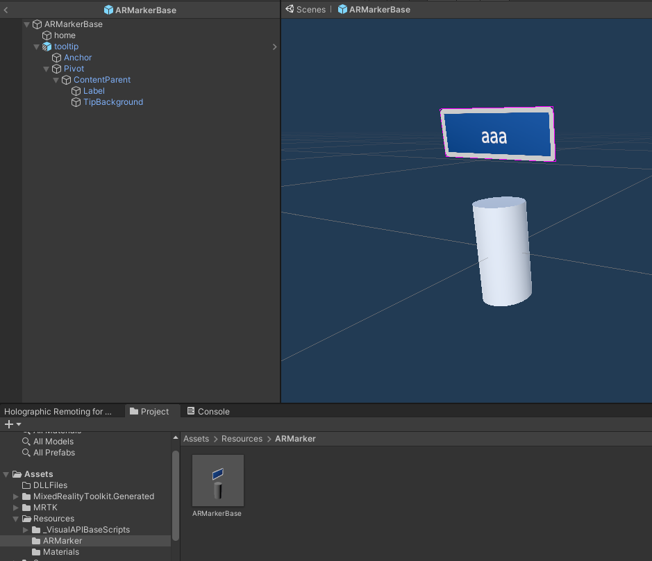
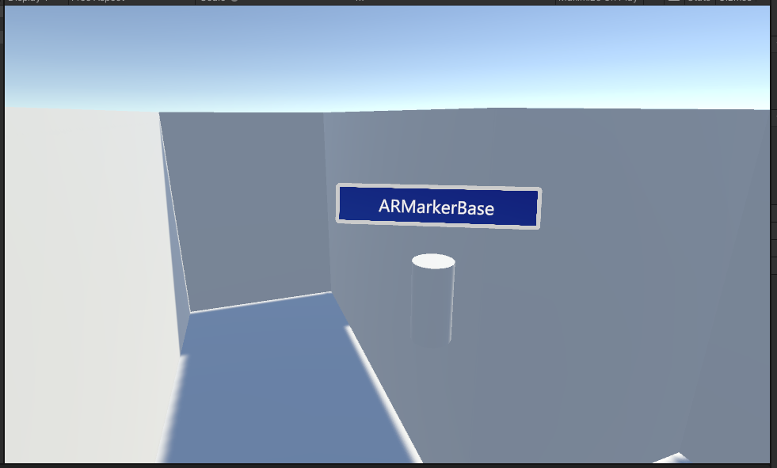

## UNITY PACKAGE -- AR Marker

---

```{toctree}
---
cation: contents:
maxdepth: 2
---
./README.md
```

---

## Dependencies

*No dependencies are needed for this package.*

---

## Namespaces Classes

```
Packages.ARMarker.Components
```

- ARMarkerHandle

	Options:

	<image src="./_docs/images/ARMarkerHandleComponent.png" alt="ARMarkerHandleComponent"/>

	- It allows to control the component having no idea of its internal structure (abstraction)
	- it has a small text inside the tooltip, dynamically changable through its public field `MarkerTooltipTextContent` ; the text could be bounded to the name of the GameObject using the public field `MarkerTooltipTextFromGameObject`
	- `IsManipulable` is a switch allowing the user to make the object manipulable or not depending on the situation; the feature, using MRTK2 inputs, can be enabled or disabled. The ckass has a public method as well, which is `public bool SetManipulation(bool opt = true)`
	- **if no manipulation components are found, they are instanced in the Start() Unity Callback**. For this reason, it is strongly suggested to use the public field `IsManipulable` instead of the function, since, due to frames management by Unity, it could happen that the objects are instanced in another frame different from the current one, depending on when the `Start()` callback is invoked by Unity.

- ARMarkerBuilder
	
	Options:

	<image src="./_docs/images/ARMarkerBuilderComponent.png" alt="ARMarkerBuilderComponent"/>

	This component provides a system for spawning markers in the map. A implementation as component is required sice otherwise Unity doesn't allow to use `Instanciate()` from a common class which is not a `MonoBehaviour`.

	**Note Well** : the script just sets the handle, the components for the manipulation, and the local transform (without local scale which is set by default to 1.0f). It is business of the script that builds the component to do the final regulation. 

```
Packages.ARMarker.Utils
```

*The package doesn't include Utils classes.*

```
Packages.ARMarker.ModuleTesting
```

*The package doesn't include ModuleTesting classes.*

---

## Resources

```
Assets/Resources/ARMarker
```

- ARMarkerBase
	
	Structural Overview:

	

	Appearance in scene:

	
	
	This is a simple marker with a small tooltip on it. **By default, it has no handler**: the script instanciating the prefab should also set the handle to it. 

---

```{toctree}
---
cation: contents:
maxdepth: 2
---
./README.md
```

---