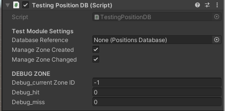
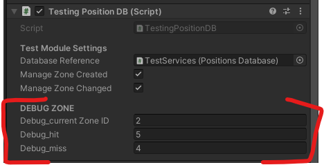

# UNITY PACKAGE -- Position Database

---

```{toctree}
---
cation: contents:
maxdepth: 2
---
./README.md
```

---

## Dependencies

- **Disk Storage Services** : StorageWriterOneShot
- **AR Marker** : ARMarkerHandle

---

## Namespaces Classes and Resources

```
Packages.PositionDatabase.Components
```

- PositionsDatabase
- PositionDatabaseWaypointHandle

	Options:

	<image src="./_docs/images/PositionDatabaseWaypointHandleComponent.png" alt="PositionDatabaseWaypointHandleComponent"/>

	The script indicates that the marker, owner of this component, represents one position previously recorded into the database. The main functionality of the handle (curently) is to make positions in the database *modifieable* from their representations, which enables the user to correct some wrong position. 

```
Packages.PositionDatabase.Utils
```

- PositionDatabasePath
- PositionDatabaseWaypoint

```
Packages.PositionDatabase.ModuleTesting
```

- TestingPositionDB
	
	

---

## Installation

1. place the script inside the folder `_Packages`

---

## Perform module testing and tuning

*Simple version*:

1. create a empty GameObject
2. attach component : `PositionsDatabase`
3. attach component : `TestingPositionDB`
4. assign the `PositionsDatabase` reference to the `TestingPositionDB`
5. assign on Zone Created to the DB
6. assign on Zone Changed to the DB

then, play. While you move, you should see the values of current zone ID, debug hit and debug miss changing:



- **current zone ID** : each zone has a unique number when it is created into the database
- **hit** : how many times the DB recognized a zone previoulsy recorded
- **miss** : how many times he database created a new position, detecting the current zone as new

The script can be used for tuning the Position Database Component:

- passing in a common area, the number of miss should keep the same value during the exploration
- if the number of misses increases even if you're passing on a previously explored zone, the position database is not capable of following the user's movement
- use clusters and max indexes to improve the follow rate

---

## Database Import Export

currently, the database can be exported and imported in JSON format. 

- **Export** : EVENT_ExportJson()
- **Import** : EVENT_ImportJson(), COR_ImportJson()

---

## Live Position Update (TRADURRE IN LINGUAGGIO UMANO e magari anche in inglese)

Il principio è che, al primo inserimento, il DB registra la posizione corrente del riferimento. Questo record rimane nell’oggetto fin quando non viene assegnato un oggetto che rappresenta il waypoint. A quel punto, quando andrò a chiedere la posizione del waypoint, quello mi dovrà ritornare in maniera trasparente la posizione dell’oggetto piuttosto che la posizione iniziale. 

Questo però non modifica di per sè la posizione. Per far sì che la posizione interna venga modificata, è necessario impostare a true il flag `bool CanUpdate` che dice al waypoint di aggiornare anche il record interno ogni volta che viene richiesta la posizione. Quindi il waypoint può riferirsi ad un oggetto, ma per poter effettivamente modificare il waypoint tramite la posizione dell’oggetto occorre usare il `CanUpdate`.

---

```{toctree}
---
cation: contents:
maxdepth: 2
---
./README.md
```

---