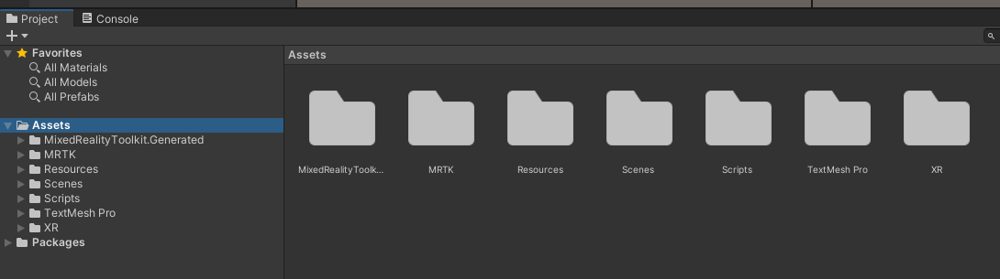

# Linee guida sviluppo HoloLens con Unity/MRTK2 (V1)

---

## Indice

---

### Changelog

- ********created April 30, 2023 3:00 PM*
- **************First Release May 1, 2023 5:44 PM*
- *nuova sezione: **Impostare un progetto secondo linee guida (primi 4 steps)** May 7, 2023 3:27 PM*
- ***************Second Release May 7, 2023 5:34 PM*

---

## ✅ Norme generiche

### Notazioni generali

In mancanza di altrre specificazioni,

- tutti i nomi vengono scritti con notazione *****CamelCase*****
- iniziale maiuscola nel caso generale
- iniziale minuscola solo per elementi privati del codice o comunque elementi non esposti all’utente. Meglio se anche lì si usa la maiuscola, a scanso di equivoci.

—

### Notazioni speciali con underscore

In generale, per i nomi non si utilizza mai l’underscore. Nelle linee guida, es. nella programazione ad eventi, il nome potrebbe essere strutturato nella seguente maniera:

`EVENT_ThisEvent()`

`UWP_ThisUniversalWindowsPlatformMethod()`

Questo serve a rendere più leggibile il nome nel codice e a sapere subito che genere di funzionalità implementa. In questo caso,

- la parte prima dell’underscore è scritta tutta in maiuscolo
- la parte dopo l’underscore segue la convenzione camelcase generica

Per i profili MRTK2 c’è una notazione ancora più particolare, simile a questa:

`INPUT_09_MyCustomInputProfile`

`_Project`

e altre di questo genere. in genere si usano per avere un ordine particolare sulla visualizzazione nell’editor (ad esempio l’underscore mette al primo posto gli oggetti, dunque è perfetto per dare un nome ad un qualcosa di particolarmente generico in un set di oggetti). 

—

### Gestione generica degli assets

In generale, ogni tipo di asset ha la sua cartella, es. se a una certa scene serve un material, esso avrà nella sua cartella una cartella Materials che contiene il material, es. se una scene ha una determinata fonte audio, allora la scene avrà una cartella Audios con l’audio all’interno.

- usare sempre nomi al plurale per le cartelle
- in linea di massima, predomina sempre **********************il tipo Unity di asset**********************

Quindi in generale si deve sempre preferire il tipo di elemento piuttosto che la funzionalità offerta. Es. se si sta implementando un elemento per una certa interfaccia grafica, non si avrà (in genere) mai cartelle con parti di interfaccia strutturate all’interno in maniera confusa, ma bensì una raccolta di tipologie di elementi. Questo è anche il metodo più naturale e semplice per catalogare gli elementi. 

—

### Namespaces e file system

Gli script in generale non seguono la convenzione sulla gestione degli asset, così come i visual items. Queste cartelle sono strutturate in sottocartelle, e ogni sottocartella viene chiamata come il namespace usato per un eventuale scripting. 

Questa regola viene usata per il codice esportabile e per gli asset esportabili, perchè per questi è necessario mantenere distinto il corpus del lavoro sull’item in oggetto, in modo da poterlo poi spostare in futuro senza dover stare a raccogliere pezzi in giro per il progetto. 

****************questa strutturazione non vale per gli elementi non esportabili****************, come ad esempio il codice delle scene o codice globale che mischia più packages assieme. 

—

### Altre Best Practises

- **Evita per quanto possibile le strutture innestate per gli assets**
    
    la regola dovrebbe valere in generale. Le cartelle per lo scripting possono essere anche strutturate per subtopic visto il tipo di asset, ma ad esempio per i material non serve a molto. 
    
    Unica eccezione: i profili di MRTK2, perchè lo strumento costringe in generale a implementare un numero enorme di profili diversi per poter configurare alcune impostazioni. 
    
- **Usare nomi brevi, incisivi, d’effetto, ma soprattutto chiari**
    
    importante dare subito un’idea di cos’è un certo elemento. Un nome è una concatenazione di nomi in genere, dal più generico al più specifico. 
    
- ************************************************************Mantenere chiare le dipendenze tra script e assets************************************************************
    
    Questa convenzione è stata studiata per dare un minimo di coerenza alla struttura del codice e del progetto, proprio per evitare di dover perdere tempo a cercare in giro per il progetto le dipendenze qualora si volesse riutilizzare dle codice. Evita di scrivere codice “alla buona”: fare sempre riferimento strettamente alle linee guida. 
    
- **************************************************************************************************Mantenere un livello di classificazione con il giusto grado di dettaglio**************************************************************************************************
    
    evita di scendere troppo nel dettaglio, ed evita di essere troppo generico nella suddivisione del codice. Ricorda che 
    
    - scendere troppo nel dettaglio poi ti porta ad una difficile gestione e manutenzione del codice
    - rimanere troppo sul generale tende a far diventare tutto un unico pastone, difficilmente gestibile o riutilizzabile nelle sue parti
    
    L’importante è sempre scegliere il livello di dettaglio che ti permette di vedere le features e di utilizzarle senza diventare pazzo nella gestione del codice. 
    
- ******************************************************************Tieni distinti utils e components******************************************************************
    
    Ogni script dovrebbe contenere al più un solo item, che può essere un utils o un component. Non fare strutture dati e oggetti che non siano esposti come singolo file, perchè così creerai elementi nascosti nel codice di difficile gestione. In generale, per trovare un pezzo di codice, mi deve bastare esplorare le directories dall’alto al basso fino a quello che mi serve, *****************************************non andare a vedere cosa c’è dentro ogni singolo file.***************************************** 
    
- **********************Parallelismo tra nome del file e nome della classe**********************
    
    meglio sempre fare in modo che il nome del file coincida col nome della classe, per una questione di leggibilità della struttura del progetto. 
    
- ******************************************Massima esportabilità del codice******************************************
    
    in generale la parte maggiore di coding per il progetto dovrebbe essere fatta su tutta quella parte di codice ******************che può essere riutilizzata per altri progetti.****************** Il codice del progetto in se dovrebbe solo occuparsi di mescolare questo codice. 
    

—

---

## ✅ File System

### Struttura della root del progetto

Per quanto riguarda la root, tutto quello che fa parte del progetto a livello globale *******************e non è esportabile******************* si trova all’interno della stessa root, catalogato sotto la sua cartella. Sarà dunque possibile trovare a questo livello Materials, Scripts e altro. 

Cartelle obbligatorie:

- `Resources` (vedi sezione sui ************visual items************)
    
    contiene gli elementi grafici caricabili in maniera dinamica
    
- `Scenes` (vedi sezione per le scenes)
    
    contiene le scene, una per cartella ordinate secondo il loro build index 
    
- `Scripts` (vedi sezione scripting)
    
    per lo scripting a livello globale
    
- `DLLFiles` (vedi sezione DLL e packages)
    
    contiene i packages e le DLL per il progetto
    
- `MRTK` (vedi linee guida per MRTK2)
    
    contiene i profili globali di progetto per la configurazione di MRTK2
    

In caso servano altri elementi, fare riferimento alle linee guida generali per gli assets. Possono esserci anche altre cartelle al di fuori delle linee guida, ma perlopiù si tratta di materiale autogenerato. 



se la cartella non serve, è giusto che non ci sia. Questo rende più comoda anche la gestione lato Git del progetto. 

—

### Intro sui Visual Items

I visual items sono assets che vanno poi a comporre gli elementi con cui l’utente può interagire nel mondo che il programma va a creare. 

Siccome occorre poterli caricare in maniera dinamica, Unity richiede che tali assets vengano messi sotto una cartella speciale chiamata`Resources` subito sotto la root. 


La cartella contiene sempre 

- `VisualAPIBaseScripts`
    
    contiene tutto lo script condiviso tra i visual items
    
- ************************una cartella per ogni item************************
    
    ogni visua item ha una cartella che si chiama come il suo namespace
    

Nota che ogni cartella di un visual item è a sua volta strutturata categorizzando per tipo di assets:


Per maggiori dettagli, vedi la parte dedicata all’implementazione dei visual items. 

—

### Package Scripting

Nella root è presente la cartella `Scripts` che contiene

- sia il codice ******Shared****** nell’ambito del progetto
- che sopratutto i ********packages********

In particolare, come si vede dall’immagine qui sotto, esiste una cartella `_Packages` che contiene tutti i packages, ognuno ben separato per namespace. 

All’interno di ognuna di queste cartelle, non dev’esserci altro che codice. Eventualmente è possibile ricorrere ad una sottostruttura che divide per tipi, nel rispetto della linea guida di far coincidere per quanto possibile i namespace con le folder effettive. 


Vedi ad esempio il modulo GeoLocation nell’immagine sotto, strutturato per parti:


—

### Packages Namespace

I packages devono essere incapsulati in un namespace la cui convenzione è la seguente:

```
Packages.<PackageNamespace>.<ScriptType>
```

dove,

- `PackageName` (CamelCase) è sia il nome del namespace riservato al package che il nome della fonder che contiene la parte di scripting
- `ScriptType` è il tipo di script, vedi sezione scripting

In questo modo, cercando sotto il namespace `Packages` si trovano tutti gli script non legati al progetto, mentre cercando sotto il `ProjectNamespace` si trovano gli script legati al progetto. 

—

### Project Script Namespace

Ance lo scripting interno al progetto segue più o meno la stessa convenzione. Vedi l’immagine:


La convenzione sui nomi utilizzata qui è la seguente, molto simile a quella usata per le scenes:

```
<ProjectNamespace>.Scripts.<ScriptType>
```

dove,

- `ProjectNamespace` (camelcase) è il nome del progetto
- `ScriptType` è il tipo di script, vedi sezione scripting

Questo scripting è globale del progetto perchè non è legato ad alcuna Scene, ma è allo stesso tmepo *******************interno al progetto******************* percè è legato al `ProjectNamespace` .

—

### DLL Scripting

I DLL vengono gestiti come dei packages un po’ particolari sotto una cartella specifica chiamata `DLLFiles` appena sotto la root del progetto:


Per maggiori informazioni su come trattare le DLL e implementarle, vedi la sezione scripting dedicata. 

—

---

## ✅ Gestone delle scene

### File system delle scene

La cartella `Scenes` è strutturata in maniera particolare al suo interno, come si può vedere in figura sotto. 


Nota che ogni progetto deve contenere una scene `EntryPoint` che, come dice il nome, sarà la primissima scene caricata dall’applicazione. 

### Nomi delle folder delle scenes

Nome della folder:

```
<buildno>-<SceneNamespace>
```

dove

- il `buildno` rappresenta il numero nell’ordine di build.
    
    **********************Mi aspetto che nelle build settings la scene appaia con quell’indice**********************, perchè questo mi permette di richiamarla anche usando un semplice numero. 
    
- il `SceneNamespace` (CamelCase) è il namespace della scene, che corrisponde al namespace del codice associato alla scene.

Alcune linee guida per il buildno:

- l’ID `00` è riservato all’entry point. Si parte sempre da `01` in su
- non possono esserci due scene con pari `buildno`, così come non possono esserci due scene con lo stesso `SceneNamespace`

—

### All’interno di una scene folder

All’interno ogni folder è strutturata *********************per categoria di file*********************. Il file scene si trova direttamente all’interno della root folder. In generale ognuna di queste cartelle dovrebbe contenere una sola scena. 

Ecco qualche esempio di struttura interna di una folder scene:


### Nome di una scene

ecco la convenzione sul nome di una scee:

```
Scene<SceneNamespace>
```

dove

- il `SceneNamespace` (CamelCase) è il namespace della scene, che corrisponde al namespace del codice associato alla scene.
    
    **********************************************E’ lo stesso nome della cartella che contiene la scene, a meno del `buildno`.* 
    

—

### Scene Scripting Namespace

Gli script all’interno di una scene folder devono avere un namespace di questo tipo:

```
<ProjectNamespace>.Scenes.<SceneNamespace>.Scripts.<ScriptType>
```

dove,

- `ProjectNamespace` (CamelCase) è il nome del progetto
- il `SceneNamespace` (CamelCase) è il namespace della scene, che corrisponde al namespace del codice associato alla scene
- `ScriptType` è il tipo di script. Vedi sezione successiva dedicata allo scripting

—

### Anatomia di una scene in termini di GameObjects

In generale, appena creata una Scene e dopo aver aggiunto gli elementi di MRTK2, vengono anche creati una serie di oggetti per creare le funzionalità particolari legate alla scene come l’interazione vocale e in generale tutta la parte di scripting necessaria al funzionamento della scene. 

Per fare un esempio, vedi l’immagine qui di seguito:


In particolare, c’è un oggetto la cui convenzione sul nome e’ la seguente:

```
<SceneNamespace>Services
```

dove,

- il `SceneNamespace` (CamelCase) è il namespace della scene, che corrisponde al namespace del codice associato alla scene

questo Empty gameobject contiene tutti gli script che formano il funzionamento della scene. 

Per gl input invece, ci dovrebbe essere un altro empty gameObject chiamato così:

```
<SceneNamespace>UserInputs
```

dove,

- il `SceneNamespace` (CamelCase) è il namespace della scene, che corrisponde al namespace del codice associato alla scene

Qui si trovano ad esempio i comandi vocali, che sono implementati in modo da lanciare eventi nei components sotto il gameObject `Services`. 

—

### EntryPoint

Subito sotto la folder `Scenes` ci dev’essere nel progetto una scene chiamata `SceneEntryPoint` . Questa scene è particolare, perchè ******************non contiene MRTK2****************** ma solo il gameobject `EntryPointServices`. 


Questa scene serve come area condivisa tra le scenes. Nota inoltre che c’è sempre un component `EntryPoint` subito sotto `EntryPointServices` che mette a disposizione una serie di servizi per ricaricare le scene tenendo sempre l’area globale. 

Ogni altra  scene dovrà essere caricata in `Additive` rispetto all’entry point: lo script per il cambio di scena fornisce anche un evento per eseguire questo cambio. 

—

### Setup entry point

- [There are 2 audio listeners in the scene. Please ensure there is always exactly one audio listener in the scene. - Unity Answers](https://answers.unity.com/questions/267213/there-are-2-audio-listeners-in-the-scene-please-en.html)
- [How to fix the “Resolve of invalid GC handle” error in Unity — Terresquall Blog](https://blog.terresquall.com/2023/03/how-to-fix-the-resolve-of-invalid-gc-handle-error-in-unity/)

MRTK2 è in genere abbastanza furbo da gestire la situazione Additive eliminando la camera di default di Unity e rimpiazzandola con quella sua. In generale comunque è meglio usare l’entry point solo ed eslcusivamente come area di memoria condivisa, perciò elimina ****qualunque cosa**** eccetto `EntryPointServices` che dovrai creare. 

- [Loading and Unloading scenes - Unity Forum](https://forum.unity.com/threads/loading-and-unloading-scenes.461169/)

nei components del progetto va inserito anche lo script per la gestione delle scene. Vedi template per come costruire il component. 

L’entr point, appena caricato, lancia un’altra scene subito all’avvio in additive. Specificare il nome della Scene direttamente da GUI. 


—

### ⁉️ MRTK2 - prod e cons dell’approccio con entry point

<aside>
⚠️ Il grosso svantaggio è quello di dover reistanziare ogni volta MRTK2 non potendolo piazzare nell’entrypoint. Tuttavia, se il problema è costituito solo dai profili, si potrebbe optare per un setup a runtime di MRTK: [MRTK2 profile configuration guide - MRTK 2 | Microsoft Learn](https://learn.microsoft.com/en-us/windows/mixed-reality/mrtk-unity/mrtk2/configuration/mixed-reality-configuration-guide?view=mrtkunity-2022-05#changing-profiles-at-runtime)

</aside>

La scene EntryPoint dovrebbe essere utilizzata solo ed esclusivamente per avere un’area condivisa di memoria tra le scene, e niente di più. In generale ogni scene istanzia il proprio oggetto MRTK2 e soprattutto la propria camera con tutti i servizi necessari. 

*L’entryPoint non può contenere script che facciano riferimento a MRTK2*, il che rappresenta la principale limitazione di questo approccio. In mezzo a questo, c’è anche il fatto che questo genere di impostazione non consente di usare il ScenTransitionService di MRTK2, rendendo la transizione da una scene all’altra piuttosto secca. Questo non è necessariamente un male, specie per l’applicazione prevista da questo progetto in cui l’utente finisce per usare una stessa scene per gran parte del tempo di funzionamento dell’applicazione. 

Il vantaggio principale dell’approccio sta invece nell’avere la possibilità di implementazioni di classi che devono essere istanziate una sola volta. 

Es. la necessità di mantenere una connessione continua con un server, potrebbe essere un problema cambiare scena, perchè questo vorrebbe dire che il component che mantiene la connessione verrebbe deallocato, e questo comporterebbe la perdita della connessione. (probabilmente non un buon esempio, ma era giusto per dare l’idea).

Es. il tipico caso delle settings: spesso è utile avere un solo oggetto che conservi tutte le impostazioni dell’applicazione, e che le propaghi a tutte le scene. Questo è il caso perfetto in cui è necessaria un’area globale. E lo stesso si può dire per anche altre forme di storage, come ad esempio il logging su file, che ha necessità di aggiornare continuamente il file di log durante tutto il funzionamento dell’applicazione. 

********************************Una precisazione********************************. In realtà MRTK2 mette a disposizione un metodo per caricare una Scene in Additive usando lo SceneTransitionService, vedi link

[MixedRealitySceneSystem.LoadContent Method (Microsoft.MixedReality.Toolkit.SceneSystem) | Microsoft Learn](https://learn.microsoft.com/it-it/dotnet/api/microsoft.mixedreality.toolkit.scenesystem.mixedrealityscenesystem.loadcontent?view=mixed-reality-toolkit-unity-2020-dotnet-2.8.0#microsoft-mixedreality-toolkit-scenesystem-mixedrealityscenesystem-loadcontent(system-string-unityengine-scenemanagement-loadscenemode-microsoft-mixedreality-toolkit-scenesystem-sceneactivationtoken))

Purtroppo però, dovendo fornire diverse interfacce vocali, potenzialmente una per scene, ci sarebbe bisogno di complicare l’architettura assegnando il profile ogni volta dinamicamente. Per ragioni di semplicità, meglio evitare e rimanere sul semplice, anche se questo comporta non poter utilizzare Scene Transition Service ma solo ll cambio scene di default di Unity. 

—

### Behaviours e Behaviour Scripting

Un behaviour è un script che si occupa di coordinare le azioni dell’utente con le attività del sistema. 

Es. supponiamo che l’utente abbia da usare HoloLens2 per l’esplorazione di un environment parecchio esteso. Un approccio del tutto legittimo all’esplorazione può essere quello di fornire in maniera del tutto agnostica una serie di strumenti di base, e lasciare all’utente l’onere di combinarli per condurre l’esplorazione secondo esgenze. Un problema di questo approccio però sta proprio nel fatto che il sistema **************************non avanza alcuna proposta************************** che assecondi l’utente, quando invece potrebbe ad esempio sforzarsi di prevedere la prossima mossa dell’utente, raccogliere informazioni che attualmente l’utente non riesce a notare, o anche segnalare all’utente potenziali zone non esplorate, o anche zone pericolose. Tutto questo presuppone un sottosistema, anche minimo, che permetta al sistema di avere coscienza di quanto sta avvenendo al fine di supportare al meglio l’esplorazione. Vale a dire, serve un *********behaviour*********. 

Es. un esempio più semplice di behaviour è quello in cui l’utente è chiamato a seguire una procedura guidata per realizzare un certo tipo di operazione. In questo caso il sistema si pone da guida per l’utente nei passi da eseguire per portare a termine l’operazione. 

Un behaviour script spesso è implementato nella singola scene: vive e muore con essa. Concettualmente è un processo orchestratore che si occupa 

- di tenere costantemente aggiornato lo stato del sistema rispetto alle azioni dell’utente
- e di coordinarsi con l’utente per provvedere eventuale assistenza alle azioni

Lo si può intendere come una macchina a stati, o magari come qualcosa di più semplice tipo una Sense-Act. 

******************************************************************Più behaviours contemporaneamente******************************************************************? In generale è una situazione sconsigliabile: per ogni scene dobrevve esserci un solo behaviour script che si occupa di coordinare tutti gli altri script nella Scene. L’opzione è comunque interessante, purchè si trovi il giusto modo per far parlare i due in modo che non si pestino i piedi a vicenda. 

—

---

## ✅ Guidelines per l’uso di MRTK2 nel progetto

### Profiles e FIleSystem

<aside>
⁉️ Per il momento non prevedo necessità di supportare profili legati alla parte di packages. In futuro però potrebbe essere necessario, specie se si vanno a sviluppare packages in grado di modificare dinamicamente le impostazioni di MRTK2, cosa che sarebbe molto utile fare in genere.

</aside>

Solita organizzazione in profili globali e profili locali. 

- Profili globali
    
    `MRTK/Profiles/`
    
- Profili locali
    
    `Scenes/<SceneNamespace>/MRTK/`
    

—

### Profilo _*******Project*******

in tutti i progetti con questo standard esiste un profilo globale chiamato semplicemente `_Project` nella cartella globale dei profili. 

In caso mancasse, va creato come clone di 


Vedi l’immagine sotto per la configurazione iniziale:


Il toolkit dev’essere impostato inizialmente su queso profilo *********per tutte le scenes.*********


—

### Profilo _**********************SceneNamespaceProfile**********************

Il profilo `_Profile` è un super default del progetto, ma potrebbe succedere che qualche scene richieda qualcosa di ancora più particolare. Perciò, possibile creare subito sotto la cartella `MRTK` della scene che richiede il profilo speciale un profilo con questo nome:

```
_<SceneNamespace>Profile
```

dove

- il `SceneNamespace` (CamelCase) è il namespace della scene, che corrisponde al namespace del codice associato alla scene.

Il profilo viene creato inizialmente come clone di `_Project`. 

—

### Naming Convention per i profili MRTK2

- **Profili generici di progetto** (quelli sotto la cartella `MRTK/Profiles`)
    
    ```
    _<Scope>Project
    ```
    
    dove
    
    - `Scope` (CamelCase) è l’ambito del profilo. Vuoto se l’ambito è quello più generico possibile
    
    tale profilo è posto in una sequenza di cartelle che ricorda come arrivare a quell’area del profilo. 
    
- **Profili specifici globali del progetto**
    
    ```
    <SCOPE>_PROJ_<ProfileCharacteristic>
    ```
    
    dove
    
    - `SCOPE` (tutto maiuscolo) è l’ambito toccato dalla configurazione
    - `ProfileCharacteristic` contraddistingue il tipo di oggetto
    
- **Profili generici locali**
    
    ```
    _<SceneNamespace><Scope>
    ```
    
    dove
    
    - il `SceneNamespace` (CamelCase) è il namespace della scene, che corrisponde al namespace del codice associato alla scene.
    - `Scope` (CamelCase) è l’ambito del profilo. Vuoto se l’ambito è quello più generico possibile
    
- **profili specifici locali**
    
    ```
    <SCOPE>_<buildno>_<ProfileCharacteristic>
    ```
    
    dove,
    
    - `SCOPE` (tutto maiuscolo) è l’ambito toccato dalla configurazione
    - il `buildno` rappresenta il numero nell’ordine di build.
        
        **********************Mi aspetto che nelle build settings la scene appaia con quell’indice**********************, perchè questo mi permette di richiamarla anche usando un semplice numero. 
        
    - `ProfileCharacteristic` contraddistingue il tipo di oggetto
    

—

### Gestione di profili MRTK2 (con un esempio)

MRTK2 forza a dover fare un *****clone***** per ogni sezione di configurazione. E’ un meccanismo per impedire che l’utente modifichi un profilo di default. 


Per tenere tutto ordinato, conviene creare *****************************una subfolder per ogni profilo creato.***************************** Muovendosi dall’alto verso il basso. 

L’esempio tipico è quello del comando vocale:

1. seleziono il profilo super-globale che voglio
2. Input
3. se ancora è definito solo il default, ***definisco prima un mio default***
    
    
    
    1. creo una cartella sotto `MRTK/Profiles/Input/`
    2. il profilo è `_InputProject`
        
        
        
4. supponiamo me ne serva uno ancora più specifico dedicato alla scene in questione. 
    
    allora nella cartella `Scenes/<SceneNamespace>/MRTK/Input/` creo il mio profilo `_<SceneNamspaceInput>Input`
    
5. Speech richiede ancora il profilo di default, quindi lo creo, solita convenzione
    
    
    
    
    
6. vado poi a creare la mia interfaccia vocale custom
    
    
    

A questo punto dovresti avre tutto per implementare l’interfaccia vocale. 

—

---

## ✅ Scripting

### Tipi di script

I nomi riportati qui sono utilizzati come `ScriptType` laddove serva completare il namespace. 

- `Types` - script che servono per imporre un certo tipo di interfaccia ad una classe
    
    I types sono script che forzano un oggetto ad avere determinate caratteristiche. 
    
    Quando non devono essere usati per implementare eventi, sono implementati come ************Interfaces************
    
    Quando un oggetto può essere usato per richiamare eventi, allora il tipo viene implementato come discendente del `ProjectMonoBehaviour`. ***********Nota bene: non del solo `MonoBehaviour`* a meno che si voglia non utilizzare le customizzazioni del progetto. 
    
    Per maggiori informazioni, vedi la parte sulla programmazione a eventi. 
    
- `Components` - i component del progetto
    
    Questi script possono essere usati direttamente come component e inseriti nella scene. Implementano una funzionalità conclusa, ben definita. 
    
    Tipi particolari di component sono:
    
    - `solvers`
    - `handlers`
    - `builders`
    - `functionals`
    
    ma in generale, per mantenere semplice la struttura del codice, si preferisce mettere tutto sotto il set dei `Components` . Tendenzialmente questo genere di denominazione viene inserito come finale sul nome del component stesso. 
    
- `Utils` - codice di servizio
    
    Spesso si tratta di strutture dati o piccole classi non utilizzabili come component. Le classi contenute qui non sono fatte per essere utilizzate come component. 
    
- `ModuleTesting` - components usati per testare altri components
    
    questi component implementano dei test da usare in sede di sviluppo. Non sono in generale components fatti per essere utilizzati in produzione. 
    
- `Behaviour` - interazioni guidate con l’utente
    
    questi script implementano il codice che sta immediatamente sotto le interfacce con cui l’utente può interagire in maniera diretta. 
    

—

### Livelli di scripting

Nell’ambito del progetto ci sono più livelli di scripting:

- DLL scripting
    
    purtroppo spesso è impossibile forzare una DLL a incapsulare il codice secondo queste linee guida, perciò questo codice rimane spesso a livello globale. Per questo consiglio sempre di racchiuderlo con dei wrapper appositi all’interno di un `Packages.<DLLNamespace>` con uno script fatto apposta. 
    
- Package Scripting
    
    Sono tutti gli script contenuti nella cartella `Scripts/_Packages` subito sotto la root del progetto. 
    
- Global Scripting
    
    Tutti gli script immediatamente sotto `Scripts` nella root del progetto
    
- Local Scripting
    
    sono gli script appartenenti alle singole scene
    

—

### Livelli di scripting e File System

- DLL scripting
    
    per i file DLL:
    
    `Assets/DLLScripts/<DLLNamespace>/_DLL/`
    
    per gli script wrapper e gli script associati, 
    
    `Assets/DLLScripts/<DLLNamespace>/<ScriptType>/`
    
- Package Scripting
    
    Visual API:
    
    `Assets/Resources/<VisualItemNamespace>/Scripts/<ScriptType>/`
    
    Tutti gli altri packages:
    
    `Assets/_Packages/<PackageNamespace>/<ScriptType>/`
    
- Global Scripting
    
    `Assets/Scripts/<ScriptType>/`
    
- Local Scripting
    
    `Assets/Scenes/<SceneNamespace>/Scripts/<ScriptType>/`
    

—

### Namespaces

- DLL Scripting
    
    `DLL.<DllNamespace>`
    
- Package Scripting
    
    Questo namespace vale sia per i packages che per le DLL wrappate:
    
    `Packages.<PackageNamespace>.<ScriptType>`
    
    La VisualAPI segue una struttura molto simile:
    
    `Packages.VisualItems.<PackageNamespace>.<ScriptType>`
    
- Global Scripting
    
    `<ProjectNamespace>.Scripts.<ScriptType>`
    
- Local Scripting
    
    `<ProjectNamespace>.Scenes.<SceneNamespace>.<ScriptType>`
    

—

### Il ProjectMonoBehaviour

<aside>
💡 L’uso del ProjectMonoBehaviour lega indissolubilmente il component al progetto, definendone precisamente la funzione di script interno al progetto non esportabile. E’ un vantaggio, a conti fatti. I package non possono usare il ProjectMonoBehaviour proprio perchè devono rimanere esportabili.

</aside>

Tutti i component ereditano di default da `MonoBehaviour`, ma per favorire una maggiore flessibilità, ogni progetto Unity che segua queste linee guida deve avere un component `ProjectMonoBehaviour` come script type, da usare come base per tutti gli altri component del codice. 

Tale script è importante percè contiene metodi custom del progetto, come ad esempio le funzioni che si occupano di fare il logging, o codice che altrimenti si dovrebbe ripetere ovunque. 

In generale può anche essere vuoto. Basta solo 

- che ci sia
- e che si trovi sotto il namespace `<ProjectNamespace>.Scripts.Types`

Ne consegue che tutti gli script MonoBehaviour dovranno includere questo namespace. 

I package esterni non possono usare questo behaviour: per ragioni di compatibilità, possono anche ereditare direttamente da MonoBehaviour perchè altrimenti dovrebbero includere un riferimento esplicito al nome del progetto, il che  è vietato per questo genere di script. 

—

---

## 🔄 DLL - External Scripting

### Implementare una DLL

<aside>
❌ ***************************************************************Non funziona: quando lanci il Build, non si riesce a compilare. Vedi errore qui sotto.***************************************************************

</aside>

```
ArgumentException: The Assembly Newtonsoft.Json is referenced by NewtonsoftJsonUilities ('Assets/DLLFiles/JsonUtilities/_DLL/NewtonsoftJsonUilities.dll'). But the dll is not allowed to be included or could not be found.
UnityEditor.AssemblyHelper.AddReferencedAssembliesRecurse (System.String assemblyPath, System.Collections.Generic.List`1[T] alreadyFoundAssemblies, System.String[] allAssemblyPaths, System.String[] foldersToSearch, System.Collections.Generic.Dictionary`2[TKey,TValue] cache, UnityEditor.BuildTarget target) (at <2cd7f07c7b884ea9bf02386eb91a464c>:0)
UnityEditor.AssemblyHelper.AddReferencedAssembliesRecurse (System.String assemblyPath, System.Collections.Generic.List`1[T] alreadyFoundAssemblies, System.String[] allAssemblyPaths, System.String[] foldersToSearch, System.Collections.Generic.Dictionary`2[TKey,TValue] cache, UnityEditor.BuildTarget target) (at <2cd7f07c7b884ea9bf02386eb91a464c>:0)
UnityEditor.AssemblyHelper.FindAssembliesReferencedBy (System.String[] paths, System.String[] foldersToSearch, UnityEditor.BuildTarget target) (at <2cd7f07c7b884ea9bf02386eb91a464c>:0)
UnityEngine.GUIUtility:ProcessEvent(Int32, IntPtr, Boolean&)
```

<aside>
✅ Il giochino va bene fintanto che il package richiama poi delle DLL che non vengono gestite in automatico da NuGet. Se hai da importare del codice da altri plugins, ti conviene prendere e importare a mano *********************tutte le DLL del caso*********************, il che in effetti limita un pochino l’utilità di avere delle DLL nel progetto. ***********************************************In generale l’uso delle DLL non mi piace molto***********************************************.

</aside>

Nel caso in cui capitasse di essere sia l’autore che l’utende della DLL, o di dover rilasciare una DLL per conto di altri, sarebbe opportuno tentare di seguire alcune linee guida generali che permettono una maggiore adattabilità agli standard descritti in questo documento. 

Ecco un esempio di codice: è un semplice wrapper della libreria Newtonsoft JSON (scaricata da NuGet) che voglio importare in Unity (nota che Unity non ha un suo NuGet, e comunque sarebbe meglio non utilizzarlo). 

```csharp
using UnityEngine;
using Newtonsoft.Json;

namespace DLL.NewtonsoftJsonUilities
{
    public class Json
    {
        // JSON string -> Object
        public TJsonType JsonDeserialize<TJsonType>(string jsonCode)
        {
            return (TJsonType)JsonConvert.DeserializeObject<TJsonType>(jsonCode);
        }

        // Object -> JSON string
        public string JsonSerialize<TJsonType>(TJsonType jsonObject)
        {
            return JsonConvert.SerializeObject(jsonObject);
        }
    }
}
```

Ci sono alcune importanti linee guida da seguire, per poter rendere la DLL adattabile al massimo col nostro progetto:

- ********************evitare dati statici********************, perchè come visto nella sezione importazione, non si riesce a gestirli bene con l’ereditarietà in fase di standardizzazione del package
- *******************************seguire la convenzione sui nomi******************************* sia sul file DLL che all’interno di esso, in modo da non dover andare a cercare chissà che cosa quando si va a fare questo lavoro

Nota che un package all’interno del progetto può contenere più file DLL combinati assieme: per questo nello standard di progetto è definito anche un livello superiore collegato per ereditarietà, che non dove necessariamente essere un livello formato con ereditarietà secca. Non c’è nessun problema a combinare il codice di diverse DLL nell’ambito dello stesso package, ******************************************purchè alla fine il risultato sia conforme allo standard del package.****************************************** 

—

### Namespace consigliato per le DLL

in generale è fatto così:

```csharp
DLL.<DllNamespace>
```

dove

- `DllNamespace` è sia il nome del file DLL che il namespace principale del codice all’interno del file

—

### Usare e importare le DLL

Le DLL sono comode perchè permettono di estrarre ad esempio packages NuGet e di importarli in Unity senza usare NuGet che spesso porta problemi di compatibilità. In generale le DLL racchiudono non solo l’eventuale codice custom implementato quando il pezzo di codice è stato scritto, ma anche ***********************************************tutto l’eventuale environment correlato con quel pezzo di codice***********************************************, il che permette di importare plugins e altro materiale utile in Unity senza dover per forza installare utilities su Unity che spesso finiscono per rendere il materiale del progetto meno esportabile o riutilizzabile. 

Le DLL sono poste nella cartella `DLLFiles` subito sotto la root del progetto. 


Le DLL si trattano quasi esattamente come packages: hanno una loro cartella, la cartella all’interno è divisa per namespaces, e all’interno del namespace viene fatta una classificazione del materiale per subnamespaces. 


Rispetto ai packages però, nota che la cartella ne contiene un’altra chiamata `_DLL` che andrà a contenere i file DLL. 


In generale, *************************la DLL non seguirà la convenzione standard in termini di namespace*************************. Dentro, la DLL ha la sua struttura propria che molto probabilmente sarà diversa da quanto richiesto dallo standard per questo progetto. 

La DLL andrà dunque **************standardizzata**************, e anche per questo si usa l’ereditarietà. 


Il codice che andrà a standardizzare la libreria sarà di questo tipo: ereditarietà secca dalla DLL di partenza, senza aggiungere altro. NOTA BENE: Questo metodo funziona solo se la classe non contiene metodi statici; evitare in tutti i modi di inserire metodi statici nella classe, altrimenti non sarà posssbile fare alcuna standardizzazione del metodi. 

```csharp
using System.Collections;
using System.Collections.Generic;
using UnityEngine;

namespace Packages.JsonUtilities.Utils
{
    // la DLL contiene il namespace DLL sotto il quale è contenuto l'oggetto JsonUtilities
    public class Json : DLL.NewtonsoftJsonUilities.Json
    {

    }

}
```

In  questo modo si riuscirà ad allineare la DLL allo standard del progetto. 

Per evitare sorprese, infine, suggerisco caldamente di prevedere per il package sempre un module testing, in modo da poter provare la DLL subito al momento dell’importazione. 


Un rapidissimo esempio di module testing per questa libreria:

```csharp
using System.Collections;
using System.Collections.Generic;
using UnityEngine;
using Packages.JsonUtilities.Utils;

namespace Packages.JsonUtilities.ModuleTesting
{
    public class JsonTesting : MonoBehaviour
    {
        private bool testDone = false;

        private class TestingJson
        {
            public int ciao = 24;

            public override string ToString()
            {
                return $"not in JSON ciao={ciao}";
            }
        }

        // Update is called once per frame
        void Update()
        {
            if(!testDone)
            {
                Json js = new Json();
                Debug.Log($"JSON from class: {js.JsonSerialize<TestingJson>(new TestingJson())}");
                Debug.Log($"JSON to class: {js.JsonDeserialize<TestingJson>("{ 'ciao' : 24 }")}");
                testDone = true;
            }
        }
    }

}
```

—

---

## ✅ Guidelines per programmazione ad eventi

### Convenzioni sui nomi Scripting

In generale, una funzione che implementa un evento ed è fatta per essere chiamata dall’esterno da un’altra entità segue questa convenzione sul nome:

```
public void EVENT_<Topic>( ...args... )
```

dove, 

- `Topic` (CamelCase) è un nome che identifica la funzionalità a cui fa riferimento l’evento.
    
    Tale nome può anche essere un verbo in questo caso. Diversamente per coroutine e task che invece devono avere ***************proprio un nome*************** come topic. 
    

In generale comunque, più brevi si è coi topic e meglio è.

Stessa convenzione per le callback, vedi sezione più avanti. 

—

### Protocollo con Invoke

<aside>
💡 Metodo limitato che riporto qui giusto per completezza. Sarebbe meglio non utilizzarlo.

</aside>

Questo metodo si basa sull’uso del metodo Unity `Invoke()` che è parte di un oggetto di tipo `UnityEvent`. Solitamente, questa è la procedura per richiamare un evento con la Invoke:

- ******************************************Metodo visibile a GUI******************************************
    
    Con questo metodo, ****************************************************************la classe B non può assegnare internamente i valori degli argomenti perchè questi vengono già assegnati da GUI.****************************************************************
    
    
    
    1. la classe che espone l’evento (diciamo A) crea un metodo 
        
        `public EVENT_<Topic>(...args...)`
        
    2. la classe che deve richiamare l’evento (diciamo B) espone una variabile a GUI
        
        `public UnityEvent<...types...>`
        
    3. la classe B implementa inoltre delle strategie per poter “invocare” l’evento usando
        
        `<unity event>.Invoke( )`
        
    4. le classi A e B vengono assegnate ai loro rispettivi GameObject
    5. il riferimento al metodo di A viene passato all’istanza di B per poter essere richiamato
- ******************************Metodo nascosto******************************
    
    ******************************************************************Questo metodo corrisponde sostanzialmente ad una chiamata a funzione, il che rende poco utile usare la Invoke se non per ottenere un minimo di generalizzazione, che però richiede sempre di conoscere con esattezza il nome della funzione da invocare.****************************************************************** 
    
    
    
    1. la classe che espone l’evento (diciamo A) crea un metodo 
        
        `public EVENT_<Topic>(...args...)`
        
    2. la classe che deve richiamare l’evento (diciamo B) ha internamente un riferimento privato del tipo
        
        `private UnityEvent<...types...>`
        
    3. la classe B implementa inoltre delle strategie per poter “invocare” l’evento usando
        
        `<unity event>.Invoke( )`
        
    4. la classe B espone a GUI un riferimento alla classe A pubblico
        
        `public A RefToClassA;`
        
    5. per finire, la classe B implementa un qualche metodo per cercare nella classe A il metodo da invocare.
        
        ```
        UnityEvent ue;
        ue.AddListener( A.EVENT_<topic> );
        ```
        
    6. le classi A e B vengono assegnate ai loro rispettivi GameObject
    7. il riferimento alla classe A viene passato alla classe B tramite GUI (oppure la classe B se lo cerca in caso di architetture standardizzate)

—

### Usare la Invoke e quando non usarla

La `Invoke()` ha una grossa limitazione riguardo gli arguments:

- se richiamata in maniera nascosta, essa equivale sostanzialmente ad una chiamata di funzione a cui vengono passati gli argomenti. *************************************************************In questa forma, il riferimento non può essere passato da GUI*************************************************************
- se richiamata da GUI, allora ************************gli argomenti saranno presi solo ed esclusivamente da GUI************************. Gli argomenti passati da codice verranno totalmente ignorati

Va da sè che non è possibile usare la `Invoke()` se non nei casi in cui gli argomenti rimangono fissi, ma nella stragrande maggioranza dei casi si ha invece bisogno di passare semplicemente il riferimento alla funzione e lasciar fare al component l’assegnazione dei parametri con cui chiamarla. 

La `Invoke()` quindi non può essere usata se non nel caso in cui gli argomenti possono essere assegnati come costante da GUI. *******************************************************Per questo sconsiglio caldamente di usare questo metodo.******************************************************* Usare invece le interfacce. 

Altra limitazione di `Invoke()` : non permette di creare eventi con valore di ritorno, mentre invece il protocollo con interfacce permette di implementare eventi con un eventuale valore di ritorno. 

—

### Protocollo con interfacce

L’idea viene dal metodo nascosto ad eventi: non è molto flessibile, ma almeno corrisponde ad una vera chiamata a funzione con parametri. 

Si usa l’inheritance piuttosto che le interfacce, per 

- dare generalità alla classe che deve chiamare un’altra classe, permettendogli di richiamare un tipo di oggetto dato ********************il suo tipo generale********************
- assicurarsi che una certa implementazione possieda dei metodi con nomi standard
- poter lavorare coi riferimenti anche via editor

La figura sotto mostra l’archiettura in questo caso:


La classe chiamata deve appartenere ad un tipo generico, ***********************e non ad un’interfaccia*********************** dato che Unity non permette alla classe B di fare riferimento ad un’altra classe tramite l’interfaccia, ragion per cui è necessario creare una classe GenercicClassA che erediti a sua volta dal MonoBehaviour.

Allora le interfacce non si usano? ***************Non esattamente***************, perchè ancora possono dare maggiore flessibilità al nostro programma. Si tratta solo di implementare un nuovo monobehaviour, anche vuoto in caso, e usare l’inheritance per generalizzare a livello di component. In generale, sarebbe consigliato implementare le rispettive interfacce prima di wrapparle in una sola classe: permette di evitare ereditarietà a cascata non desiderata. 

—

### Implementazione di eventi

1. implementazione delle interfacce del *************tipo generico*************
    
    non è un punto obbligatorio, quanto piuttosto **********************caldamente consigliato**********************. Capiterà di dover combinare più tipi di funzionalità in una sola classe base: a quel punto, le interfacce permetteranno di ereditare da più tipi invece che da uno solo, cosa che si realizza con l’ereditarietà solo usando una struttura a cascata. 
    
    per ereditarietà mista e definizione di interfacce on-the-fly, vedi questo post su StackOverflow - [oop - C# inheritance: implements + extends - Stack Overflow](https://stackoverflow.com/questions/14139097/c-sharp-inheritance-implements-extends)
    
2. implementazione del *************tipo generico*************
    
    un tipo generico è un `MonoBehaviour` (se possibile, un `ProjectMonoBehaviour`) che contiene solo definizioni di eventi. 
    
3. implementazione della classe che implementa l’evento
    
    in questo caso, si richiede alla classe di reimplementare in `overwrite` gli eventi ereditati dalla classe generica. 
    
    ```
    public overwrite void EVENT_Evnt( ...args... )
    {
    	// ...
    }
    ```
    
4. la classe chiamante ha bisogno di riferirsi non al tipo specifico (class A) ma bensì al tipo generico (GenericClassA)
5. implementare un sistema per trovare il reference all’oggetto, eventualmente facendoselo passare da GUI
6. implementare tutte le strategie del caso per chiamare l’evento

Questo è quanto: con questo sistema, usando direttamente l’oggetto anzichè il singolo evento, si riesce a fare della programmazione a eventi anche meglio che usando la Invoke. 

—

### Eventi e Callbacks

E’ una distinzione che a volte torna utile. Ci sono in generale due tipi di evento, i quali si distiguono per tipo di reazione utilizzata alla chiamata:

- `EVENT_???` - sono metodi che svolgono *****azioni attive***** sulla classe. Es. spawnare un oggetto.
- `CALLBACK_???` - sono metodi pensati con una ********************funzionalità passiva********************, cioè qualcosa che fornisce informazioni ad una classe più che scatenare un evento. Es. attendere che una classe mi fornisca un’informazione

La distinzione è molto sottile, dato che comunque si tratta pur sempre di eventi, con la stessa architettura di sempre. La differenza sta nel tipo di funzionalità offerta. 

—

### Uso corretto delle callbacks

le callbacks sono metodi dei component fatti per poter ricevere dati da altre classi. Ecco alcune linee guida per il design:

- in generale, una callback implementa una funzionalità che può essere resa in a malappena una riga di codice: la semplice assegnazione. La callback si limita a ricevere e assegnare.
    
    Siccome il meccanismo è praticamente identico a quello degli eventi con interfaccia, uno potrebbe chiedersi perchè è necessario aver euna callback. In certi casi infatti si può usare un meccanismo a scrittura diretta nella variabile, ma occorre anche capire quando è stata ricevuta un’informazione nuova in alcuni casi, e altre richieste a cui il caller non può pensare. A scanso di equivoci perciò, è sempre meglio dichiarare un metodo `CALLBACK` anche per un fattore di pulizia del codice **************evitiamo di inventarci un metodo nuovo ogni volta che si vuole tirare a risparmio**************. Diamo priorità ai metodi già presenti. 
    
- la variabile dev’essere protetta da un LOCK: occorre dunque definire un semaforo condiviso tra callback e consumer
    
    questa è un’altra funzionalità che non può essere implementata se la variabile non venisse protetta da una sua callback. 
    

Ecco un esempio di implementazione corretta di callback, giusto per dare un’idea della convenzione sui nomi da usare in questo contesto:

```csharp
private ClassA Resource; // la risorsa letta 
private object MUTEX_Resurce; // il semaforo per accedere alla risorsa
```

```csharp
// callback esempio
public void CALLBACK_Resource( ClassA Resource )
{
	lock(MUTEX_Resource) { Resource = this.Resource; }
}
```

```csharp
// il consumer ricorrerà ad un codice molto simile, copiando il riferimento
private IEnumerator BSCOR_MyIncredibleFeatures()
{
	// ...

	ClassA Resource = null;
	lock(MUTEX_Resource) { this.Resource = Resource; }

	// ...
}
```

Questo genere di implementazione può essere ulteriormente raffinato. Ad esempio, si può richiedere che il dato letto dal consumer sia sempre fresco: in questo caso, il consumer dovrà creare una strategia per identificare il dato nuovo rispetto al precedente. 

Inoltre, è sempre meglio passare classi intere alle callbacks invec che singoli argomenti. Questo darà luogo ad un maggiore effort e un maggiore numero di classi, ma permetterà di tenere tutte le informazioni al posto giusto, e soprattutto di mantenere pulito e semplice il codice delle callbacks. 

—

---

## ✅ Visual API e implementazione di Visual Items

### Organizzazione degli Assets

Un visual item è un elemento grafico dotato di un certo comportamento e di un certo tipo di interazioni utente. 

Ogni visual item ha la sua cartelal (e quindi il suo namespace) al di sotto della cartella `Resources` :


Subito sotto la root del singolo namespace si trovano i prefabs che vanno a costituire gli elementi creati dinamicamente oppure inseriti con drag&drop nella scene. 

Come da linee guida generali, gli asset d base vengono classificati, per quanto possibile, in base al tipo Unity anzichè rispetto alla variante interna dell’elemento. 

—

### Nomi dei prefabs

convenzione sul nome del prefab:

```
<VisualItemNamespace><Variant>
```

dove

- `VisualItemNamespace` è il nome della cartella
- `Variant` è il nome della variante del prefab

—

### Nomi dei tipi di componente

Ad esempio materials, audio, e tutto il resto:

```
<VisualItemNamespace><ComponentType>
```

dove

- `VisualItemNamespace` è il nome della cartella
- `ComponentType` è il tipo di asset, es. `Material`

In certi casi, questa convenzione è migliore:

```
<VisualItemNamespace><Characteristic><ComponentType>
```

dove

- `VisualItemNamespace` è il nome della cartella
- `ComponentType` è il tipo di asset, es. `Material`
- `Characteristic` è una precisazione aggiuntiva sulla funzionalità offerta dal component

—

### Namespaces per i Visual Items

Ricorda che i visual items sono in una certa misura **********************equiparati ai packages e alle DLL**********************, per cui devono sempre essere pensati e implementati come elementi esportabili, non vincolati al progetto. 

Poichè però sono anche una categoria molto speciale di package, in ogni progetto viene definito un namespace generale che è `Packages.VisualItems`. La convenzione per lo scripting funziona in maniera molto simile a quanto già visto per lo scripting in generale:

```
Packages.VisualItems.<VisualItemNamespace>.<ScriptType>
```

dove

- `VisualItemNamespace` è il nome della cartella / namespace
- `ScriptType` è il tipo di script, vedi sezione scripting

—

### VisualAPIBaseScript - Shared Scripting per VisualAPI

Oltre al namepace specale `VisualItems`, in ogni progetto ne viene definito anche un altro ancora più generico. 

```
Packages.VisualItems.<ScriptType>
```

dove 

- `ScriptType` è il tipo di script, vedi sezione scripting

Gli script contenuti in questo namespace devono stare sotto la cartella `_VisualAPIScriptBase` che sta immediatamente sotto la cartella `Resources`:


tale cartella è pensata per contenere tipi generici di oggetto, necessari per poter fornire eventi come interfacce. In generale infatti è abbastanza poco elegante richiamare un tipo preciso di handler per un evento: in molte situazioni, quello che vogliamo è disporre degli stessi eventi e delle stesse callbacks senza preoccuparci di quale handler stiamo usando ne da quale package provenga. Il metodo ha degli inconvenienti in ogni caso; per evitare di avere problemi nell’esportazione, meglio fare riferimento a funzionalità di base condivisibili da altri progetti. 

Valgono qui tutte le considerazioni fatte per gli eventi, in particolare in merito alle interfaces in C#. 

—

### Anatomia di un visual item

Data la varietà degli elementi grafici da implementare, ci sono veramente poche linee guida che si possono dare oltre a dove piazzare la componentistica. 

Alcune norme generali:

- tutto l’oggetto dev’essere racchiuso al di sotto di un empty GameObject particolare che funge da root
- il componente va, per quanto possibile, suddiviso in sottoalberi, ognuno con una sua root come empty gameobject
- ******************************la struttura del gameobject deve rimanere più chiara possibile****************************** perchè poi le successive implementazioni faranno riferimento ai GameObject usando ***************percorsi particolari a partire dalla root del componente***************
- per quanto possibile, evitare lo scripting nello scripting
- l’oggetto deve sempre avere un handler che funga da interfaccia in grado di astrarre la struttura interna del componente. Es. in generale io non voglio sapere com’è fatta la finestra ne che tipo particolare di finestra sto usando; a livello di scripting, io voglio solo avere le comuni operazioni che avrei con una finestra, e nient’altro

Ecco un esempio di visual item molto semplice: la root del component ha il suo handler che fornisce le operazioni di base per poter interagire ad alto livello col componente. 


—

### Handler Script

Un handler è un component posto alla radice del visual item, che assolve a tre principali funzioni:

- fornisce un’astrazione di alto livello sul componente; chi ha bisogno di visualizzare qualcosa non deve così preoccuparsi di come sia fatto il component di preciso
- fornisce funzionalità che possono essere utilizzate ****************************************anche da elementi interni al visual item**************************************** per creare interazioni autonome con l’utente
- tiene traccia dello stato interno del visual item

L’handler conosce la struttura interna del visual item e riesce ad organizzare l’aggiornamento dei componenti correttamente e nel dettaglio, anche eventualmente formando animazioni. 

Importante fornire in questa sede alcuni metodi per l’accesso diretto ad una parte dle component, che sarà il metodo di accesso principale usato dall’handler:

```csharp
gameObject.transform.Find("MarkerText/MarkerTextContent").gameObject.GetComponent<TextMeshPro>().text = txt;
```

1. si accede al `transform` del componente root
2. a partire da quello si ripercorre la gerarchia con `Find()` usando come argomento letteralmente un ****path**** dal componente immediatamente sotto la radice fino al nome del component finale
3. di quel componente si ottiene il `gameObject`

a questo punto, una volta avuto il gameObject, si procede ad ottenere eventuali component interni o altro. 

—

### Nome di un handler Script

Un handler è in generale un component, quindi segue la convenzione di base di tutti i components. Se proprio siamo interessati a contraddistinguere l’handler, anche al fronte di diverse varianti possibili del componente, si può usare una convenzione sul nome dell’oggetto come la seguente:

```
<VisualItemNamespace><Variant>Handle
```

dove,

- `VisualItemNamespace` è il nome della cartella
- `Variant` è il nome della variante del prefab

in linea con la convenzione generale sui tipi di script che vede ulteriori specificazioni sulla funzionalità dell’oggetto non sulla cartella, ma bensì in fondo al nome dell’oggetto. Vedi sezione sui tipi di script.

—

### Builder Script

Un builder script permette di istanziare e configurare un certo visual item con determinate caratteristiche. Per via di limitazioni di Unity, questo dev’essere un component `MonoBehaviour` vero e proprio. 

Osservazioni sul comportamento di un builder script:

- Importanissimo fare presente fin da subito che *******************un builder script istanzia un particolare tipo di oggetto*******************.
- Importante notare inoltre che *************************si tratta di un component*************************, sempre per limitazion di Unity sull’uso della funzione `Instanciate()` che può essere richiamata solo da oggetti che ereditano da `MonoBenhaviour`.
- Un builder deve poter essere usato anche più volte. E’ a tutti gi effetti uno spawner, a cui si comanda semplicemente di replicare nel “mondo di gioco” un certo modello di oggetto: questa operazione deve poter essere fatta virutalmente in qualunque momento riutilizzando lo stesso oggetto
- la funzione `Update()` non è utilizzata da questa classe
- la funzione `Start()` viene utilizzata solo per implementare la funzionalità `SpawnOnStart` che permette di utilizzare il builder come vero e proprio component senza dover per forza chiedere ad uno script di istanziare il builder quando serve.

Elementi costitutivi di un builder script:

- una variabile statica contenente il percorso del prefab a parire dalla cartella `Resources`
    
    deve essere definita nel seguente modo:
    
    ```
    public static readonly 
    	string <VisualItemNamespace><Variant>PrefabPath = "<VisualItemNamespace>/<prefabName>";
    ```
    
    il nome del prefab va riportato senza estensione. 
    
- di fondamentale importanza  implementare la funzione `Build()`. La funzione **************************non prende alcun argomento************************** perchè prende tutte le impostazioni di customizzazione direttamente dai campi della classe, e ritorna l’handle dell’oggetto creato.
    
    Propongo qui il template della funzione. Sostituire `???` con `<VisualItemNamespace><Variant>`. 
    
    ```
    public ???Handle Build()
    {
    	GameObject prefab = Resources.Load(???PrefabPath) as GameObject;
    	if(prefab == null)
    	{
    		// error!
    		return null;
    	}
    
    	GameObject ref = Instantiate(prefab, MarkerPosition, Quaternion.Euler(0.0f, 0.0f, YawOrientation));
    	var handle = marker.GetComponent<???Handle>();
    	
    	// ... other customizations ...
    
    	if(SpawnUnderObject != null)
    		marker.transform.SetParent(SpawnUnderObject.transform);
    
    	return handle;
    }
    ```
    
- le impostazioni per regolare il modello devono essere passate al builder ***********************direttamente tramite field***********************, esposti come campi pubblici a GUI
- il builder dovrebbe sempre implementare una funzione `SpawnOnStart` che spawna l’oggetto subito dopo essere stato attivato al primo frame.
    
    ```
    [Tooltip("Spawn on start")]
    public bool SpawnOnStart = false;
    
    private void Start()
    {
        if (SpawnOnStart)
            this.Build();
    }
    ```
    
- altra funzionalità utile: `SpawnUnderObject` che permette di spawnare l’oggetto al di sotto di un altro GameObject di riferimento.
    
    ```
    [Tooltip("Spawn under a given GameObject")]
    public GameObject SpawnUnderObject = null;
    ```
    

Come ci si aspetta debba essere usato un builder script:

1. istanzio il builder come component
    
    ```
    var builder = gameObject.AddComponent<...Builder>();
    ```
    
2. preparo il builder per lo spawning
    
    ```
    builder.objProperty = "value";
    builder.SpawnUnderObject = ... ;
    // ... e altri settings
    ```
    
3. spawn dell’oggetto
    
    ```
    builder.Build();
    ```
    
4. i passi 2. e 3. possono essere ripetuti quante volte si vuole, per replicare uno stesso oggetto oppure per crearne di nuovi con caratteristiche diverse
5. (opzionale) per rimuovere lo spawner, 
    
    vedi post — [How delete or remove a component of an GameObject? - Unity Answers](https://answers.unity.com/questions/378930/how-delete-or-remove-a-component-of-an-gameobject.html)
    
    vedi post — [Add and remove components by scripting - Unity Forum](https://forum.unity.com/threads/add-and-remove-components-by-scripting.33039/)
    
    ```
    Destroy(gameObject.GetComponen(builder))
    ```
    

—

### Nome di un BuilderScript

Per un builder script, la convenzione è praticamente identica a quella usata per gli Handlers:

```
<VisualItemNamespace><Variant>Builder
```

dove,

- `VisualItemNamespace` è il nome della cartella
- `Variant` è il nome della variante del prefab

in linea con la convenzione generale sui tipi di script che vede ulteriori specificazioni sulla funzionalità dell’oggetto non sulla cartella, ma bensì in fondo al nome dell’oggetto. Vedi sezione sui tipi di script.

—

### Come gestire le varianti

Un visual item, come visto dalla convenzione data finora, può anche avere diverse varianti. 

In generale dovrebbe esserci sempre una variante `Base` nell’implementazione di un visual item, laddove sia sensato che ce ne sia una. 

Altre osservazioni:

- usare il campo `Variant` nella convenzione sui nomi per tenere distinte le varianti
- ***************evita le sottocartelle*************** per quanto possibile. Di sicuro, non hai bisogno di sottocartelle per quanto riguarda materials, textures, audio, etc etc etc . Potresti averne bisogno per lo script, ma sconsiglio vivamente a meno di non avere 20 varianti
- ogni variante deve comunque avere il suo builder script. Si può ricorrere ad un’implementazione generica, ma alla fine sempre occorre che ogni variante abbia il suo handle, dato che il nome della variante cambia.
- in generale è permesso generalizzare sugli handle, specie se le varianti sono solo grafiche. Sarebbe comunque meglio implementare un raggruppamento, tenendo comunque un tipo particolare di handle per ogni variante, poichè in questo modo è possibile fare override degli eventuali metodi qualora cambiassero.

—

---

## ✅ Doppia compatibilità UWP/Unity

### Organizzazione interna dello scripting con doppia compatibilità

Programmare con misto UWP/Unity richiede almeno due, se non anche tre livelli di astrazione:

- **HIGH LEVEL** — qui si inizia a non guardare più chi fornisce di preciso la funzionalità che voglio utilizzare, ma solo che genere di funzionalità sto offrendo. Ad esempio, non mi importa sapere chi o cosa sta fornendo la geolocalizzazione: mi importa solo di sapere che c’è, e che la posso usare in un certo modo.
    
    *Gli eventi fanno parte di questo livello. Ne fanno parte anche le funzioni senza prefisso, cioè libere dalla convenzione sui nomi data sopra, dotate di semplice scrittura CamelCase. Anche le normali routines Unity fanno parte di questo livello.* 
    
- **MID LEVEL** — si occupa di fornire le funzionalità raggruppate per task e coroutine. Anche qui la distinzione dovrebbe essere netta, ma a volte si può iniziare a mescolare le carte se questo riduce l’utilizzo di strane macro. Usare il meno possibile la macro `WINDOWS_UWP`: consiglio di limitarla solo alla chiamata dei task, e niente più.
    
    *Le coroutines e i task fanno parte di questo livello. Le funzioni coinvolte sono quelle orchestratrici: `ORTASK_???` e `ORCOR_???` .*
    
    una precisazione sui nomi, specie nel midlevel: ***************evita di fare riferimento alle azioni***************, pensa di più alla feature. Ad esempio, una cosa del tipo ****************GetGeoLocation()**************** è fondamentalmente sbagliata perchè fa riferimento all’azione e non alla feature. Per essere più chiaro, occorre cambiare leggermente il nome: ad esempio, ********************GeoLocationFeature()******************** può essere un’idea.
    
- **LOW LEVEL** — a questo livello esistono solo operazioni di base e il distinguo tra metodi Unity e metodi UWP è chiaro. La convenzione sui nomi data sopra in genere va rispettata alla lettera per questo livello di astrazione. Questo in teoria dovrebbe essere l’unico livello a possedere la macro `WINDOWS_UWP`.
    
    *Le singole funzioni fanno parte di questo livello. In genere fanno parte le funzioni `BSTASK_` e `BSCOR_`, quindi tutti i metodi di base.* 
    

Ogni pezzo di script va pensato su questi tre livelli, e ogni volta che si pensa una funzionalità che deve dipendere anche da una parte UWP, bisogna svolgere questo ragionamento top-down pensando anzitutto alle funzionalità di alto livello da offrire, per poi trovare le funzioni di base e come realizzarle in ciclo. 

—

### Ordine degli elementi nello scripting

Se proprio vogliamo dare un ordine agli elementi della classe, dovrei vedere scorrenndo dall’alto verso il basso,

LIBRERIE E NAMESPACES

1. le librerie normali
2. le librerie UWP racchiuse nella loro ridottissima macro
3. il namespace corretto della classe

VARIABILI

1. Nel caso la classe contenga metodi UWP, la definizione di `UWPEnv` dev’essere la prima cosa che vedo nella classe
2. le variabili visibili nella GUI
3. le variabili private

HIGH LEVEL

1. seguono i metodi start, update, e compagnia cantante
2. poi gli eventi

MID LEVEL

1. innanzitutto le chiamate senza prefisso delle features
2. poi le orchestratrici

LOW LEVEL

1. implementazione delle BS (prima UWP, poi UNITY, solita convenzione)
2. infine, in fondo in fondo, le utilities di classe generiche (che sono quelle che non conviene generalizzare in classi esterne di solito)

—

### Uso corretto della macro WINDOWS_UWP

Visual Studio tende a ***********************************nascondere il codice sotto la macro*********************************** quando si va a sviluppare le parti UWP, il che potrebbe dare luogo ad errori che non si riescono a notare fino a che quel pezzo di codice non diventa attivo, dando luogo a significative perdite di tempo date le tempistiche di deployment sul dispositivo. 

Meglio ********************************usare il meno possibile la macro********************************, circoscrivendo le zone in cui viene utilizzata al solo LOW LEVEL, e in maniera molto limitata a MID LEVEL. 

- Tutti gli script devono avere definita la variabile UWPEnv, che vale `true` solo quando l’environment è di tipo UWP:
    
    ```csharp
    #if WINDOWS_UWP
        private bool UWPEnv = true;
    #else
        private bool UWPEnv = false;
    #endif
    ```
    
- importantissimo: sempre prima la parte UWP, poi la parte Unity. Non usare il NOT sulla macro, perchè ne riduce la leggibilità.
    
    ```csharp
    #if WINDOWS_UWP
    // parte UWP
    #else
    // parte Unity
    #endif
    ```
    
- i metodi orchestratori che hanno necessità di decidere se usare una funzionalità Unity o una funzionalità UWP devono, in prima battuta, utilizzare la variabile `UWPEnv` per reindirizzare il flusso di esecuzione: questo eviterà l’uso della macro in qualche caso. *******Preferire sempre il nome generico per l’orchestratore*******, specificando solo all’interno con la notazione `UWP_` e `UNITY_` .
    
    ```csharp
    if(UWPEnv)
        UWP_GetLocationContinuously();
    else
        UNITY_GetLocationContinuously();
    ```
    
- un caso in cui è bene distinguere è quando la stessa funzionalità viene implementata come coroutine in Unity e come task in UWP. In questo caso, si ricorre a una cosa di questo genere:
    
    ```csharp
    #if WINDOWS_UWP
    	private Task TASK_GeoLocationRoutine;
    #else
    	private Coroutine UNITY_GeoLocationRoutine;
    #endif
    ```
    
    è un caso un po’ dettagliato. A seconda delle necessità, si può anche ricorrere ad una notazion più generica:
    
    ```csharp
    #if WINDOWS_UWP
    	private Task GeoLocationRoutine;
    #else
    	private Coroutine GeoLocationRoutine;
    #endif
    ```
    

—

### Convenzioni generiche sul low level

In generale occorre usare a questo livello una convenzione sui nomi che specifichi, laddove utile, se il metodo è fatto per essere lanciato in UWP oppure in Unity. 

La convenzione è laa seguente:

- `UWP_???` per i metodi che possono essere lanciati solo in UWP
- `UNITY_???` per i metodi lanciati solo dalla parte Unity

Tali metodi devono sempre avere un ritorno stub se lanciati in un environment che non è il loro. 

******************************************************Importante notare che entrambi i tipi di metodo sono comunque definiti su entrambi gli environment******************************************************: ciò che cambia è l’implementazione. Questo evita situazioni (molto comuni purtroppo) in cui si va a wrappare l’intera funzione. 

Tutti i metodi del LOW LEVEL implementano una funzionalità elementare, es. leggi da un file, es. apri un socket e invia qualcosa, e altre cose molto semplici di questo genere. **********Eventualmente, un metodo UWP può essere composizione di tanti metodi elementari**********, ma questo sconsiglio di farlo in livelli diversi dal MID LEVEL.

—

### Convenzioni sui nomi per TASK e COROUTINES in doppia compatibilità

Oltre ai metodi base `UNITY_` e `UWP_`, occorre mettere su anche metodi che **************************************************realizzano funzionalità continue o di lunga durata**************************************************. Parleremo di ********************metodi orchestratori******************** per indicare l’entry point di un processo lungo, e di ***********metodi base*********** per indicare il body degli orchestratori. 

I task, per quanto supportati anche da Unity, ***********sono da considerarsi una prerogativa di UWP laddove il sistema di esecuzione diviso per frames costituisca una limitazione***********. Ecco le convenzioni:

- `ORTASK_???` per il task orchestratore, cioè un metodo che richiama le funzionalità di base e che le combina per formare il comportamento del job richiesto. Costituisce il body del task, e non deve essere wrappato se si usano i metodi `BSTASK` e `UWP` come astrazione sul codice.
- `BSTASK_???` per il task base, cioè le parti del task. Non è strettamente necessario per un orchestratore avere dei metodi del genere se le funzionalità sono molto semplici, mentre diventa necessario per lunghi processi.

Per quanto riguarda le coroutines, la convenzione è molto simile:

- `ORCOR_???` per la coroutine orchestratrice, cioè la parte che viene avviata direttamente dalla `StartCoroutine()`
- `BSCOR_???` per la coroutine base. Stesso discorso per i task: in generale non serve avere delle coroutine base se la funzione della orchestratrice è molto semplice.

—

### Task o coroutine? Pro e contro

In generale, meglio sempre la coroutine laddove non ci siano particolari vincoli sulle tempistiche. 

Preferire il task quando ci sono dei vincoli realtime, tenendo a mente però che fare logging da un task è impossibile coi metodi normali. 

Un altro vantaggio dell’usare un task piuttosto che una coroutine sta nel fatto che **************************************************************************il tempo di esecuzione del task non risulta bloccante per il singolo frame**************************************************************************, mentre invece l’uso della coroutine rischia di creare dei frame di durata più lunga, quindi disonogeneità nello scorrimento del tempo che possono portare ad una pessima esperienza utente. 

D’altro canto è incredibilmente più semplice utilizzare una coroutine, e si adatta meglio all’infrastruttura Unity, dunque se non si hanno particolari constraints a livello temporale, meglio usare metodi del tipo `UWP_` in maniera furba piuttosto che chiamare in causa i task. La cancellazione ad esempio è di sicuro uno dei casi in cui la coroutine stravince sull’uso de task (vedi sezione dedicata). 

—

### Lanciare un task/una coroutine

Supponiamo di voler implementare una funzionalità `ContinuousImageCapture` ; non è importante sapere cosa fa, quanto piuttosto sapere che è un processo che richiederà sicuramente una esecuzione continua nel tempo con metodi UWP. Scegliamo di implementare alla fine con task e coroutine per evitare che il tempo legato alla cattura dell’immagine crei un impatto diretto sul frame time. 

seguendo le linee guida alla lettera,

1. importazione delle librerie Windows per UWP
    
    ```csharp
    #if WINDOWS_UWP
    using System.Threading.Tasks;
    using Windows;
    using Windows.Devices;
    // ... altri namespace ...
    #endif
    ```
    
2. la variabile per UWP subito all’inizio della classe
    
    ```csharp
    #if WINDOWS_UWP
        private bool UWPEnv = true;
    #else
        private bool UWPEnv = false;
    #endif
    ```
    
3. per il task servirà mantenere nella classe un riferimento per controllarlo
    
    ```csharp
    #if WINDOWS_UWP
    	private Task TASK_ContinuousImageCapture;
    #else
    	private Coroutine UNITY_ContinuousImageCapture;
    #endif
    ```
    
4. HIGH LEVEL — ci sarà un evento che fa partire il task, oppure un qualche sistema. Supponiamo il task deppa partire a seguito di un evento. 
    
    ```csharp
    public void EVENT_ContinuousImageCapture(bool status)
    {
    	// ...
    }
    ```
    
5. MID LEVEL — l’evento farà riferimento ad una funzione generica, *****mai direttamente alla parte Unity o alla parte UWP.***** Si andrà dunque a definire un metodo di questo tipo:
    
    ```csharp
    public void ContinuousImageCapture()
    {
    	if(UWPEnv)
    	    UWP_ContinuousImageCapture();
    	else
    	    UNITY_ContinuousImageCapture();
    }
    ```
    
6. MID LEVEL — la funzione `UNITY` avviterà la coroutine con una struttura di questo tipo:
    
    ```csharp
    #if WINDOWS_UWP
    	return;
    #else
    	UNITY_ContinuousImageCapture = StartCoroutine( ORCOR_ContinuousImageCapture() );
    #endif
    ```
    
7. MID LEVEL — la funzione `UWP` avviterà il task con una struttura di questo genere:
    
    ```csharp
    #if WINDOWS_UWP
    	TASK_ContinuousImageCapture = Task.Run( () => { ORTASK_ContinuousImageCapture(); } );
    #else
    	return;
    #endif
    ```
    
8. a questo punto è possibile implementare le orchestratrici nel MID LEVEL e i metodi base, laddove necessari nel LOW LEVEL. 

—

### Cancellare una coroutine

Il turn on è facile: basta chiamare `StartCoroutine()` e lanciare la coroutine. 

Per terminare la coroutine, ci sono più strategie diverse:

- (***********consigliato***********) ********************definire una variabile privata nella classe di tipo `bool` che sia `true` quando la coroutine può procedere, e `false` quando la coroutine deve interrompersi. In presenza del valore `false`, è la coroutine che dve occuparsi di ripulire lo stato della classe prima di terminare.
    
    NOTA BENE: la coroutine può solo leggere da questa variabile.
    
    Lo svantaggio del metodo è quello di dover definire una variaible privata apposta, che però si può allegare all’insieme di variabili della coroutine assieme al suo riferimento. 
    
- usare il metodo `StopCoroutine( UNITY_??? )` per forzare l’interruzione della coroutine. In questo caso è chi interrompe la coroutine a doversi occupare di ripulire lo stato, in caso serva.
    
    il metodo non richiede di definire una variabile apposta, ma bisogna essere sicuri che la coroutine si possa “buttare via” senza grossi problemi. 
    

—

### Cancellare un task

Anche per i task l’operazione di “accensione” è molto semplice. La cancellazione un po’ meno:

- (***********consigliato***********) ********************definire una variabile privata nella classe di tipo `bool` che sia `true` quando il task può procedere, e `false` quando il task deve interrompersi. In presenza del valore `false`, è il task che dve occuparsi di ripulire lo stato della classe prima di terminare.
    
    NOTA BENE: il task può solo leggere da questa variabile.
    
    Lo svantaggio del metodo è quello di dover definire una variaible privata apposta, che però si può allegare all’insieme di variabili del task assieme al suo riferimento. 
    

Un altro metodo interessante per killae i task è usare il CancellationToken quando si lancia il task. 

—

---

## ✅ Templates Standard

### ProjectMonoBehaviour

- sostituire `???pn` col `ProjectNamespace`

```
using System.Collections;
using System.Collections.Generic;
using UnityEngine;

namespace ???pn.Scripts.Types
{
    public class ProjectMonoBehaviour : MonoBehaviour
    {
        // ...
    }
}
```

—

### Component ereditato da ProjectMonoBehaviour

- sostituire `???pn` col `ProjectNamespace`
- sostituire `???cmp` con il nome del component

```
using System.Collections;
using System.Collections.Generic;
using UnityEngine;
using ???pn.Scripts.Types;

namespace ???pn.Scripts.Components
{
    public class ???cmp : ProjectMonoBehaviour
    {
        // Start is called before the first frame update
        void Start()
        {

        }

        // Update is called once per frame
        void Update()
        {

        }
    }
}
```

—

### EntryPoint component

<aside>
💡 Lo script è già creato per supportare la convenzione sui nomi che vede il prefisso `Scene` prima dello `SceneNamespace` .

</aside>

- sostituire `???pn` col `ProjectNamespace`

```
using System.Collections;
using System.Collections.Generic;

using UnityEngine;
using UnityEngine.SceneManagement;

namespace ???pn.Scripts.Components
{
    public class EntryPoint : MonoBehaviour
    {
        public string SceneName = "";

        private bool isLoadingScene = false;
        private Coroutine COR_SwichScene;

        // Start is called before the first frame update
        void Start()
        {
            // SceneManager.LoadScene($"Scene{SceneName}", LoadSceneMode.Additive);
            COR_SwichScene = StartCoroutine(ORCOR_SwitchSceneAdditive("", this.SceneName));
        }

        public void EVENT_ChangeScene(string sceneName)
        {
            if (SceneName == "")
            {
                Debug.LogError($"Not given a scene to load!");
                return;
            }
            if (sceneName == this.SceneName)
            {
                Debug.LogError($"Trying to reload the same scene");
                return;
            }
            if (!isLoadingScene)
                COR_SwichScene = StartCoroutine(ORCOR_SwitchSceneAdditive(this.SceneName, sceneName));
        }

        private IEnumerator ORCOR_SwitchSceneAdditive(string fromScene, string toScene)
        {
            isLoadingScene = true;
            yield return null;

            if (fromScene != "")
            {
                fromScene = (fromScene.StartsWith("Scene") ? fromScene : $"Scene{fromScene}");

                Debug.Log($"Unloading scene '{fromScene}' ... ");
                UnityEngine.AsyncOperation op = SceneManager.UnloadSceneAsync(fromScene);
                if (op == null)
                {
                    Debug.LogError($"Cannot unload scene '{fromScene}'");
                    yield break;
                }
                yield return op;
                Debug.Log($"Unloading scene '{fromScene}' ... OK");
            }

            if (toScene != "")
            {
                toScene = (toScene.StartsWith("Scene") ? toScene : $"Scene{toScene}");

                Debug.Log($"Loading scene '{toScene}' ... ");
                UnityEngine.AsyncOperation op = SceneManager.LoadSceneAsync(toScene, LoadSceneMode.Additive);
                if (op == null)
                {
                    Debug.LogError($"Cannot load scene '{fromScene}'");
                    yield break;
                }
                yield return op;
                Debug.Log($"Loading scene '{toScene}' ... OK");
            }

            this.SceneName = toScene;

            yield return null;
            isLoadingScene = false;
        }
    }

}
```

—

### VisualAPI - Builder Script Template

- `<???VisualItemNamespace>`
- `<???Variant>`
- `<???position>`
- `<???orientation>`

```
using System.Collections;
using System.Collections.Generic;
using UnityEngine;

namespace Packages.VisualItems.<???VisualItemNamespace>.Components
{
	public class <???VisualItemNamespace><???Variant>Builder : MonoBehaviour
	{
		public static readonly string <???VisualItemNamespace><???Variant>PrefabPath = "<???VisualItemNamespace>/<???VisualItemNamespace><???Variant>";

		[Header("Other settings")]
		[Tooltip("Label of the item")]
		public string InitName = "";
		
		[Tooltip("Spawn on start")]
		public bool SpawnOnStart = false;

		[Tooltip("Spawn under a given GameObject")]
		public GameObject SpawnUnderObject = null;
		
		private <???VisualItemNamespace><???Variant>Handle LastSpawnedItem;

		private void Start()
		{
			if (SpawnOnStart)
				this.Build();
		}
		
		public <???VisualItemNamespace><???Variant>Handle GetLastSpawned()
		{
			return LastSpawnedItem;
		}

		public void EVENT_Build()
		{
			this.Build();
		}

		public <???VisualItemNamespace><???Variant>Handle Build()
		{
			GameObject prefab = Resources.Load(<???VisualItemNamespace><???Variant>PrefabPath) as GameObject;
			if(prefab == null)
			{
				// ... ERROR! ...
				return null;
			}

			GameObject go = Instantiate(prefab, <???position>, <???orientation>);
			go.name = InitName;
			var handle = go.GetComponent<<???VisualItemNamespace><???Variant>Handle>();

			if(SpawnUnderObject != null)
				go.transform.SetParent(SpawnUnderObject.transform);

			return handle;
		}
	}
}
```

—

---

## ✅ Impostare un progetto secondo linee guida

Ecco i passi iniziali per impostare un nuovo progetto con MRTK2 usando queste linee guida. 

### 1 — Partire dal template e nova repo GIT

La seguente repo contiene un progetto già pronto per essere configurato:

[programmatoroSeduto/HoloLens2ProjectTemplate at template_unity_basic (github.com)](https://github.com/programmatoroSeduto/HoloLens2ProjectTemplate/tree/template_unity_basic)

Ecco qui una mini guida per scaricare il progetto:

1. clona la repo ed elimina il riferimento a GIT
    
    ```
    git_token="..."
    git_user="..."
    git_repo="HoloLens2ProjectTemplate"
    git_branch="template_unity_basic"
    git_url="https://${git_token}@github.com/${git_user}/${git_repo}.git"
    
    git clone ${git_url} -b ${git_branch}
    cd ${git_repo}
    rm -rf .git
    ```
    
2. rinominare la cartella, e non aprire ancora il progetto
3. consiglio già in questa fase di impostare una repository su GIT: creare una nuova repo su Git
4. e scaricare il contenuto del progetto nella repo, a partire dalla cartella attuale
    
    per automatizzare, puoi usare uno script di questo tipo, che crea in automatico anche il branch `clean` in caso servisse creare altri filoni di progetto nel medesimo progetto, ad esempio per la documentazione.  Ricorda solo di avviare lo script in una cartella completamente separata rispetto al resto del progetto. 
    
    ```
    git_token="..."
    git_user="..."
    git_repo="..."
    git_branch="..."
    git_url="https://${git_token}@github.com/${git_user}/${git_repo}.git"
    
    mkdir project
    cd project
    
    git init
    echo "# ..." >> README.md
    git add README.md
    git commit -m "first commit"
    git branch -M main
    git remote add origin ${git_url}
    git push -u origin main
    
    git checkout -b clean
    rm -rf README.md
    git add .
    git commit -m "clean branch"
    git push -u origin clean
    
    git checkout main
    git checkout -b project
    git push -u origin project
    
    cd ..
    ```
    
    il branch di progetto sarà ovviamente `project` .
    
5. sposta sotto il branch `project` la cartella intera contenente il progetto e committalo.

Ora hai un template del progetto di base con MRTK2 già configurato e pronto all’uso. Purtroppo il template non funziona benissimo, perciò sarà necessario fare alcun passi iniziali per diventare operativi col progetto:

1. Apri il progetto con unity hub
2. spunteranno fuori degli errori
    
    
    
3. apri la SampleScene (Explorer > Assets/Scenes/SampleScene)
4. applica MRTK e configura
    
    
    
5. avvia la scene: Unity segnalerà alcuni errori su degli oggetti coinvolti nel rendering della scene
    
    
    
    ```
    DrawMeshInstanced does not support the shader 'Hidden/Instanced-Colored' because it does not read any instanced properties. Try switching to DrawMeshInstancedProcedural if the shader is doing procedural instancing.
    ```
    
6. stoppa la scene
7. lancia nuovamente la scene: dovrebbe essere ora tutto risolto. 
    
    
    

A questo punto abbiamo un progetto già configurato, ma ancora da adattare alle linee guida. 

—

### 2 — Setup File System del progetto

<aside>
💡 *consiglio di fare questa operazione mentre Unity è chiuso.*

</aside>

La prima cosa da fare è settare l’area per lo scriping e i packages. Puoi usare questo script per fare rapidamente il setup, da lanciare all’interno della main folder del progetto, appena prima di Assets.

```
unity_base_path="$(pwd)"
unity_assets_path="${unity_base_path}/Assets"

echo "Assets path is: ${unity_assets_path}"

cd "$unity_assets_path"

######## SCRIPTING ########
echo "Creating scripting folder ... "
mkdir Scripts
cd Scripts

mkdir _Packages
cd _Packages
touch .gitkeep
cd ..

mkdir Types
cd Types
touch .gitkeep
cd ..

mkdir Components
cd Components
touch .gitkeep
cd ..

mkdir Utils
cd Utils
touch .gitkeep
cd ..

cd ..
echo "Creating scripting folder ... OK"

######## DLL SCRIPTING ########
echo "Creating DLL assets folder ... "
mkdir DLLFiles
cd DLLFiles
touch .gitkeep
cd ..
echo "Creating DLL assets folder ... OK"

######## MRTK2 PROFILES FOLDER ########
echo "Creating MRTK2 'profiles' folder ... "
cd MRTK

mkdir profiles
cd profiles
touch .gitkeep
cd ..

cd ..
echo "Creating DLL assets folder ... OK"

######## RESOURCES FOLDER ########
echo "Creating Resources folder ... "
mkdir Resources
cd Resources

mkdir VisualAPIBaseScripts
cd VisualAPIBaseScripts

mkdir Types
cd Types
touch .gitkeep
cd ..

mkdir Components
cd Components
touch .gitkeep
cd ..

mkdir Utils
cd Utils
touch .gitkeep
cd ..

cd ..

cd ..
echo "Creating Resources folder ... OK"

######## ENTRY POINT SCENE ########
echo "Creating scene 'EntryPoint' ... "
cd Scenes
cp ./SampleScene.unity ./EntryPoint.unity
mkdir _SceneTemplates
mv ./SampleScene.unity ./_SceneTemplates/_template.unity
cd ..
echo "Creating scene 'EntryPoint' ... OK"

######## MAIN STUB SCENE ########
echo "Creating scene 'Main' ... "
cd Scenes
mkdir ./01-Main
cp ./_SceneTemplates/_template.unity ./01-Main/SceneMain.unity
mkdir ./01-Main/Scripts
touch ./01-Main/Scripts/.gitkeep
cd ..
echo "Creating scene 'Main' ... OK"

cd ..
```

Il resto dei settaggi va fatto ********************squisitamente a mano********************. Lo script inoltre imposta già un entry point per la scene, e crea un template della SampleScene creata all’inizio, in modo da avere già un modello di scene per un eventuale script che andrà a settare il file system al momento della creazione di una nuova scene. 

—

### 3 — Setup entry point

1. apri la scene EntryPoint
2. cancella tutti i gameObjects al di sotto della scene e salva
3. cartella Assets > Scripts > Components
4. crea un nuovo script `EntryPoint` e aprilo in Visual Studio
5. racchiudi il component nel namespace di progetto
    
    ```
    namespace ???pn.Scripts.Components
    ```
    
    ricorda anche di importare i componenti necessari pr poter interagire con SceneMager:
    
    ```
    using UnityEngine;
    using UnityEngine.SceneManagement;
    ```
    
6. copia infine il contenuto della classe sotto l’oggetto
7. torna sulla scene EntryPoint e crea un GameObject `EntryPointServices`
    
    
    
    
    
8. aggiungi a questo GameObject il component `EntryPoint`

Più avanti, quando ci sarà una prima Scene da caricare, occorrerà inserirne il nome nel component appena definito. 


Per poter procedere con la configurazione, suggerisco di creare una prima scene stub da collegare sutito all’entry point.

—

### 4 — Setup gestione di MRTK2

<aside>
💡 *Per poter settare MRTK2 correttamente serve aver definito una prima Scene oltre alla EntryPoint. Se hai usato lo script di sopra, va bene usare la Main scene.*

</aside>

1. apri una scene, tutte tranne l’enry point
2. game object MixedRealityToolkit
3. clona il superdefault `MixedRealityToolkitConfigurationProfile` e salvalo col nome `_Profiles` sotto la cartella `Assets/MRTK/Profiles/`
    
    NOTA BENE: La prima volta questo passaggio potrebbe generare un errore del tipo `NullReference`. E’ un errore legato all’uso del template di base. Basta però eseguire nuovamente la procedura di clone per far andare tutto a posto. In caso di errore, il nuovo profilo `_Profiles` se applicato a MRTK2 farà disattivare tutte le opzioni messe nel pannello. Quando invece le cose vanno bene, le opzioni restano attive. 
    
4. disattiva il pannello diagnostico
    
    
    
5. disattiva il teleport system
    
    
    

A questo punto il progetto è stato configurato completamente, ed è pronto per essere 

—

---

---