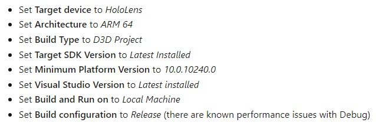

# HoloLens2 — Deployment su device

---

---

Vedi qui → [Exercise - Add hand interaction with object manipulator - Learn | Microsoft Docs](https://docs.microsoft.com/en-us/learn/modules/learn-mrtk-tutorials/1-7-exercise-hand-interaction-with-objectmanipulator)

Altra guida da tenere d’occhio → [https://docs.microsoft.com/en-us/windows/mixed-reality/develop/advanced-concepts/using-visual-studio?tabs=hl2](https://docs.microsoft.com/en-us/windows/mixed-reality/develop/advanced-concepts/using-visual-studio?tabs=hl2)

---

# Prima di tutto — Build su Unity

1. file > build settings
2. aggiungi tutte le scene da compilare nella build list
3. seleziona UWP
4. Configurazione per HoloLens2:
    
    
    
5. click su build, seleziona la folder e aspetta che Unity abbia terminato il build process

L’appllicazione la trovi nella cartella selezionata per il build

# Deploy su HoloLens2 via USB

<aside>
👆 conviene usare questo tipo di deploy, a meno di non essere a casa.

</aside>

<aside>
⚠️ ricorda prima di fare il pairing tra HoloLens2 e il PC, altrimenti il processo di deploy termina con un errore di timeout.

</aside>

1. assicurati che il dispositivo sia acceso e di aver fatto login
2.  **fai il build del progetto** 
    
    Seleziona la cartella dove fare build subito dopo aver premuto sul pulsante build. Il processo di build non crea l’applicazione da piazzare su HoloLens2, ma bensì un progetto C# in Visual Studio. 
    
    Anche per progetti semplici, il build dura qualche minuto. In genere, al termine del build la cartella appare così:
    
    
    
    Quella indicata è la soluzione da aprire in VS
    
3. nella cartella, apri la prima Solution che trovi in VS (si chiama come il progetto)
4. Configura le impostazioni di building in VS con: master, ARM64, Device
    
    
    
    Nota bene: *devi fare buid su ARM64 e non su ARM e basta.* 
    
    
    
    Il processo di compilazione dichiede un sacco di tempo, ed ‘ pesantissimo anche usando un PC con prestazioni elevate. 
    
5. Debug > Start Without Debugging
    
    Il processo di compilazione dura un po’. Per vedere l’output relativo alla fase di Deploy usa il dropdown sopra la console:
    
    
    

# Deployment su HoloLens2 via WiFi

La procedura da seguire è molto simile a quella per il deployment via USB, con la semplice differenza che bisogna dare esplicitamente l’IP del dispositivo al compilatore oltre a fare anche il pairing. 

1. assicurati che il dispositivo sia acceso e di aver fatto login
2.  **fai il build del progetto su Unity**
3. nella cartella, apri la prima Solution che trovi in VS (si chiama come il progetto)
4. Configura le impostazioni di building in VS con: master, ARM64, ***Remote***
5. Adesso bisogna dire a Visual Studio dove si trova il dispositivo nella rete. 
    
    Nel solutio explorer, l’indicatore del progetto, …
    
    
    
    … tasto destro mouse, in fondo troverai le *Properties*
    
    
    
    Un altro modo per raggiungere lo stesso menù è
    
    
    
    … scheda Debugging, aggiungi l’ndirizzo IP del visore
    
    
    
    Nota anche la *Authentication Mode* che dovrebbe essere settata a *Universal* (dovrebbe trovarsi così di default)
    
6. Come prima, start without debugging
    - Output tipico in caso di successo
        
        ```
        Bootstrapping for deployment, version 4.
        BootstrapAsync-Deploying: START
        Bootstrapping the deployment target.
        	Bootstrapping.Target = PII(192.168.1.88)
        	DeviceConfiguration/GetDevice/Name
        		Caller = SshDeviceProvider
        		Name = 192.168.1.88
        		DeviceFound = False
        ConnectTo-Device: START
        Connecting to the device '192.168.1.88'.
        Connecting to the device '192.168.1.88' using SSH.
        Device/Connecting: START
        Connected to the device '192.168.1.88'.
        	DeviceConfiguration/GetDevice/Name
        		Caller = SshDeviceProvider
        		Name = 192.168.1.88
        		DeviceFound = False
        Project architecture: ARM64
        Target processor architecture: ARM64
        Target supported architectures: ARM64,ARM
        Device/Connecting: END (Success, 0:00:01.438)
        ConnectTo-Device: END (Success, 0:00:01.438)
        Download-Packages: START
        Deploying packages.
        Bootstrapping/DeployingPackages: START
        Deploying packages.
        	ToolsPackageConfiguration/GetToolsPackage
        		PackageId = eb22551a-7f66-465f-b53f-e5aba0c0574e
        		Architecture = Arm64
        		PackageFound = True
        	ToolsPackageConfiguration/GetToolsPackage
        		PackageId = 62b807e2-6539-46fb-8d67-a73dc9499940
        		Architecture = Arm64
        		PackageFound = True
        	ToolsPackageConfiguration/GetToolsPackage
        		PackageId = 98e13d7b-2ac3-4b11-bbeb-758ad8bd607a
        		Architecture = Arm64
        		PackageFound = True
        	ToolsPackageConfiguration/GetToolsPackage
        		PackageId = 9093ee4a-01e5-44ed-9214-0b4d15023fde
        		Architecture = Arm64
        		PackageFound = True
        	ToolsPackageConfiguration/GetToolsPackage
        		PackageId = b968cc6a-d2c8-4197-88e3-11662042c291
        		Architecture = Arm64
        		PackageFound = True
        	ToolsPackageConfiguration/GetToolsPackage
        		PackageId = 57e8cc1f-36e5-41b7-972f-80e4f1016bfc
        		Architecture = Arm64
        		PackageFound = True
        	ToolsPackageConfiguration/GetToolsPackage
        		PackageId = cc6587b3-a749-4158-989f-1c3bb2b234f5
        		Architecture = Arm64
        		PackageFound = True
        	ToolsPackageConfiguration/GetToolsPackage
        		PackageId = e0999a8f-0200-4738-ae1e-b45742be6b6b
        		Architecture = Arm64
        		PackageFound = True
        Device/CompressPackageFiles: START
        Compressing 222 package files
        Device/CompressPackageFiles: END (Success, 0:00:01.799)
        Device/CopyingCompressedPackages: START
        Copying compressed packages to remote device
        Device/CopyingCompressedPackages: END (Success, 0:00:36.071)
        Device/UnzipFileOnDevice: START
        Uncompressing packages on remote device
        Unzipping files on device with command: LaunchForDeploy "C:\Data\Users\DefaultAccount\AppData\Local\DevelopmentFiles\VisualStudio\16.11\arm64\TailoredDeploy.exe" "/_u C:\Data\Users\DefaultAccount\AppData\Local\DevelopmentFiles\VisualStudio\16.11\RemoteDevTools.313252263.ARM64.zip C:\Data\Users\DefaultAccount\AppData\Local\DevelopmentFiles\VisualStudio\16.11 /_se Global\abc0f05f-4cc5-44e8-b628-6d9520715dc8" Global\abc0f05f-4cc5-44e8-b628-6d9520715dc8
        Device/UnzipFileOnDevice: END (Success, 0:00:03.866)
        Bootstrapping/DeployingPackages: END (Success, 0:00:43.665)
        Download-Packages: END (Success, 0:00:43.665)
        Bootstrapping/StartingRemoteDebugger: START
        Starting remote debugger.
        Launching remote debugger with the following command: 'DevToolsLauncher.exe LaunchForDeploy "C:\Data\Users\DefaultAccount\AppData\Local\DevelopmentFiles\VisualStudio\16.11\ARM64\msvsmon.exe" "/nowowwarn /noauth /anyuser /nosecuritywarn /__dbgautolaunch /port:8116 /LaunchCompleteEventName:Global\76530050-a11e-4ec2-9907-7b285879805b" Global\76530050-a11e-4ec2-9907-7b285879805b'
        Device endpoint: 192.168.1.88:8116
        Bootstrapping/StartingRemoteDebugger: END (Success, 0:00:00.329)
        BootstrapAsync-Deploying: END (Success, 0:00:45.591)
        Bootstrapping complete (0:00:45.637).
        Starting remote deployment...
        Target/CreateAsync: START
        	TargetDescription = PII(192.168.1.88)
        	Type = RemoteDevice
        Target/CreateAsync: END (Success, 0:00:00)
        Deploy: START
        	Bootstrapping.Target = PII(192.168.1.88)
        	Target.OSMajor = 10
        	Target.OSMinor = 0
        	Target.OSBuildNumber = 20348
        	Target.ProcessorArchitecture = ARM64
        	Target.UapVersion = 10.0.20348
        	BootstrappingSucceed = True
        	TimeToBootstrapping = 45637
        	CorrelationVector = w/0zccXx4ky+2ZBnIlZNWA.0
        	RemoteTargetInfo.DevFilesShareName = 
        	RemoteTargetInfo.DeviceFamily = Windows.Holographic
        	RemoteTargetInfo.DevToolsPath = C:\Data\Users\DefaultAccount\AppData\Local\DevelopmentFiles
        	RemoteTargetInfo.ProcessorArchitecture = ARM64
        	RemoteTargetInfo.SupportedProtocols = SSH
        	RemoteTargetInfo.SupportsNewPipeline = True
        	DeploymentOptions.RegisterFromNetwork = False
        	DeploymentOptions.RemoveNonLayoutFiles = False
        DeployAsync: START
        Reading package recipe file "C:\shared\UnityHoloLens2\HoloLens2HandsOn\build\build\bin\ARM64\Release\HoloLens2HandsOn.build.appxrecipe"...
        Executing: DevToolsLauncher.exe LaunchForDeploy C:\Data\Users\DefaultAccount\AppData\Local\DevelopmentFiles\VisualStudio\16.11\ARM64\TailoredDeploy.exe "WriteOutputToFile \\.\pipe\td_15b3e2e5-67fb-4f4d-91d9-58985c105193 /xml GetLayoutState HoloLens2HandsOn|VS.Release_ARM64.Canfresco|CN=DefaultCompany|C:\Data\Users\DefaultAccount\AppData\Local\DevelopmentFiles\HoloLens2HandsOnVS.Release_ARM64.Canfresco GetInstalledFrameworks GetRemoteDebuggerVersions C:\Data\Users\DefaultAccount\AppData\Local\DevelopmentFiles" \\.\pipe\td_15b3e2e5-67fb-4f4d-91d9-58985c105193
        	Target.MachineClientId = 1C8A56B6-438A-4549-A340-2BDF7679E626
        	RemoteDebuggerVersions = 16.10;16.11;16.8;16.9
        Remote deployment layout folder location: "C:\Data\Users\DefaultAccount\AppData\Local\DevelopmentFiles\HoloLens2HandsOnVS.Release_ARM64.Canfresco"
        Comparing with new recipe: 'C:\shared\UnityHoloLens2\HoloLens2HandsOn\build\build\bin\ARM64\Release\HoloLens2HandsOn.build.appxrecipe'
        File unchanged: 'C:\shared\UnityHoloLens2\HoloLens2HandsOn\build\build\bin\ARM64\Release\HoloLens2HandsOn.exe', timestamp: '2022-05-21T09:11:36.368'
        File unchanged: 'C:\Program Files\Unity\Hub\Editor\2020.3.30f1\Editor\Data\PlaybackEngines\MetroSupport\Players\UAP\il2cpp\ARM64\Release\UnityPlayer.winmd', timestamp: '2022-02-15T00:03:46.000'
        File unchanged: 'C:\Program Files\Unity\Hub\Editor\2020.3.30f1\Editor\Data\PlaybackEngines\MetroSupport\Players\UAP\il2cpp\ARM64\Release\UnityPlayer.dll', timestamp: '2022-02-15T00:03:46.000'
        File unchanged: 'C:\shared\UnityHoloLens2\HoloLens2HandsOn\build\build\bin\ARM64\Release\HoloLens2HandsOn.winmd', timestamp: '2022-05-21T09:11:36.273'
        File unchanged: 'C:\shared\UnityHoloLens2\HoloLens2HandsOn\build\HoloLens2HandsOn\Assets\SplashScreen.scale-200.png', timestamp: '2022-02-14T23:30:06.000'
        File unchanged: 'C:\shared\UnityHoloLens2\HoloLens2HandsOn\build\HoloLens2HandsOn\Assets\Square150x150Logo.scale-200.png', timestamp: '2022-02-14T23:30:06.000'
        File unchanged: 'C:\shared\UnityHoloLens2\HoloLens2HandsOn\build\HoloLens2HandsOn\Assets\Square44x44Logo.scale-200.png', timestamp: '2022-02-14T23:30:06.000'
        File unchanged: 'C:\shared\UnityHoloLens2\HoloLens2HandsOn\build\HoloLens2HandsOn\Assets\Square44x44Logo.targetsize-24.png', timestamp: '2022-02-14T23:30:06.000'
        File unchanged: 'C:\shared\UnityHoloLens2\HoloLens2HandsOn\build\HoloLens2HandsOn\Assets\Square44x44Logo.targetsize-24_altform-unplated.png', timestamp: '2022-02-14T23:30:06.000'
        File unchanged: 'C:\shared\UnityHoloLens2\HoloLens2HandsOn\build\HoloLens2HandsOn\Assets\StoreLogo.png', timestamp: '2022-02-14T23:30:06.000'
        File unchanged: 'C:\shared\UnityHoloLens2\HoloLens2HandsOn\build\HoloLens2HandsOn\Assets\Wide310x150Logo.scale-200.png', timestamp: '2022-02-14T23:30:06.000'
        File unchanged: 'C:\shared\UnityHoloLens2\HoloLens2HandsOn\build\HoloLens2HandsOn\StoreManifest.xml', timestamp: '2022-05-21T08:58:56.175'
        File unchanged: 'C:\shared\UnityHoloLens2\HoloLens2HandsOn\build\HoloLens2HandsOn\Data\il2cpp_data\etc\mono\mconfig\config.xml', timestamp: '2022-02-14T23:34:32.000'
        File unchanged: 'C:\shared\UnityHoloLens2\HoloLens2HandsOn\build\HoloLens2HandsOn\Data\boot.config', timestamp: '2022-05-21T08:58:54.571'
        File unchanged: 'C:\shared\UnityHoloLens2\HoloLens2HandsOn\build\HoloLens2HandsOn\Data\il2cpp_data\etc\mono\2.0\machine.config', timestamp: '2022-02-14T23:34:32.000'
        File unchanged: 'C:\shared\UnityHoloLens2\HoloLens2HandsOn\build\HoloLens2HandsOn\Data\il2cpp_data\etc\mono\2.0\web.config', timestamp: '2022-02-14T23:34:32.000'
        File unchanged: 'C:\shared\UnityHoloLens2\HoloLens2HandsOn\build\HoloLens2HandsOn\Data\il2cpp_data\etc\mono\4.0\machine.config', timestamp: '2022-02-14T23:34:32.000'
        File unchanged: 'C:\shared\UnityHoloLens2\HoloLens2HandsOn\build\HoloLens2HandsOn\Data\il2cpp_data\etc\mono\4.0\web.config', timestamp: '2022-02-14T23:34:32.000'
        File unchanged: 'C:\shared\UnityHoloLens2\HoloLens2HandsOn\build\HoloLens2HandsOn\Data\il2cpp_data\etc\mono\4.5\machine.config', timestamp: '2022-02-14T23:34:32.000'
        File unchanged: 'C:\shared\UnityHoloLens2\HoloLens2HandsOn\build\HoloLens2HandsOn\Data\il2cpp_data\etc\mono\4.5\web.config', timestamp: '2022-02-14T23:34:32.000'
        File unchanged: 'C:\shared\UnityHoloLens2\HoloLens2HandsOn\build\HoloLens2HandsOn\Data\globalgamemanagers', timestamp: '2022-05-21T08:58:00.523'
        File unchanged: 'C:\shared\UnityHoloLens2\HoloLens2HandsOn\build\HoloLens2HandsOn\Data\level0', timestamp: '2022-05-21T08:57:56.607'
        File unchanged: 'C:\shared\UnityHoloLens2\HoloLens2HandsOn\build\HoloLens2HandsOn\Data\il2cpp_data\etc\mono\config', timestamp: '2022-02-14T23:36:42.000'
        File unchanged: 'C:\shared\UnityHoloLens2\HoloLens2HandsOn\build\HoloLens2HandsOn\Data\Resources\unity default resources', timestamp: '2022-02-14T23:30:10.000'
        File unchanged: 'C:\shared\UnityHoloLens2\HoloLens2HandsOn\build\HoloLens2HandsOn\Data\Resources\unity_builtin_extra', timestamp: '2022-05-21T08:58:54.560'
        File unchanged: 'C:\shared\UnityHoloLens2\HoloLens2HandsOn\build\HoloLens2HandsOn\Data\globalgamemanagers.assets', timestamp: '2022-05-21T08:58:00.633'
        File unchanged: 'C:\shared\UnityHoloLens2\HoloLens2HandsOn\build\HoloLens2HandsOn\Data\resources.assets', timestamp: '2022-05-21T08:58:06.240'
        File unchanged: 'C:\shared\UnityHoloLens2\HoloLens2HandsOn\build\HoloLens2HandsOn\Data\sharedassets0.assets', timestamp: '2022-05-21T08:58:42.923'
        File unchanged: 'C:\shared\UnityHoloLens2\HoloLens2HandsOn\build\HoloLens2HandsOn\Data\level0.resS', timestamp: '2022-05-21T08:57:56.607'
        File unchanged: 'C:\shared\UnityHoloLens2\HoloLens2HandsOn\build\HoloLens2HandsOn\Data\resources.assets.resS', timestamp: '2022-05-21T08:58:06.240'
        File unchanged: 'C:\shared\UnityHoloLens2\HoloLens2HandsOn\build\HoloLens2HandsOn\Data\sharedassets0.assets.resS', timestamp: '2022-05-21T08:58:42.923'
        File unchanged: 'C:\shared\UnityHoloLens2\HoloLens2HandsOn\build\HoloLens2HandsOn\Data\nativePlugins.txt', timestamp: '2022-05-21T08:59:29.412'
        File unchanged: 'C:\shared\UnityHoloLens2\HoloLens2HandsOn\build\HoloLens2HandsOn\Data\RuntimeInitializeOnLoads.json', timestamp: '2022-05-21T08:57:26.230'
        File unchanged: 'C:\shared\UnityHoloLens2\HoloLens2HandsOn\build\HoloLens2HandsOn\Data\ScriptingAssemblies.json', timestamp: '2022-05-21T08:58:00.285'
        File unchanged: 'C:\shared\UnityHoloLens2\HoloLens2HandsOn\build\HoloLens2HandsOn\Data\UnitySubsystems\MicrosoftOpenXRPlugin\UnitySubsystemsManifest.json', timestamp: '2022-05-21T06:45:08.175'
        File unchanged: 'C:\shared\UnityHoloLens2\HoloLens2HandsOn\build\HoloLens2HandsOn\Data\UnitySubsystems\UnityOpenXR\UnitySubsystemsManifest.json', timestamp: '2022-02-14T23:36:50.000'
        File unchanged: 'C:\shared\UnityHoloLens2\HoloLens2HandsOn\build\HoloLens2HandsOn\Data\sharedassets0.resource', timestamp: '2022-05-21T08:58:42.891'
        File unchanged: 'C:\shared\UnityHoloLens2\HoloLens2HandsOn\build\HoloLens2HandsOn\Data\il2cpp_data\etc\mono\browscap.ini', timestamp: '2022-02-14T23:36:42.000'
        File unchanged: 'C:\shared\UnityHoloLens2\HoloLens2HandsOn\build\HoloLens2HandsOn\Data\il2cpp_data\etc\mono\2.0\DefaultWsdlHelpGenerator.aspx', timestamp: '2022-02-14T23:34:32.000'
        File unchanged: 'C:\shared\UnityHoloLens2\HoloLens2HandsOn\build\HoloLens2HandsOn\Data\il2cpp_data\etc\mono\4.0\DefaultWsdlHelpGenerator.aspx', timestamp: '2022-02-14T23:34:32.000'
        File unchanged: 'C:\shared\UnityHoloLens2\HoloLens2HandsOn\build\HoloLens2HandsOn\Data\il2cpp_data\etc\mono\4.5\DefaultWsdlHelpGenerator.aspx', timestamp: '2022-02-14T23:34:32.000'
        File unchanged: 'C:\shared\UnityHoloLens2\HoloLens2HandsOn\build\HoloLens2HandsOn\Data\il2cpp_data\etc\mono\2.0\settings.map', timestamp: '2022-02-14T23:34:32.000'
        File unchanged: 'C:\shared\UnityHoloLens2\HoloLens2HandsOn\build\HoloLens2HandsOn\Data\il2cpp_data\etc\mono\4.0\settings.map', timestamp: '2022-02-14T23:34:32.000'
        File unchanged: 'C:\shared\UnityHoloLens2\HoloLens2HandsOn\build\HoloLens2HandsOn\Data\il2cpp_data\etc\mono\4.5\settings.map', timestamp: '2022-02-14T23:34:32.000'
        File unchanged: 'C:\shared\UnityHoloLens2\HoloLens2HandsOn\build\HoloLens2HandsOn\Data\il2cpp_data\etc\mono\2.0\Browsers\Compat.browser', timestamp: '2022-02-14T23:34:32.000'
        File unchanged: 'C:\shared\UnityHoloLens2\HoloLens2HandsOn\build\HoloLens2HandsOn\Data\il2cpp_data\etc\mono\4.0\Browsers\Compat.browser', timestamp: '2022-02-14T23:34:32.000'
        File unchanged: 'C:\shared\UnityHoloLens2\HoloLens2HandsOn\build\HoloLens2HandsOn\Data\il2cpp_data\etc\mono\4.5\Browsers\Compat.browser', timestamp: '2022-02-14T23:34:32.000'
        File unchanged: 'C:\shared\UnityHoloLens2\HoloLens2HandsOn\build\HoloLens2HandsOn\Data\il2cpp_data\Metadata\global-metadata.dat', timestamp: '2022-05-21T08:59:24.578'
        File unchanged: 'C:\shared\UnityHoloLens2\HoloLens2HandsOn\build\HoloLens2HandsOn\Data\il2cpp_data\Resources\I18N.CJK.dll-resources.dat', timestamp: '2022-05-21T08:59:14.092'
        File unchanged: 'C:\shared\UnityHoloLens2\HoloLens2HandsOn\build\HoloLens2HandsOn\Data\il2cpp_data\Resources\mscorlib.dll-resources.dat', timestamp: '2022-05-21T08:59:14.092'
        File unchanged: 'C:\shared\UnityHoloLens2\HoloLens2HandsOn\build\HoloLens2HandsOn\UnityOpenXR.dll', timestamp: '2022-02-14T23:36:50.000'
        File unchanged: 'C:\shared\UnityHoloLens2\HoloLens2HandsOn\build\HoloLens2HandsOn\openxr_loader.dll', timestamp: '2022-02-14T23:36:50.000'
        File unchanged: 'C:\shared\UnityHoloLens2\HoloLens2HandsOn\build\HoloLens2HandsOn\MicrosoftOpenXRPlugin.dll', timestamp: '2022-05-21T06:45:08.175'
        File unchanged: 'C:\shared\UnityHoloLens2\HoloLens2HandsOn\build\build\bin\ARM64\Release\GameAssembly.dll', timestamp: '2022-05-21T09:11:33.395'
        File unchanged: 'C:\Program Files\Unity\Hub\Editor\2020.3.30f1\Editor\Data\PlaybackEngines\MetroSupport\Players\UAP\il2cpp\ARM64\Release\baselib.dll', timestamp: '2022-02-15T00:03:44.000'
        File unchanged: 'C:\shared\UnityHoloLens2\HoloLens2HandsOn\build\build\bin\ARM64\Release\resources.pri', timestamp: '2022-05-21T09:11:36.597'
        File unchanged: 'C:\shared\UnityHoloLens2\HoloLens2HandsOn\build\build\bin\ARM64\Release\AppxManifest.xml', timestamp: '2022-05-21T09:11:36.811'
        Updating the layout...
        RemoteDeployClient-DeployFilesAsync: START
        0.0% Copying: C:\Data\Users\DefaultAccount\AppData\Local\DevelopmentFiles\HoloLens2HandsOnVS.Release_ARM64.Canfresco\vs.appxrecipe
        100.0% Copying: C:\Data\Users\DefaultAccount\AppData\Local\DevelopmentFiles\HoloLens2HandsOnVS.Release_ARM64.Canfresco\vs.appxrecipe
        RemoteDeployClient-DeployFilesAsync: END (Success, 0:00:03.141)
        Checking whether required frameworks are installed...
        Framework: Microsoft.VCLibs.140.00/ARM. Skipping installation because framework package architecture does not match target architecture ARM64 and app package architecture ARM64.
        This app references Microsoft.VCLibs.140.00, version 14.0.30035.0, found in your SDK, but you have a higher version of Microsoft.VCLibs.140.00 installed on the target machine, 14.0.30704.0. If you continue to run this application, it will run against the currently installed version, Microsoft.VCLibs.140.00, version 14.0.30704.0. Consider updating your SDK to match the version of Microsoft.VCLibs.140.00 that is installed. 
        Framework: Microsoft.VCLibs.140.00/X64. Skipping installation because framework package architecture does not match target architecture ARM64 and app package architecture ARM64.
        Framework: Microsoft.VCLibs.140.00/X86. Skipping installation because framework package architecture does not match target architecture ARM64 and app package architecture ARM64.
        Registering the application to run from layout...
        RemoteDeployClient-RegisterApplicationFiles: START
        RemoteDeployClient-RegisterApplicationFiles: END (Success, 0:00:01.829)
        Executing: DevToolsLauncher.exe LaunchForDeploy C:\Data\Users\DefaultAccount\AppData\Local\DevelopmentFiles\VisualStudio\16.11\ARM64\TailoredDeploy.exe "WriteOutputToFile \\.\pipe\td_b7b92218-1665-416b-a40e-0a8b528230fe /xml GetLayoutState HoloLens2HandsOn|VS.Release_ARM64.Canfresco|CN=DefaultCompany|C:\Data\Users\DefaultAccount\AppData\Local\DevelopmentFiles\HoloLens2HandsOnVS.Release_ARM64.Canfresco GetRemoteDebuggerVersions C:\Data\Users\DefaultAccount\AppData\Local\DevelopmentFiles" \\.\pipe\td_b7b92218-1665-416b-a40e-0a8b528230fe
        	Target.MachineClientId = 1C8A56B6-438A-4549-A340-2BDF7679E626
        	RemoteDebuggerVersions = 16.10;16.11;16.8;16.9
        	PackageArchitecture = ARM64
        	TargetOSArchitecture = ARM64
        	IsOptionalProject = False
        	SolutionConfiguration = Release
        	SolutionPlatform = ARM64
        	Context.FileChanged = False
        	Context.InOtherLocation = False
        	Context.ManifestChanged = False
        	Context.Registered = False
        	Action.CleanReinstall = False
        	Action.Register = True
        	Action.UpdateLayout = False
        Deployment complete (0:00:08.555). Full package name: "HoloLens2HandsOn_1.0.0.0_arm64__pzq3xp76mxafg"
        	Target.DeviceFamily = Windows.Holographic
        	DeploymentSucceeded = True
        	TimeToDeploy = 8555
        	HasSharedCode = False
        	Target.Id = 1024
        	ProjectGuid = {2fabdf39-a3a3-4497-95ba-5aee089ebf0f}
        	Project.TargetPlatformVersion = 10.0.19041.0
        	Project.TargetPlatformMinVersion = 10.0.10240.0
        DeployAsync: END (Success, 0:00:08.629)
        Deploy: END (Success, 0:00:08.629)
        Bootstrapping for debugging, version 4.
        BootstrapAsync-Debugging: START
        Bootstrapping the deployment target.
        	Bootstrapping.Target = PII(192.168.1.88)
        	DeviceConfiguration/GetDevice/Name
        		Caller = SshDeviceProvider
        		Name = 192.168.1.88
        		DeviceFound = False
        ConnectTo-Device: START
        Connecting to the device '192.168.1.88'.
        Connecting to the device '192.168.1.88' using SSH.
        Device/Connecting: START
        Connected to the device '192.168.1.88'.
        	DeviceConfiguration/GetDevice/Name
        		Caller = SshDeviceProvider
        		Name = 192.168.1.88
        		DeviceFound = False
        Project architecture: ARM64
        Target processor architecture: ARM64
        Target supported architectures: ARM64,ARM
        Device/Connecting: END (Success, 0:00:00.522)
        ConnectTo-Device: END (Success, 0:00:00.522)
        Download-Packages: START
        Deploying packages.
        Download-Packages: END (Success, 0:00:00)
        Bootstrapping/StartingRemoteDebugger: START
        Starting remote debugger.
        Launching remote debugger with the following command: 'DevToolsLauncher.exe LaunchForDebug "C:\Data\Users\DefaultAccount\AppData\Local\DevelopmentFiles\VisualStudio\16.11\ARM64\msvsmon.exe" "/nowowwarn /noauth /anyuser /nosecuritywarn /__dbgautolaunch /port:8117 /LaunchCompleteEventName:Global\6dafb984-700e-4025-8d00-575d83811b59" HoloLens2HandsOn_pzq3xp76mxafg!App Global\6dafb984-700e-4025-8d00-575d83811b59'
        Device endpoint: 192.168.1.88:8117
        Bootstrapping/StartingRemoteDebugger: END (Success, 0:00:00.537)
        BootstrapAsync-Debugging: END (Success, 0:00:01.074)
        Bootstrapping complete (0:00:01.185).
        ```
        

# Possibili errori durante il Deployment

## timeout scaduto in deploy via USB — problema di pairing

Il testo di questo errore assomiglia a questo: il compilatore tenta di connettersi via SSH anche quando il dispositivo è collegato a USB, viene rilevato ma non si riesce a portare a termine la connessione. 

```
DEP6955: Timed out while attempting to connect to device '127.0.0.1' after '60' seconds.
```

La prima volta che fai deploy col dispositivo, non importa se via WiFi o via USB, devi fare pairing. 

Su HoloLens2 vai nelle impostazioni di sviluppatore e richiedi il pair, clicca su *Pair*. Non chiudere la schermata. 

da PC, all’inizio del deployment, viene richiesto il pin. Digita il PIN che appare su HoloLens2 e conferma. 

In caso si presentasse un problema di connessione (cose del tipo *timeout scaduto*) sempre su HoloLens2 nelle impostazioni di configurazione click su *Unpair All* e poi rifai il pairing come descritto sopra. 

## Ritrovare un precedente deployment

Ogni volta che fai deploy di un’applicazione da VS viene installata un’app che puoi ritrovare tra le app di HoloLens2 in start. 

Puoi anche disinstalalrla da HoloLens2, più o meno nella stessa maniera che useresti sul PC: vai nelle impostazioni, cerca l’app e rimuovila. 


---