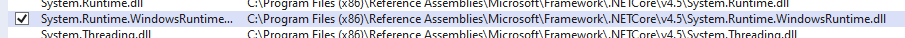

# UWP — Files e Storage in UWP

- ********created May 8, 2023 5:19 PM*
- getting started
- references
    - [Files, folders, and libraries - UWP applications | Microsoft Learn](https://learn.microsoft.com/en-us/windows/uwp/files/)
    - la classe fornisce vari puntatori a file e cartelle a cui l’applicazione è autorizzata ad accedere — [ApplicationData Class (Windows.Storage) - Windows UWP applications | Microsoft Learn](https://learn.microsoft.com/en-us/uwp/api/windows.storage.applicationdata?view=winrt-22621)
    - file access permissions — [File access permissions - UWP applications | Microsoft Learn](https://learn.microsoft.com/en-us/windows/uwp/files/file-access-permissions)
        
        ***************contiene una lista di tutte le cartelle a cui è possibile accedere.*************** 
        
- guide online
- troubleshooting
    - un errore piuttosto fastidioso che capita sull’app di test — [[Universal 10] The type 'X' exists in both 'Windows.Foundation.UniversalApiContract' and 'Windows' - Unity Forum](https://forum.unity.com/threads/universal-10-the-type-x-exists-in-both-windows-foundation-universalapicontract-and-windows.383791/)
        
        
        
        
        
        (*********************alla fine ho dovuo rifare da capo il progetto console…*********************)
        
- folklore

---

---

## Capabilities e folders accessibili

<aside>
⚠️ *************************NOTA BENE: ci sono delle capabilities che Unity non mostra. Per potervi accedere, bisogna usare Visual Studio direttamente: si può modificare direttamente il manifest della build aggiungendo i permessi mancanti. Oppure c’è il modo di farlo direttamente dal VS con Unity ma non ho capito come si faccia.*************************

</aside>

🔗 per maggiori informazioni, vedi la pagina — [File access permissions - UWP applications | Microsoft Learn](https://learn.microsoft.com/en-us/windows/uwp/files/file-access-permissions)

🔗 tutte le possibili capabilities — [App capability declarations - UWP applications | Microsoft Learn](https://learn.microsoft.com/en-us/windows/uwp/packaging/app-capability-declarations)

### AppData - LocalFolder

<aside>
💡 *In mancanza di motivazioni specifiche, usa sempre questa folder specifica.*

</aside>

- lettura e scrittura
- CAPABILITIES — nessuna
- maggiori informazioni qui — [Store and retrieve settings and other app data - Windows apps | Microsoft Learn](https://learn.microsoft.com/en-us/windows/apps/design/app-settings/store-and-retrieve-app-data#local-app-data)

```
StorageFolder localFolder = ApplicationData.Current.LocalFolder;
```

Un file in LocalFolder lo puoi ritrovare a questo percorso:


### AppData - Temporary Folder

- lettura e scrittura
- CAPABILITIES — nessuna
- accesso anche tramite URI `ms-appdata:///temp/`
    
    ```
    
    ```
    
- la cartella temporanea contiene informazioni utili durante la sessione, ma che possono essere anche eliminati non appena l’app viene chiusa. Infatti Windows ha tutta una serie di funzionalità per eliminare i file temporanei: *****************************************************************tutto quello che c’è in questa cartella viene eliminato quando tali funzionalità vengono eseguite.*****************************************************************
- maggiori informazioni qui — [ApplicationData.TemporaryFolder Property (Windows.Storage) - Windows UWP applications | Microsoft Learn](https://learn.microsoft.com/en-us/uwp/api/windows.storage.applicationdata.temporaryfolder?view=winrt-22621)
- anche qui, informazioni teoriche su questa cartella — [Store and retrieve settings and other app data - Windows apps | Microsoft Learn](https://learn.microsoft.com/en-us/windows/apps/design/app-settings/store-and-retrieve-app-data#temporary-app-data). Conferma il fatto che questa cartella va usata un po’ come una cache

```
StorageFolder localFolder = ApplicationData.Current.TemporaryFolder;
```

### Pictures

- CAPABILITY — `picturesLibrary`

```
StorageFolder storageFolder = KnownFolders.PicturesLibrary;
```

### Videos

- CAPABILITY — `videosLibrary`

```
StorageFolder storageFolder = KnownFolders.VideosLibrary;
```

### Music

- CAPABILITY — `musicLibrary`

```
StorageFolder storageFolder = KnownFolders.MusicLibrary;
```

### Universal Access Capability

non può essere aggiunta da Unity: bisogna richiederla direttamente a Visual Studio.

```
<Capabilities>
    <rescap:Capability Name="broadFileSystemAccess" />
</Capabilities>
```

### Documenti

- lettura e scrittura
- *********************************In Unity non è possibile selezionare questa capability.********************************* Bisogna farlo direttamente da Visual Studio.
- CAPABILITY — `documentsLibrary`
- **********occorre specificare nel manifest quali formati l’app è autorizzata ad utilizzare (???)**********

```
StorageFolder storageFolder = KnownFolders.DocumentsLibrary;
```

### Download folder

- read e write
- CAPABILITY — nessuna richiesta specifica
- Nota bene: l’app ha accesso ai soli file che l’app ha creato all’interno di questa cartella, quindi ad esempio non può accedere a file creati da altre app a meno di non usare un FilePicker o FolderPicker
- vi si accede tramite oggetto globale `DownloadsFolder` (nota che, se tenti di usarlo come una `StorageFolder`, C# si incazza)

```
using Windows.Storage;

// nuovo file
StorageFile newFile = await DownloadsFolder.CreateFileAsync("file.txt");

// nuova folder
StorageFolder newFolder = await DownloadsFolder.CreateFolderAsync("New Folder");
```

### ❌ AppData - Roaming

- obsoleta in Win11 e successivi
- lettura e scrittura
- **********************************************************ci sono restrizioni sui nomi dei file in questa cartella.**********************************************************
- maggiori informazioni qui — [ApplicationData.RoamingFolder Property (Windows.Storage) - Windows UWP applications | Microsoft Learn](https://learn.microsoft.com/en-us/uwp/api/windows.storage.applicationdata.roamingfolder?view=winrt-22621)
- altre informazioni riguardo il significato di questa convenzione — [Store and retrieve settings and other app data - Windows apps | Microsoft Learn](https://learn.microsoft.com/en-us/windows/apps/design/app-settings/store-and-retrieve-app-data#roaming-data) . Il senso è che questa cartella serve a contenere file che possono potenzialmente essere scambiati con altri device.
- vedi anche — [Store and retrieve settings and other app data - Windows apps | Microsoft Learn](https://learn.microsoft.com/en-us/windows/apps/design/app-settings/store-and-retrieve-app-data#roaming-data-dos-and-donts)

```
StorageFolder localFolder = ApplicationData.Current.RoamingFolder;
```

---

## Files e folders in UWP

Modialità di utilizzo:

- non è necessario richiedere la capability: basta impostarla nel manifest e stop

### Librerie

```csharp
// set minimo di librerie 
using System;
// using System.Collections;
using System.Collections.Generic;
// using System.Threading.Tasks;

#if WINDOWS_UWP
using Windows.Foundation;
using Windows.Storage;
using Windows.Storage.Streams;
#endif
```

### Accesso non autorizzato - eccezione

E’ solo una verifica. Non è necessario accedere alla capability, comunque è sempre meglio verificare. 

cosa succede se non sono autorizzato ad accedere ad una determinata folder? qquesto:


[try-catch - C# Reference | Microsoft Learn](https://learn.microsoft.com/en-us/dotnet/csharp/language-reference/keywords/try-catch)

```csharp
// se non sei autorizzato, lo sai già dall'istanziazione al puntatore alla cartella
//    alla quale stai tentando di accedere
StorageFolder storageFolder;
try
{
    storageFolder = KnownFolders.PicturesLibrary;
    // storageFolder = ApplicationData.Current.LocalFolder;
}
catch (System.UnauthorizedAccessException e)
{
    Console.WriteLine("ERROR: unauthorized!");
    Console.ReadKey();
    return;
}
```

Il pattern tipico per capire se si è autorizzati o meno non richiede nemmeno una procedura asincrona: basta richiamare quel campo, il che solleverà eccezione nel caso non si sia autorizzati a fare quell’accesso:

```
try
{
    StorageFolder sf = ApplicationData.Current.LocalFolder;
}
catch (System.UnauthorizedAccessException)
{
    Debug.LogWarning($"ERROR: Unauthorized to access folder '{sf.ToString()}'");
    return;
}
```

### Listare file e cartelle

```csharp
StorageFolder storageFolder = ApplicationData.Current.LocalFolder;

// lista folders
Console.WriteLine("List of Files:");
IReadOnlyList<StorageFile> fileList = storageFolder.GetFilesAsync().AsTask().GetAwaiter().GetResult();
foreach (StorageFile file in fileList)
    Console.WriteLine($"{file.Name}\n->\t{file.Path}");

// lista files
Console.WriteLine("List of Folders:");
IReadOnlyList<StorageFolder> dirList = storageFolder.GetFoldersAsync().AsTask().GetAwaiter().GetResult();
foreach (StorageFolder dir in dirList)
    Console.WriteLine($"{dir.Name}\n->\t{dir.Path}");

// lista mista file e cartelle (più efficiente?)
IReadOnlyList<IStorageItem> itemsList = storageFolder.GetItemsAsync().AsTask().GetAwaiter().GetResult();
foreach (var item in itemsList)
    if (item is StorageFolder)
        Console.WriteLine($"[FILE] {item.Name}\n->\t{item.Path}");
    else
        Console.WriteLine($"[FOLDER] {item.Name}\n->\t{item.Path}");
```

### Creare un file

[Create, write, and read a file - UWP applications | Microsoft Learn](https://learn.microsoft.com/en-us/windows/uwp/files/quickstart-reading-and-writing-files)

[CreationCollisionOption Enum (Windows.Storage) - Windows UWP applications | Microsoft Learn](https://learn.microsoft.com/en-us/uwp/api/windows.storage.creationcollisionoption?view=winrt-22621)

```csharp
// dato un riferimento di cartella
StorageFolder storageFolder = ApplicationData.Current.LocalFolder;

// creare un nuovo file
string filename = "sample.txt";
CreationCollisionOption mode = CreationCollisionOption.ReplaceExisting;
StorageFile fil = storageFolder.CreateFileAsync( filename, mode ).AsTask().GetAwaiter().GetResult();

// crea se non esiste, altrimenti lancia eccezione
//    System.Exception
CreationCollisionOption mode = CreationCollisionOption.FailIfExists;

// Se esiste, genera un "nome unico" ('file' esiste? crea 'file (2)' ...uAu...)
CreationCollisionOption mode = CreationCollisionOption.GenerateUniqueName;

// se esiste, non crearne uno nuovo apri quello già esistente
CreationCollisionOption mode = CreationCollisionOption.OpenIfExists;

// sovrascrivi se esiste già
CreationCollisionOption mode = CreationCollisionOption.ReplaceExisting;
```

### Scrittura su file

```csharp
// scrivere su un file di testo (sovrascrittura!)
FileIO.WriteTextAsync(fil, "txt content").AsTask().GetAwaiter().GetResult(); 
// usa StringBuffer!

// per poter andare in apped su un file c'è il metodo
FileIO.AppendTextAsync(fil, "txt content").AsTask().GetAwaiter().GetResult(); 
```

```csharp
// per evitare problemi di performance conviene scrivere sul file usando uno stream
IRandomAccessStream stream = fil.OpenAsync(FileAccessMode.ReadWrite).AsTask().GetAwaiter().GetResult();
IOutputStream outputStream = stream.GetOutputStreamAt(0);
DataWriter wr = new DataWriter(outputStream);

// per scrivere
wr.WriteString("Tanto lavoro e niente svago rendono Jack un ragazzo annoiato.\n");
wr.StoreAsync().AsTask().GetAwaiter().GetResult();
outputStream.FlushAsync().AsTask().GetAwaiter().GetResult();

// una volta che lo stream non serve più
ouputStream.Dispose();
stream.Dispose();
```

### Leggere un file

```csharp
// dato un riferimento di cartella
StorageFolder storageFolder = ApplicationData.Current.LocalFolder;

// apri un file in lettura
string filename = "sample.txt";
StorageFile fil = storageFolder.GetFileAsync( filename, mode ).AsTask().GetAwaiter().GetResult();

// lettura semplice
string content = FileIO.ReadTextAsync(fil).AsTask().GetAwaiter().GetResult();
```

```csharp
// per la lettura conviene usare gli stream
var stream = fil.OpenAsync(FileAccessMode.Read).AsTask().GetAwaiter().GetResult();
ulong size = stream.Size;
var inputStream = stream.GetInputStreamAt(0)
var dataReader = new Windows.Storage.Streams.DataReader(inputStream)

// e qui la lettura vera e propria (assurdo...)
uint numBytesLoaded = await dataReader.LoadAsync((uint)size);
string text = dataReader.ReadString(numBytesLoaded);

inputStream.Dispose();
stream.Dispose();
```

---

## (Sempre utili) nomi file con timestamp

[formatting - C# convert int to string with padding zeros? - Stack Overflow](https://stackoverflow.com/questions/4325267/c-sharp-convert-int-to-string-with-padding-zeros)

```csharp
DateTime ts = DateTime.Now;

// senza padding
FileNameFinal = $"{LogFileName}_{ts.Year}{ts.Month}{ts.Day}_{ts.Hour}{ts.Minute}{ts.Second}.{LogFileFormat}";

// con padding
FileNameFinal = $"{LogFileName}_{ts.Year:0000}{ts.Month:00}{ts.Day:00}_{ts.Hour:00}{ts.Minute:00}{ts.Second:00}.{LogFileFormat}";

// con padding rimpiazzando con trattini eventuali spazi
FileNameFinal = $"{LogFileName.Replace(" ", "-")}_{ts.Year:0000}{ts.Month:00}{ts.Day:00}_{ts.Hour:00}{ts.Minute:00}{ts.Second:00}.{LogFileFormat}";
```

---

---