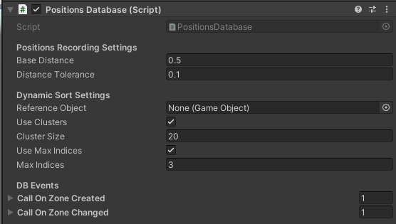

# @July 3, 2023 — PERCORSO — unire la raccolta posizioni alla minimappa

- ********created July 3, 2023 8:33 PM*
- getting started
- references
- altre guide
- troubleshooting
- folklore

---

---

## Breve sunto delle features del DB

— inserimento e tracciamento

- inserimento in base alla distanza
    
    non in base al tempo, ma in base alla distanza rispetto alla zona nota
    
- tracciamento dei percorsi effettivamente seguiti dall’utente
    
    questo serve per riconoscere anche le zone in cui si può camminare
    

— indicizzazione

- ordinamento delle posizioni in base alla posizione corrente di un certo oggetto nello spazio
    
    viene fatto con un approccio di ordinamento greedy (dynamic sort multi indice)
    

— gestione della topologia

- scomposizione dello spazio in zone, vale a dire punti centrali con un raggio attorno
- modello a grafo delle posizioni
- possibilità di legare una posizione ad un determinato oggetto, ******************rendendo così la topologia manipolabile******************

—

## Diario di lavoro

E’ importante non solo registrare le posizioni, ma anche metterle a disposizione dell’utente in modo che questi possa anche eventualmente fare qualche correzione sulla posizione registrata. L’biettivo qui è di creare un piccolo sistema di visualizzazione dei markers, con visualizzazione degli archi annessi, e rendere i markers manipolabili oltre che visualizzarli. E’ un lavoro che in gran parte ho già fatto, infatti qualche asset ce l’ho già. Procediamo passo per passo. 

1. innanzitutto, il tuning del database.
    
    facciamo qualche prova, vorrei scegliere un tuning che mi garantisca buone performances. 
    
    Modifico prima lo script di test in modo da contare dinamicamente inserimenti e change di zona. (tolgo anche la visualizzazione dal DB, in modo da alleggerire il tutto)
    
    con questa regge piuttosto bene. Secondo me posso anche aumentare le dimensioni del cluster.
    
    
    
2. ora la visualizzazione. Che abbiamo di già pronto?
    
    Abbiamo questo piccolo marker già pronto ad esempio. Ne avrò fatti a migliaia di markers già pronti, e queso è abbastanza caruccio. 
    
    
    
    Nasce già col suo piccolo script builder (sembra piuttosto standard). Lo potrei modificare per renderlo manipolabile. La tentazione sarebbe quella di fare la cosa più avanti, ma in effetti non vorrei tornare indietro. 
    
3. e quindi rendiamo questo piccolo oggettino manipolabile
    
    Per renderlo manipolabile, semplicemente lo duplico e gli aggiungo un grabbable. 
    
    *********************************************ma come si rendeva un oggetto manipolabile???********************************************* Figurati ricordare le basi… 
    
    ma oviamente con un object manipulator (e sennò utta questa buona palata di appunti che la prendo a fare????)
    
    
    
    Il risultato è abbastanza carino, praticamente a sforzo zero:
    
    
    
    come ultimo passo, anche per questo serve il suo builder. 
    
4. ora che il mio bellissimo grabbable ce l’ho, passiamo a creare uno script che ad ogni inserimento crea un marker
    
    una cosa veramente molto basilare. Grossomodo è un copia incolla dello script che conta le hit e le miss sul database. 
    
    Una cosa molto semplice e poco realistica: semplicemente quando viene ricevuta una nova posizione, si procede a visualizzarla andando a prendere dalla posizione creata … ***************************l’esattoo contrario di quello che voglio***************************, ma per il momento mi basta solo che funzioni così. Un passo alla volta. 
    
    E dopo qualche bestemmia sulle posizioni, ecco i nostri magnifici markers. 
    
5. ora, voglio essere in grado di modificare la posizione sul database quando il marker viene mosso. 
    
    Per fare questo, prima piazzo il marker con la posizione che mi ritrovo nel database, **************************************************poi assegno alla position il reference al marker.************************************************** 
    
    anche qui più facile a dirsi che a farsi, perchè l’oggetto non viene istanziato nello stesso momento in cui lavoro… per creare l’oggetto bisogna *******************usare una coroutine******************* purtroppo:
    
    1. creazione dell’oggetto
    2. ************attendo un frame************
    3. e faccio gli ultimi settaggi
    
    Non difficile, ma onestamente è una rottura di minchia. Tipo una cosa del genere, solo la corotine:
    
    ```
    private IEnumerator BSCOR_SpawnMarker()
    {
        yield return null;
    
        PositionDatabaseWaypoint pos = DatabaseReference.DataZoneCreated;
        spawner.InitName = "ID" + pos.PositionID.ToString("000");
        spawner.InitPosition = pos.AreaCenter;
        Debug.Log(pos);
        Debug.Log(pos.AreaCenter);
        spawner.Build();
    
        yield return new WaitForEndOfFrame();
    
        pos.ObjectCenterReference = spawner.GetLastSpawned().gameObject;
    }
    ```
    
    conta che possono arrivare diverse richieste, perciò sarà necessario ******************metterle in coda.****************** 
    
    Metto anche un avviso quando la posizione interna viene alterata. 
    
    e dopo aver bestemmiato giusto un pochino, ecco che ora abbamo le nostre posizioni manipolabili.
    
    
    
6. Prima di andare avanti a fare cose più complesse, vorrei provare a creare la feature che crea una nuova linea che rappresenta l’arco
    
    Anzitutto, dovrei avere da qualche parte lo script per disegnare dinamicamente una linea tra due punti. 
    
    E infatti guardalo lì, il mio bel flexible line renderer.
    
    
    
    Dentro ha una struttura veramente essenziale: oggetto 1, oggetto 2, e va bene così. 
    
    Ora, io voglio dare all’arco la possibilità di gestire il fatto che dev’essere disegnato, ma ho anche molta libertà in termini di oggetto che realizza la linea. Perciò, posso far ecosì:
    
    - l’arco ha un flag (getter) che indica se il riferimento ad un monobehaviour c’è, e iene in memoria un component generico. Sta poi a chi usa l’arco ricordare quale oggetto sta disegnando l’arco
    - tutto il resto sta al nodo che implementa l’arco
    
    Questa cosa è piuttosto pericolosa. Per far funzionare l’esempio va bene, ***************************************************ma tieni conto del fatto che non è obbligatorio che una posizione abbia una rappresentazione.***************************************************
    
    ```
    PositionDatabasePath link = pos.GetPathTo(DatabaseReference.CurrentZone);
    if(!link.HasRenderer)
    {
        FlexibleLineRenderer lr = pos.ObjectCenterReference.AddComponent<FlexibleLineRenderer>();
        link.Renderer = lr;
        lr.Object1 = link.wp1.ObjectCenterReference;
        lr.Object2 = link.wp2.ObjectCenterReference;
    }
    ```
    
    ok, l’idea va un pochino sistemata, ma questa è alla fine. 
    
    
    
    *************Specifichiamo*************. In che modo può essere sistemata? 
    
    - Ad esempio lo spawner potrebbe essere un componente ufficiale, che applichi un controllo sensato sull’esistenza degli oggetti di riferimento.
    - Ogni linea è un potenziale update. Dovrei visualizzare meno markers alla volta, quindi andare su una feature simile a quella dell’ultima volta con esplorazione ei dintorni
    - tutti i markers devono essere istanziati al di sotto di un nodo che ne gestisca attivazione e disattivazione … ehi: ma io un componente del genere ce l’ho! Prende un ordinamento, ma in generale potrei anche creare un’opzione che gli dica di sbattersene dell’ordinamento
    - l’architettura va quindi su 3 livelli: il livello db, che comunica col livello spawner, che comiunica con un componente che gestisce tutti i markers
    
    **********************************************************e in tutto questo ancora della minimappa nessuna traccia.********************************************************** Vedi l’immagine sopra? Bene: tutta quella roba lì dovrà doventare minimappa. 
    
7. **rivediamo il minimap structure per avere un meccanismo di istanziazione degli oggetti trasparente alla logica di visualizzazione**
    
    <aside>
    💡 DEVO RIMETTERE A POSTO TUTTI I NOMI DEGLI SCRIPT! *****************Avrei preferito evitare di arrivare in questa situazione…*****************
    
    </aside>
    
    Il punto principale che limita la riutilizzabilità del componente è il fatto di essere costretti a riferirsi ad un certo oggetto nel database ********per riferimento diretto al GameObject******** e non ad un eventuale tag. Se io mi rivolgo ad un certo componente come gestore di allocazione, mi aspetto anche di non dover tenere io stesso il riferimento all’oggetto diretto, ma bensì di poter dare l’onere della conservazione degli oggetti al gestore.  
    
    *******Risolvere il problema è semplice*******: si usa un Dictionary. O magari un qualcosa che utilizzi n codice hash per accedere, in modo che la ricerca di un oggetto, se istanziato, risulti veloce. 
    
    ~~e infatti, guarda un po’ questa brutta copia di Java che cosa ha? un `Hashset<T>`~~
    
    - [~~HashSet<T> Class (System.Collections.Generic) | Microsoft Learn~~](https://learn.microsoft.com/en-us/dotnet/api/system.collections.generic.hashset-1?view=net-7.0)
    
    ~~(tra l’altro, con un po’ di pazienza ci sarebbe veramente un sacco da studiare MA non c’è abbastanza tempo)~~
    
    <aside>
    💡 L’hashset è un set per l’appunto… mi serve un dictionary in questo caso
    
    </aside>
    
    - dopo aver creato un ~~hashset~~ dictionary che funga da indicizzazione
    - serve rivedere i metodi in modo che il tracciare un oggetto equivalga anche a taggarlo
    - gli oggetti non taggati semplicemente non vengono tracciati ad indice. E una soluzione migliore secondo me rispetto all’assegnare un indice a caso, che non si sa bene mai da dove arrivi ne si riesce a recuperarlo facilmente
    - in generale se l’oggetto non è attivo, non fare nulla. Meglio gestire il comportamento di attivazione disattivazione nella maniera più semplice possibile.
    - nella Untrack, il fatto che venga dato un order criterion è più un suggerimento per capire se l’oggetto è stato tracciato o no. Nel metodo che gestisce il tracciamento dell’oggetto tramite stringa questo tipo di check diventa inutile
    - Non è detto che il rimuovere un oggetto dal tracciamento equivalga a volerlo disattivare. Per queso, anche untrack deve avere un’opzione riguardante la visualizzazione, o quanto meno un set active. Anche la hide deve essere trasparente rispetto a questo comportamento
    - Per le SHOW è del tutto normale che non ci sia un’opzione visualize. Per le HIDE la questione è leggermente diversa, poichè sono metodi utilizzati per fare anche rimozione di elementi dal set di visualizzazione. Ragion per cui le HIDE hanno anche un’opzione per gestire il setActive di un oggetto. Qunado un oggetto abbandona la lista di visualizzazione e viene pure rimosso dal tracciamento, allora puoi fare di quello ciò che vuoi. Altrimenti, se è nella lista d visualizzazione, ************deve essere attivo.************ Altrimenti questo check non serve a nulla.
    
    <aside>
    💡 In effetti c’era *****molto***** lavoro da fare… l’implementazione precedente era parecchio brutta, e a questo punto il tema della manutenzione del codice diventa importantissimo. Bisogna iniziare a pensare assolutamente alla qalità del codice e delle sue strutture, altrimenti perderò ancora giornate.
    
    </aside>
    
    - Adesso gli unici metodi accessibili sono quelli che lavorano per tag. Il riferimento al gameObject dall’esterno non solo è inutile il più delle volte, ma mi porta un po’ di sporcizia nell’interfaccia della classe
    - l’attuale implementazione si può usare sia per ordered che per unordered … il problema sta nel passaggio tra i due stati. In generale sarei tentato di impostare lo stato unordered al primo inserimento non ordinato. Meglio però definire un check, una funzione esplicita che indichi se sia possibile o no settare come ordered la struttura. Di default la è. L’utente dichiara il tipo di struttura all’inziio con un campo pubblico (e di default la struttura è ordered). Al primo inserimento ignorando l’ordine, se la struttura è dichiarata ordered, allora l’inserimento fallisce. O meglio: provo a trasformare la struttura, e se non ci riesco allora ciao, altrimenti la sruttura diventa unordered al primo inserimento.
    
    <aside>
    💡 Ora, il minimap structure è un componente che fornisce anche una funzionalità di gestione completa delle risorse. Il fatto di non essere legato ad una singola root da gestire permette di fare raggruppamenti di oggetti tracciati in maniera decisamente più dinamica
    
    </aside>
    
8. ora, ragioniamo. (tralascio i dettagli, per saltare subito ai punti salienti) ************************************************************creazione di una classe drawer************************************************************
    - bisogna rivedere lo script che istanzia i markers per fare uso delle coroutines per l’istanziazione di un oggetto.
    - bisogna costruire una classe ******drawer****** che fornisce logica di supporto ad altre logiche più ad alto livello per la visualizzazione di altri markers. Questa classe drawer conterrà un metodo che prende una coppia di punti e attiva l’arco tra essi compreso se c’è. Gestirà una eventuale visualizzazione di più tipi specifici di marker
    - occorre anche costruire un handle da assegnare ai markers, che contenga il riferimento al wayppoint rappresentato
    
    Investirei maggiore energia per il momento sulla classe drawer. In particolare, la principale difficoltà del gestire la classe drawer sarà quella di gestire un’istanziazione per job e poi per coroutine
    
9. ebbene, andiamo con questa classe Drawer, che ho chiamato banalmente `PathDrawer`. 
    
    Inizierei dallo svilupparne l’interfaccia, per poi implementare i metodi in seguito:
    
    - la classe si aggancia ad un visualizzatore tipo MinimapStrucure
    - per ragioni di necessità dovrà mantenere gli oggetti sotto un’unica radice, nonostante in realtà non ce ne sia necessità.
    - dovrà avere un metodo per deistanziare tutti gli oggetti al di sotto della radice (servirà una modifica minima al MinimapStructure)
    - e uno per tracciare un percorso tra due punti
    
    … fermi tutti. La faccenda è leggermente più complicata: 
    
    - come tengo traccia di cosa sto visualizzando? Perchè occhio che quando rimuovo un certo oggetto devo anche provvedere ad aggiornare la topologia in modo che non rimangano archi attivi. Quindi, dato il marker, prima di eliminarlo dovrò andare a vedere se tutti i suoi archi sono stati disattivati. L’idea è di tenere un component che gestisca in automatico questo genere di operazioni, perchè a questi ho già dato il riferimento alla posizione che sta visualizzando
    - mi ci vuole quindi per forza un handle da assegnare all’istanziazione del marker
    
    In realtà leggendo un po’ su internet non è nemmeno necessario avere un sistema di job: se faccio due volte startCoroutine sulla stessa funzione, lui lancia effettivamente due istanze di coroutine. Quindi da quel punto di vista, problema risolto
    
10. Mi sarebbe immensamente utile, prima di andare avanti, rivedere il metodo con cui viene istanziato un marker
    
    Perchè in fondo mi fa comodo avere un qualcosa che conosca i dettagli implementativi dell’oggetto di cui poco mi importa. 
    
    Posso anche modificare quello attualmente implementato. Quello che voglio fare è creare una funzione pubblica separata su cui possa fare `yield` altrove. Se proprio non posso modificare il fatto di dover usare delle coroutine, preferisco almeno poter trattare l’intero processo di spawning come un’unica coroutine, in modo da semplificare il codice. 
    
    (me lo segno — [Custom Messages | Unity Multiplayer Networking (unity3d.com)](https://docs-multiplayer.unity3d.com/netcode/current/advanced-topics/message-system/custom-messages/#:~:text=If%20you%20don%27t%20want,re%20unbound%20to%20any%20GameObject.) — l’idea nasce dal fatto di avere sugli handle degli elementi della minimappa un messaggio custom per propagare senza iterazione il fatto che l’oggetto sta per appartenere ad una minimappa)
    
    Più che rifare, mi sono limitato a fare una modifica
    
11. e passiamo ad implementare l’istanziazione. 
    
    Supponiamo il fatto che l’oggetto sia totalmente vuoto. Non c’è nulla ne di tracciato ne tanto meno nulla di visualizzato. 
    
    Il primo ID sarebbe zero. da questo posso assegnare un tag unico all’oggetto. Come mi ricordo dell’esistenza di questi ID? Stesso approvvio per il momento: definisco da qualche parte un set con tutti gli ID.
    
    Una cosa… ma mettiamo che capitasse che io quell’oggetto l’ho già istanziato, che è una cosa delttto probabile: pensando ad esempio alla feature che “dirama” le posizioni attorno alla mia attuale posizione, come potrei gestire questa cosa? Semplicemente la posizioe che sto tentando di istanziare avrà già un gameobject istanziato. E pensandoci bene, non è nemmeno una cosa che posso accettare, perchè se il punto iniziare è già istanziato va anche bene, *************************************************************ma se il punto finale è già stao istanziato, ho un problema.************************************************************* Anzi: il punto iniziale va bene solo se l’ho istanziato io! Altrimenti, attaccati. 
    
    per l’istanziazione seguo un metodo preciso. Per il singolo marker:
    
    1. lascio al builder l’onere di costruire l’oggetto con una Yield
    2. assegno il nome
    3. e la radice
    4. il punto deve rappresentare la posizione che gli assegno
    5. e tengo traccia dell’oggetto nel database (unordered)
    6. PIù se lo voglio rendere capace di usare la propria posizione
    
    Una volta che ho entrambe le posizioni istanziate, istanzio il link tra queste. 
    
    <aside>
    💡 PROSSIMA VOLTA: ora che il path drawer è pronto, si può iniziare a pensare a ricostruire ad esempio la feature che fa la mappa attorno alla posizione corrente. ************************************************************************************************************C’è ancora un bel po’ da lavorare prima di poter provare sul device un’interazione sensata… almeno per quanto riguarda la minimappa.************************************************************************************************************
    
    </aside>
    
12. prima di procedere oltre, mi piacerebbe testare un minimo quello che ho implementato finora. In particolare, per il momento vorrei testare che la classe Drawer funzioni come si deve, e che non ci sia alcun problema con le istanze. 
    
    Per fare questo, mi faccio un moduleTesting del tutto simile a quello della scorsa volta per spawnare i marker, ma questa volta lo faccio in modo che sia la classe drawer a occuarsi della rappresentazione. 
    
    July 9, 2023 10:16 AM RELEASE *TestingPositionDB v1*
    
    July 9, 2023 10:16 AM RELEASE *MarkerSpawner* *v1*
    
    Piccola nota: per registrare un evento a DB, si può fare anche in questa maniera.
    
    ```csharp
    public PositionsDatabase DatabaseReference = null;
    
    ```
    
13. ( *******added July 9, 2023 10:41 AM* ) — manca un metodo nel drawer, che è quello che consente di disegnare punti singoli nella mappa. Meglio agigungerlo prma di andare avanti. 
    
    ~~già che ci sono, vorrei modificare come vengono forniti gli ID, perchè che i metodi leggano d auna cosa che può essere modificata in ogni momento mi da un po’ fastidio. L’ID dev’essere passato dalla chiamata pubbica al momento di fare la registrazione.~~
    
14. ( *******added July 9, 2023 11:07 AM* ) — e si passa a finalizzare il componente di test
    
    Sul DB mi viene in mente qualche limitazione sull’uso degli eventi: (è più una questione di pulizia che una vera e propria questione di limitazione del codice)
    
    - anzitutto, più che dover accedere alla current zone o all’inserimento, vorrei avere dei getter e dei setter che fosser dedicati all’evento che sto gestendo
    - inoltre per la update sarebbe davvero molto utile tener traccia non solo della posizione attuale, ma anche della precednte. Per fare questo, il getter dovrebbe ritornare una struttura con due waypoints
    
    La creazione del link che ho usato ora è un po’ particolare:
    
    - per ogni ath nel waypoint che devo istanziare
    - cerco il next rispetto alla posizione da istanziare (i foreach, per cui al più non viene istanziato nulla)
    - se il drawer ha già istanziato la precedente posizione, allora viene generato il link, altrimenti quella posizione viene skippata
    
    Questo sottintende che la funzione che gestisce la possibilità di aggiornare il punto nel database (nell’handle) gestisca il reference in maniera trasparente, qundi solo su richiesta, e che di default non lo gestisca, altrimenti faccio un accesso a NULL. 
    
    E quindi andiamo a provarlo questo path drawer!
    
15. ( *******added July 9, 2023 12:05 PM* ) — tutto *****quasi***** molto bello. Dopo un colpo al cerchio e uno alla botte, qualcosa abbiamo combinato.
    
    C’è un problema però, che riguarda il fatto che puoi istanziare un solo line renderer per gameObject!
    
    
    
    Il problema riguarda i bivii. E si risolve solo ristrutturando un po’ il component LineRenderer custom. E quindi, diamoci dentro!
    
16. ( *******added July 9, 2023 12:08 PM* ) — revisione del `FlexibleLineRenderer`
    
    Preferirei riscriverlo da capo. Me lo salvo su Notion come prima release. 
    
    July 9, 2023 12:08 PM RELEASE ***********************FlexibleLineRenderer V1***********************
    
    Per ovvie ragioni preferirei brasare via tutto e rifarlo da capo.
    
17. ( *******added July 9, 2023 1:08 PM* ) — e ora che il mio FLR perfetto ce l’ho, andiamo ad integrarlo con quello che mi serviva. Vale a dire, la gestione dei bivii. 
    
    <aside>
    🚨 Forse la parte più dolorosa del lavoro di oggi… minchia
    
    </aside>
    
    July 9, 2023 2:39 PM RELEASE *********************FlexibleLineRenderer V2*********************
    
18. ( *******added July 9, 2023 3:03 PM* ) — ora che il nostro bellissimo FLR lo abbiamo, riusciamo a far funzionare questa insert?
    
    ***********************eccel’abbiamofatta***********************
    
    
    
    — NOTE PER LA PROSSIMA VOLTA
    
    - ~~i marker, anche se sono impostati come disattivati, *******************sono ancora manipolabili*******************, e questo è n problema da risolvere~~
    - ~~provare anche lo scaling. Immagina di avere un comando che permette di fare switch tra minimappa (l’oggetto radice scalato con fattore 0.1) e dimensioni normali (fattore di scala 1).~~
    - ***************************ancora c’è da costruire la feature per l’esplorazione di percorsi adiacenti*************************** con profondità fissata!
    - la feature insert&map (cioè quella che ho implementato oggi) secondo me può essere proprio avere dignità di feature vera e propria, perciò la lascerei
    - la feature insert&map può essere rivista pari pari come una update&map. E si può pensare anche ad una feature combinata volendo
    - provare ad implementare anche la navigation prima di andare avanti
    - la posizione in cui viene istanziato il marker è un po’ troppo vicina alla testa. sarebbe meglio istanziarlo leggermente più in basso, perchè così è troppo alto
    - e per motivi di utilizzabilità, sarebbe meglio istanziarlo qualche centrimetro più avanti, perchè così almeno l’operatore è conscio del fatto che il dispositivo sta raccogliendo le informazioni
    - ************************************************************************************ma il punto principale resta sempre quello************************************************************************************: riuscire a costruire, a partire da queste features, una minimappa dell’environment. Per il momento solo come segmenti, estremamente minimal, e visualizzando il punto in cui mi trovo. Probabilmente bisonerà inventarsi un altro tipo di marker più che usare quello attuale, che secondo me è un po’ pesante. Costruire, a partire dalla rappresentazione attuale dei percorsi, una rappresentazione che possa fungere da mappa.
    
19. ( *******added July 12, 2023 9:08 PM* ) — anzitutto, vorrei correggere due cose dei markers
    - se non sono segnati come manipolabili, in generale non dovrebbero esserlo, non dovrei poterli spostare. (*********è stata una modifica più dolorosa del previsto…*********)
    - e poi non mi piace che quel cartello faccia un sacco di update… c’è il modo di toglergli questa caratteristica?
    
    il responsabile del secondo punto è quel billboard
    
    
    
    però, facendo qualche prova, ho visto che eliminarlo non conviene tantissimo. 
    
20. ( *******added July 12, 2023 9:45 PM* ) — ma lo scaling? Proviamo subito. 
    
    *********************Confermo: la cosa funziona, e anche bene*********************. Il piano che avevo all’inizio di racchiudere tutto sotto un’unica radice è un buon piano, e mi permette effettivamente di scalare tutta la mappa come fosse un intero oggetto. Ci si mette poi un object manipulator, un bounds control e un near interacition grabbable, et voillà!
    
    
    
    siamo *****molto***** vicini. Non mi piace però ancora la linea verde, troppo spessa: dovrebbe adattarsi allo scaling. ***************************E’ una modifica molto banale sul line renderer.*************************** 
    
    più ovviamente una modifica su chi cacchio istanzia quel line renderer … e ti pareva. ******************************************Ma io sono furbo, e lo metto di default (diremo più avanti se sarò stat furbo o no).******************************************
    
    Per qualche ragione la line rimane sempre un pochino più cicciosa. Scala di meno rispetto all’oggetto a cui è legata. 
    
    
    
21. ( *******added July 12, 2023 10:12 PM* ) — ora un’idea di minimappa ce l’abbiamo, ma manca molto affinchè questa diventi una vera minimappa. Segno qualche punto su cui è ancora necessario lavorare:
    - l’esplorazione dei percorsi entro un certo raggio può essere usato non solo per istanziare e mostrare percorsi, ma anche per istanziare una minimappa che mostri i percorsi nei miei paraggi
    - a livello di database si può introdurre una feature che permeta di salvare i dati e di reimportarli, per poi eventualmente richiamarli per poter creare una minimappa.
    - per indicare che sono in una certa posizione come si fa? Ci sono diverse strade che posso esplorare. La più semplice indubbiamente è cambiare colore al marker, oppure anhe cambiare colore alle linee che partono dal marker
    - la mappa in generale dovrebbe comparire solo se richiamata con comando vocale, o con un qualche altro comando che permetta di visualizzarla e controllarla.
    - C’è ancora un grosso problema da gestire, che è quello dell’area visualizzata sulla mappa. Io potrei anche visualizzare l’intero database, ma sarebbe un po’ scomodo. Il caso tipico sarebbe visualizzare i dintorni della zona dove mi trovo. Posso anche trattare però una visualizzazione integrale, e del resto per le dimensioni di una tesi *************************ho già fatto anche troppo*************************.
    
    ci sarebbe ancora veramente tantissimo su cui lavorare, però devo anche riuscire a chiudere in fretta la cosa. Per cui, da adesso l’obiettivo sarà quello di fornire una minimappa, ma allo stesso tempo anche tentare di semplificare il problema all’osso in modo che abbia un minimo di senso per la tesi, senza dover entrare per forza troppo nei dettagli. In parole povere, miriamo a fare qualcosa che funzioni *************************benino nel suo piccolo contesto,************************* senza stare a fare chissà che. 
    
22. ( *******added July 12, 2023 10:26 PM* ) — la feature ************più parlata finora************: l’esplorazione di questi benedettissimi percorsi adiacenti. Pensiamoci un po’ su. 
    
    <aside>
    💡 riprendere da qui. L’implementazione non funziona ancora, e prevedo che sarà un punto moooolto sofferto…
    
    </aside>
    
23. ( *******added July 15, 2023 3:15 PM* ) — vediamo se magari si può avere un minimo di ispirazione da implementazioni precedenti della feature
    
    La conclusione attualmente è che dalle coroutines *************non si scappa*************. Il problema, a monte di tutto, sta nel fatto che quel marker viene istanziato con una coroutine, solo perchè in realtà il component viene caricato in un momento X del marker istanziato. *********Ma se posso già aggiungerlo io esplicitamente e ottenerne il riferimento allo stesso frame, che mi serve?*********
    
24. ( *******added July 15, 2023 5:48 PM* ) — In particolare ciò che voglio risolvere è questo (contato il fatto che la classe Drawer andrà reimplementata, perchè l’attuale implementazione ha diverse falle):
    
    ```
    public IEnumerator BSCOR_Build(Nullable<Vector3> position = null, Nullable<Vector3> rotation = null)
    {
    	yield return null;
    
    	GameObject prefab = Resources.Load(LittleMarkerBasePrefabPath) as GameObject;
    	if (prefab == null)
    	{
    		Debug.LogError("prefab is null!");
    		yield break;
    	}
    
    	InitPosition = (position == null ? InitPosition : (Vector3)position);
    	InitRotation = (rotation == null ? InitRotation : (Vector3)rotation);
    
    	**GameObject go = Instantiate(prefab, InitPosition, Quaternion.Euler(InitRotation));**
    	go.name = InitName;
    
    	yield return new WaitForEndOfFrame();
    
    	**var handle = go.GetComponent<LittleMarkerBaseHandle>();
    	LastSpawnedItem = handle;**
    
    	if (SpawnUnderObject != null)
    		go.transform.SetParent(SpawnUnderObject.transform);
    }
    ```
    
    questa “incredibile” giocata era dovuta al fatto che la `GetComponent` ritornava nullo. C’è di più: il component lo avevo già regolato e messo direttamente nel prefab:
    
    
    
    che tra l’altro non è che abbia tutte queste grandi configurazioni… cosa ci vorrà per rendere l’istanziazione del marker *********one shot?*********
    
    1. togli il riferimento allo script nel prefab
    2. istanzia il component nella funzione che fa la build
    
    e dovremmo avere l’istanziazione one-shot, e così niente più funzioni che partono in momenti diversi. 
    
25. ( *******added July 15, 2023 6:26 PM* ) — la cosa funziona, ma a questo punto il path drawer, come già detto, va sicuramente reimplementato.
    
    ****************************************************Più altre due o tre cose in realtà … un disastro.****************************************************
    
26. ( *******added July 16, 2023 12:21 PM* ) — la reimplementazione del drawer e della feature è stata una roba veramente sofferta, ma veramente. 
    
    Dopo una inesauribile sequenza di porconi però, eccoci qua:
    
    
    
    io rilascerei tipo subito questo pezzo di codice, perchè è una versione abbastanza stabile anche se un po’ sporca e macchinata. 
    
    July 16, 2023 12:26 PM RELEASE FlexibleLineRenderer V2.1
    
    July 16, 2023 12:27 PM RELEASE … un sacco di release
    
27. ( *******added July 16, 2023 12:53 PM* ) — Ora è il caso di aggiungere la posizione rispetto all’utente oltre che la distanza sul cammino.
    
    La condizione può essere realizzata in OR in maniera molto semplice, e utilizzando lo stesso radius (ha poco senso secondo me usare diversi radius)
    
    
    
    diciamo: non è che per raggi piccoli migliori poi così tanto la situazione. Però almeno qualche cosina di più si riesce anche a spremere sul percorso, specie per percorsi abbastanza involuti. 
    
    Immagina un percorso che per lo più ha tutti i punti concentrati entro una certa area, con una cuspide però che si muove molto al di fuori per poi fornare nella zona a concentrazione maggiore. In questo caso, anche con questa regola, vedrai un percorso tagliato a metà. Si potrebbe risolvere andando a cercare i percorsi vicini sul database … chi ne ha voglia? ****************Non io, ne oggi, ne mai.**************** 
    
28. ( *******added July 16, 2023 1:18 PM* ) — e andiamo finalmente con questa minimappa
    
    La cosa migliore in questo caso, per un test al PC, è di fare un semplice script che sposta da qualche parte la minimappa, in modo da renderla visualizzabile. Posso agganciare lo script direttamente al root, oppre (ancora meglio) posso agganciarlo ai testServices. 
    
    Per creare una minimappa, l’esperimento che era stato fatto l’ultima volta consiste in questi step:
    
    - agganciare un BoundsControl
        
        ```csharp
        using Microsoft.MixedReality.Toolkit.UI.BoundsControl;
        private BoundsControl boundsControl = null;
        ```
        
    - agganciare un NearInteractionGrabbable
        
        ```csharp
        using Microsoft.MixedReality.Toolkit.Input;
        private NearInteractionGrabbable nearInteractionGrabbable;
        ```
        
    - agganciare un Object manipulator
        
        ```csharp
        using Microsoft.MixedReality.Toolkit.UI;
        private ObjectManipulator objectManipulator = null;
        ```
        
    - (sottinteso: popolare l’oggetto con il necessario)
        
        erò per popolare l’oggetto sarà necessario ricorrere ad un trucchetto che mi permetta di mantenere un posizionamento della minimappa che insegua l’utente. Altrimenti, pensa ad una minimappa su un terreno enorme: succede che le visualizzazioni si dispongono con le loro coordinate nello spazio, cioè lontanissime, e si crea un widget enorme. 
        
        quindi la classe dovrà tenere un riferimento al database, e leggere dal database, in modo da capire come adattare la root interna della minimappa. 
        
        La root interna dovrebbe adattarsi in modo da mantenere sempre un certo margine. 
        
    - scalare la minimappa
        
        con un fattore di scala costante
        
    - e posizionare
        
        per il posizionamento posso usare un solver per ora e tenermela sempre davanti
        
    
29. ( *******added July 16, 2023 1:25 PM* ) — Prepariamo dunque un po’ la struttura e lo script. 
    
    Una cosa alla volta. Prima la rappresentazione dinamica al di sotto della minimappa. Poi tutto il resto. 
    
30. ( *******added July 16, 2023 2:27 PM* ) — tutto molto bello, ma quel component BouldsControl non è proprio semplicissimo da gestire. 
    
    In particolare, il BoxCollider non è in grado di scalarsi automaticamente, il che non permette al bounds control di comportarsi correttamente. 
    
    *************E come fare?************* (ma peròchè per ogni minchiata devo farmi tutto io???) Consideriamo questa situazione:
    
    
    
    coordinate:
    
    - cubo
        
        
        
    - cilindro
        
        
        
    - sfera
        
        
        
    
    il centro inoltre è in (0,0,0) che coincide in questo caso col centro del cubo. Data l’origine, come faccio a scegliere la dimensione giusta del cubo tale da garantire che tutti i pezzi cadano all’interno? 
    
    Forse conviene fare un prototipo di test, ho in mente in realtà un approccio leggermente più sofisticato che dovrebbe darmi modo di risolvere il problema. 
    
31. ( *******added July 16, 2023 2:33 PM* ) — Mi creo uno script  `TestingDynamicBoundsControl` che non solo fa lo scalamento del BoxCollider, ma mostra anche i valori che usa per ragionare a GUI. 
    
    
32. ( *******added July 16, 2023 3:29 PM* ) — dopo qualche importante bestemmia, direi che ce l’abbiamo fatta. 
    
    L’approccio alla fine è il seguente:
    
    - calcolo un centro come semplice media delle posizioni al di sotto della minimappa
    - calcolo le distanze dal riferimento medio calcolato al passaggio precedente
    - fisso la scala del collider, componente che si trova su un gameObject posizionato al centro medio
    
    July 16, 2023 3:32 PM RELEASE TestingDynamicBoundsControl — uno script di test un po’ da rimaneggiare, perchè atualmente potrebbe dare un sacco di null Pointer exception 
    
    Ho testato lo script in condizioni di test che riporto qui di seguito:
    
    
    
    
    
    
    
    pare che funzioni. Purtroppo ho dovuto aggiungere un margine esplicito perchè capitava che certe volte gli oggetti uscissero fuori dallo spazio. Poco male: quando ci saranno i markers, bilancerò a mano leggermente la cosa, e andrà tutto a posto. 
    
33. ( *******added July 16, 2023 3:36 PM* ) — la prova del 9 : quel maledetto bound control ora assume dinamicamente le dimensioni del box collider?
    
    E devo modificare lo script, perchè il bounds control non ha modo di riferirsi a quello nell’altro gameObject. deve stare necessariamente sulla radice.
    
    Poco male. la modifica è semplice:
    
    - associo il boxCollider al Main da script
    - fisso anche il centro oltre che le dimensioni della box
    
    Ma purtroppo non va nemmeno con la modifica: il BoundsControl è un oggetto che non si aggiorna, rimane sempre statico. non si capisce. 
    
34. ( *******added July 16, 2023 3:57 PM* ) — Ora è il momento di farci furbi, perchè voglio chiudere la questione. 
    
    fare la finestra scalabile ti direi che non è esattamente una buona idea, per niente. 
    
    Se però limito le dimensioni dell’esplorazione, e quindi in qualche modo riesco a garantire che non vengano sforati mai certi limit, posso fare una cosa: 
    
    - calcolo il centro a seconda dei children che ci sono al di sotto della inner root
    - e tento di piazzare questo punto al centro di un cubo le cui dimensioni sono state fissate prima
    - se le dimensioni sono fisse, posso applicare il BoundsControl senza dovermi preoccupare di nulla: mi basta solo aggiornare il centro e mi devo preoccupare solo che la finestra sia abbastanza grande da contenere tutto
    
    Poi posso fare uno script che illumina un certo punto visualizzato quando si passa in quella determinata zona, e anche questo non dovrebbe essere difficile
    
35. ( *******added July 16, 2023 4:10 PM* ) — Una cosa posso implementarla già subito, il meccanismo del pivot della mappa. 
    
    ok, altro patimento ma direi che ci siamo. Lo script è `MinimapPivot`. 
    
36. ( *******added July 16, 2023 4:36 PM* ) — Siccome non posso guardare in due parti contemporaneamente, vorrei anche provare a ****portarmi appresso la minimappa.****
    
    Introduco quindi due nuove cose nello script di test (in percentuale come prima):
    
    - lo scaling della mappa
    - e un solver per portarmi appresso la minimappa e averla davanti agli occhi
    
    diciamo che, dopo averci lavorato un bel po’, la cosa potrebbe anche funzionare:
    
    
    
    solo non riesco a regolare quella cacchio di linea. Rimane sempre grossa purtroppo, e anche scalandola non riesco ad ottenere nulla. 
    
    alla fien ero solo stronzo io: scalo e sovrascrivo… lasciamo perdere. Alla fine il risultato è questo:
    
    
    
    per portarmela appresso servirà ancora qualcosina di più…
    
37. ( *******added July 16, 2023 5:38 PM* ) — come facci oa portarmela appresso? Con un solver. Quale solver? 
    
    Orbital sembra il più promettente… no, alla fine mi modifica anche la rotazione, il che non va bene perchè la rotazione iniziale la voglio dare io.
    
    Follow … lasciamo perdere. 
    
    Ci è voluto poco: **************************************abbiamo esaurito la lista dei solvers**************************************. Direi che il prossimo passo è reimplementarsi un solver a mano. un `MinimapSolver` .
    
    1. mi è sempre posizionato davanti con un certo offset
    2. permette di mantenere l’oggetto inclinato con un certo angolo *************che decido io*************
    
    Direi che come prova di può anche fare *****************la prossima volta*****************: per oggi direi che ne ho avuo abbastanza. 
    
38. ( *******added July 16, 2023 7:48 PM* ) — dovevo semplificare il problema del solver dall’inizio, comunque era giusto provarci.
    
    Il mio problema è.
    
    - data una “mappa” vale a dire un cubo largo e sottile i forma quadrata rassomigliante un pezzo di carta,
    - imitare il portarsi la mappa appresso, vale a dire lasciarla aperta sotto gli occhi ad una certa inclinazione e portarsela appresso
    
    Per fare questo, la cosa migliore è crearsi un proprio solver che muova questo cubo come voglio io. 
    
39. ( *******added July 16, 2023 7:50 PM* ) — prima però mi serve uno scenario
    
    creiamo quindi questo benedettissimo cubo. Ed eccola qui: inclinata, come se stessi leggendo da un grosso foglio davanti a me.
    
    
    
40. ( *******added July 16, 2023 7:56 PM* ) — e ora, il solver. 
    
    
    
    E con uno scriptino sciocco risolvo in un certo senso il mio problema
    
    ```csharp
    using System.Collections;
    using System.Collections.Generic;
    using UnityEngine;
    using Microsoft.MixedReality.Toolkit.Utilities.Solvers;
    
    public class MinimapSolver : Solver
    {
        // ===== GUI ===== //
    
        [Header("Minimap options")]
        [Tooltip("Position offset")]
        public Vector3 PositionOffset = new Vector3(0.0f, -0.25f, 0.5f);
        [Tooltip("Rotation Offset")]
        public Vector3 RotationOffset = new Vector3(-45.0f, 0.0f, 0.0f);
    
        // ===== SOLVER FUNCTIONS ===== //
    
        public override void SolverUpdate()
        {
            if (SolverHandler != null && SolverHandler.TransformTarget != null)
            {
                Transform target = SolverHandler.TransformTarget;
                GoalPosition = target.position + target.rotation * PositionOffset;
                GoalRotation = target.rotation * Quaternion.Euler(RotationOffset);
            }
        }
    }
    ```
    
    
    
41. ( *******added July 16, 2023 8:17 PM* ) — c’è un problema però: se calo la testa, la mappa mi segue e va ancora più in basso, il che mi rende scomoda la lettura. Serve dunque cappare la rotazione, o almeno solo ed esclusivamente quella attorno all’asse X. 
    
    Change semplice e d’effetto:
    
    ```csharp
    Transform target = SolverHandler.TransformTarget;
    
    Vector3 euler = target.rotation.eulerAngles;
    Quaternion rot = Quaternion.Euler((Mathf.Abs(euler.x) > RotationMaxX ? (euler.x > 0 ? +1 : -1) * RotationMaxX : euler.x), euler.y, euler.z);
    
    GoalPosition = target.position + rot * PositionOffset;
    GoalRotation = rot * Quaternion.Euler(RotationOffset);
    ```
    
    E questo meccanismo della minimappa lo abbiamo.
    
42. ( *******added July 16, 2023 9:44 PM* ) — Giusto un’ultima prova per l’attuale implementazione
    
    Ma se parto con l’oggetto orientato ************************in una qualunque maniera************************, quello assume poi la rotazione che mi serve?
    
    **********ebbene sì. Ottimo.**********
    
43. ( *******added July 16, 2023 9:45 PM* ) — E ora la prova del 9. Questa minimappa, ce la possiamo fare finalmente dopo una giornata di lavoro? 
    
    *****************************************e questa sera di va a dormire tranquilli.*****************************************
    
    
    
    Ci sono da aggiustare gli offset, perchè le dimensioni della mappa sono un po’ troppo ********generose,******** però è andata molto bene. 
    
    Questi sono alcuni valori che ho usato per il tuning
    
    
    
    
    
    S possono tranquillamente trovare valori migliori però secondo me, perchè così è un po’ in mezzo agli occhi. *****Se ne parlerà più avanti di questo.***** 
    
44. ( *******added July 16, 2023 9:55 PM* ) — L’idea finalmente sta prendendo forma. Ci sono giusto due o tre aspetti che si possono limare ancora dal punto di vista dell’utilizzabilità
    - ~~(più un problema della logica di visualizzazione selezionata) non mi piace molto quando la minimappa si “riscrive” da capo perchè magari la sto seguendo, e a un certo punto mi cambia totalmente. Diciamo che in visualizzazione minimappa il raggio di visualizzazione dovrebbe essere non dico massimo ma quasi, mentre per la visualizzazione a grandezza naturale è sicuramente possibile utilizzare anche una rappresentazione con meno punti~~
    - bisognerà implementare qualche comando che permetta all’utente di scegliere come visualizzare e con che grandezza visualizzare
    - ✅ bisognerà introdurre sicuramente un qualche indicatore che modifica il marker in modo che l’utente sappia dove si trova in quel momento. Questo mi risparmierebbe di fare sulla mappa cose come una bussola a lato, che con HoloLens2 sono un po’ un incubo
    - ✅ si potrebbe provare ad introdurre una rotazione sulla minimappa nella direzione in cui sto proseguendo, piuttosto di lasciare la mappa statica che potrebbe risultare di difficile consultazione. Ovviamente questa è solo una proposta: non c’è garanzia che la cosa funzioni davvero una volta messa in pratica.
    
    Più ovviamente navigation, import export dei dati dal DB, rendere il tutto richiamabile a comando, e dare insomma un senso a tutto quello che ho sviluppato ora. *****************Cosa non semplice***************** ma ormai ci siamo. L’interazione utente vera e propria penso sia una cosa tutta da scoprire nello stato attuale del progetto. 
    
45. ( *******added July 20, 2023 6:26 PM* ) — vorrei provare anche un’altra cosa: e se facessiruotare il pivot come il front dell’utente? Questo lo posso fare abbastanza semplicemente. 
    
    Un semplice script di test per capire chi è l’angolo giusto da prendere:
    
    ```csharp
    using System.Collections;
    using System.Collections.Generic;
    using UnityEngine;
    
    public class OrientationPrinter : MonoBehaviour
    {
        // ===== GUI ===== //
    
        [Header("Debug Zone")]
        public Vector3 orientation = Vector3.zero;
        public float VerticalAngle = 0.0f;
    
        // ===== UNITY CALLBACKS ===== //
    
        // Update is called once per frame
        void Update()
        {
            orientation = Camera.main.transform.rotation.eulerAngles;
            VerticalAngle = orientation.y;
        }
    
    }
    ```
    
    E si passa a modificare il pivot della mappa in modo che ruoti a seconda della posizione dell’utente. 
    
    ```csharp
    MapPivot.transform.localRotation = Quaternion.Euler(x: 0.0f, y: -Camera.main.transform.rotation.eulerAngles.y, z: 0.0f);
    ```
    
    ricordando però che la mappa deve muoversi al contrario rispetto alla rotazione…
    
    … bene ma non benissimo:
    
    
    
    queso succede perchè il realtà il pivot **********non sta esattamente al centro della mappa.********** Il pivot viene spostato in modo tale che la mappa risulti centrata, **********************ma questo se non ruota**********************. Se ruota, la geometria cambia un tantino. 
    
    Il problema anzi sembra leggermente diverso, perchè provando pare che il primo marker abbia sempre la posizione centrale, tant’è vero che l’intera struttura fa da lancetta  rispetto a questo punto. Mi pare molto strano. 
    
    
    
    ************************************************e infatti è proprio così************************************************: ho provato a mettere un cubetto sul primo marker, e quello che succede è esattamente quello. 
    
    
    
    L’approccio non può funzionare in effetti … dopo aver fatto n po’ di prove, ho capito il perchè. Questo è un caso particolare, perchè hai un punto che ha precisamente in zero, che è anche l’origien del sistema di riferimento. I due punti sono legati, per cui non sto ruotando il punto comprendendo lo spostamento, ma solo il punto, da cui l’effetto lancetta. 
    
    Per risolvere queso problema, è necessario riallestire la mappa con una struttura tripla e non doppia. 
    
    E infatti ora va:
    
    
    
46. ( *******added July 20, 2023 7:15 PM* ) — Diciamo che adesso la cosa inizia ad assomigliare davvero ad una sorta di mappa geografica. 
    
    Ancora però manca una cosa: un indicatore che recepisca la mia posizione e che la indichi sulla mappa. 
    
    E come si può fare? L’idea sarebbe quella di avere uno script che ogni volta va a modificare la posizione. 
    
    Per avere un approccio efficiente, posso usare a mio favore l’assunto secondo il quale ********************************l’utente non va poi così veloce********************************, e il DB è stato ben bilanciato. Se è così, molto probabilmente la posizione nuova in cui l’utente si trova quando il DB cambia posizione, è una di quelle vicine al punto, e se il DB insegue bene la posizione, allora è molto probabile che sia proprio una adiacente. Quindi mi basta implementare uno script che insegua la posizione dell’utente.
    
    Ok, ma poi il riferimento al marker che devo andare a modificare chi me lo da? ****************************Ho un tag bene che mi vada.**************************** Il vantaggio di usare dei tag standard. 
    
    … ok, riguardando il codice, la situazione direi che è quanto meno confusa. 
    
    <aside>
    💡 Sevo assolutamente rimettere ordine i nquesto minchia di codice, perchè non ci si capisce una fava di niente!
    
    </aside>
    
    Riassumo:
    
    - il minimap structure ****non offre un sistema di tagging standard****, il che non mi sembra molto conveniente a dire il vero.
        - In realtà, se proprio vogliamo fare bene il lavoro, sarebbe indicato avere magari un sistema di codici **************************************direttamente sull’elemento di memoria************************************** come ho fatto col link, ma dettagli.
    - Diciamo che la cosa di avere i tag solo sul path drawer non è una cosa così insensata. Poi, nell’economia della feature che sto andando ad implementare, la cosa non mi dispiace molto, anzi: siccome devo lavorare su istanze, mi va bene. Ma in altre occasioni potrei aver bisogno di un tag.
    
47. ( *******added July 20, 2023 7:35 PM* ) — per il momento mi va bene che i tag li abbia solo il drawer, quindi faccio uno script che si aggancia al drawer e tenta di disegnare in un certo modo il nodo in cui sono. 
    
    *******************************************a livello di asset, come si potrebbe fare?******************************************* 
    
    
    
    Proposta: 
    
    - gli archi attivi attorno all’oggetto diventano rossi
        
        per implementare questa cosa bisogna trovare tutti gli archi istanziati che si trovano attorno all’oggetto, e cambiargli colore. Poco male: abbastanza semplice. 
        
        La cosa è che poi devi stare attento a rimettere i colori degli archi a posto. 
        
    - l’oggetto stesso diventa rosso
        
        per implementare questa feature bisogna tenere traccia del materiale prima del cambiamento e dopo il cambiamento. 
        
        Ora, l’oggetto sono sicuro che sia una forma base, e qual’è il materiale predefinito per una forma standard? 
        
        non importa: il codice ch epermette di estrarre il materiale di base è il seguente.
        
        ```csharp
        public class MaterialSaver : MonoBehaviour {
            Material originalMat;
           
            void Start() {
                originalMat = GetComponent<Renderer>().material;
            }
           
            public void Restore() {
                GetComponent<Renderer>().material = originalMat;
            }
        }
        ```
        
        preso da qui — [Change material to default - Unity Forum](https://forum.unity.com/threads/change-material-to-default.380605/)
        
    
    Per lo switch dei materiali posso fare un’assunzione: 
    
    - quando viene notificata una nuova posizione, essa sicuramente è cambiata rispetto a prima, perciò posso memorizzarmi il vecchio material e cambiarlo con quello nuovo
    - quando la posizione cambia, mi segno quella di partenza
    - la variabile che contiene la posizione precedente ha sicuramente il vecchio material, quindi posso ristabilire il vecchio material
    - non posso mai partire da una condizione in cui il material iniziale ********************non è quello di base******************** per il marker che arriva
    - ***************************************e ricorda che al più il marker non c’è***************************************, per questo bisogna partire dai tags
    
48. ( *******added July 20, 2023 7:46 PM* ) — bene: ora dovrei avere un’idea abbastanza chiara di come fare questo script. 
    
    ho creato un `RedMaterial` per modificare il colore del marker:
    
    
    
    mi sono accorto che ********************************************devo aggiungere dei getter al PathDrawer…******************************************** alla fin fine il meccanismo di base è lo stesso dell’eliminazione. 
    
49. ( *******added July 20, 2023 8:20 PM* ) — nella mia implementazione corrente di questo primo modello ci sono talmente tante occasioni di nullpointerexception che … ma me la rischio uguale! VAI CHE ESPLODE TUTTO! 
    
    ok, non è esploso, ma non è nemmeno andato. Pari e patta. (*************da risolvere!*************)
    
50. ( *******added July 22, 2023 2:01 PM* ) — quindi, andiamo di debug adesso (sarà divertente…?)
    
    La questione si risolve abbastanza in fretta:
    
    - [x]  la cosa migliore è creare un UPDATE e non una funzione ad evento, perchè si rischia che il drawer non abbia ancora istanziato l’oggetto quando l’evento viene chiamato
    - [x]  dev’esserci qualche problema col base material. Per risolvere in realtà posso fare in modo che venga preso l’ultimo material disponibile.
    
    l’idea del material è ok, ma attenzione che in realtà l’oggetto che possiede il renderer non è esattamente il primo, ma un GO che si chiama Home, subito al di sotto della radice. 
    
    
    
    Insomma: lavorandoci un po’, sono riuscito a far funzionare anche questa feature. 
    
    
    
    Ora la mappa ruota e bene o male si riesce anche ad orientarsi. Io immagino questa feature unita al scene Observer implementato nell’altro percorso di tesi (dalla Microsoft, mica dal tesista eh). 
    
    Lo script è ancora un pochino rude, e forse andrà ritoccato per adattarsi ad un contesto di produzione, però per il momento regge abbastanza. 
    
51. ( *******added July 22, 2023 2:57 PM* ) — ci vorrei giocare ancora un pochino sul PC prima di andare avanti, e trarre qualche informazione in più sull’utilizzabilità.
    
    ****************************************************************************Ormai questo percorso volge al termine****************************************************************************, siamo pronti per il salto. E’ il momento di farsi prendere un attimo dalla fantasia. 
    
    - voglio poter fermare il solver della minimappa in modo da poterci girare attorno per vederla meglio; questo implica anche il rendere statica la mappa
    - e vorrei ci fosse un piccolo frame nel mezzo delal mappa che indicasse la direzione iniziale: avere un punto di riferimento è sempre utile se la mappa si muove. Se proprio non vuoi metterlo al centro, puoi metterlo a lato tipo la bussola di una mappa
    - in questo esempio la mappa è sempre in piano, ma potrei anche costruire una mappa che sale e scende, e in quel caso magari avrei qualche problema. Perciò sarebbe meglio integrare quella feature che permette di isolare singole fasce in base alla quota
    - anche la dimensione di visualizzazione della minimappa dovrebbe essere in qualche modo regolabile, magari per scale fisse, magari su 3 livelli: una visualizzazione locale (tipo quella che sto usando atualmente), una visuale un po’ più ampia, e poi una visuale molto larga
    - la feature delle info esportabili sulla posizione ****************************è di fondamentale importanza****************************
    - si dovrebbe poter scegliere se usare una visualizzazione
        - a cubo statico (visualizzazione su larga scala)
        - a grandezza naturale
        - a foglio, come quella attuale
    - la feature della visualizzazione degli archi inferred sarebbe molto utile, magari visualizzarli di un colore diverso dal verde, tipo un viola
    - più ovviamente le feature di visualizzazione che ho creato finora:
        - mapping on insert
        - mapping on update
        - neighborhood mapping
    
    Il concetto che deve passare è che tutte queste feature sono sostanzialmente una versione semplificata schematica che deve rappresentare tutte le difficoltà che coinvolge creare una feature simile però basata su sceneUnderstanding. Per rendere comprensibile la mappa bisogna fare tutto un lavoro di infrastruttura per poter rendere l’informazione visualizzabile e accessibile con metodi che possono risultare comodi e utili all’utente. 
    
52. ( *******added July 22, 2023 3:25 PM* ) — come ultimo step di questo percorso, sarebbe meglio capire anche come risulta questa cosa su HoloLens2. Giusto una piccola prova sul device, per avere un look&feel rapido del lavoro fatto finora. 
    - la mappa è proprio davanti agli occhi
    - e un po’ troppo vicina all’operatore
    - per questa particolare visualizzazione, l’espereinza dovrebbe essere proprio quella di una mappa cartacea davanti ai propri occhi
    - bisogna separare un po’ meglio il range di identificazione della posizione: se l’operatore si abbassa, crea diramazioni sulla mappa, il che non va benissimo
    

—

## Conclusione del percorso

Questo percorso ha portato alla costruzione di un piccolo prototipo di minimappa in grado di autoaggiornarsi in base al movimento dell’utente. 

I risultati di questo lavoro vanno assolutamente rivisti e ripuliti, ciò nonostante qui si trovano tutte le motivazioni e tutte le osservazioni che porteranno al progetto finale. 

—

## Annotazioni di lavoro

### July 9, 2023 10:02 AM — revisioni sulle linee guida per lo sviluppo in hololens2

- builder dei visual items — conviene più avere più coroutine che un’istanziazione a singolo step, perchè altrimenti non è possibile gestire l’handle come si deve. Al più si potrebbe avere un metodo che gestisce autonomamente la coroutine, senza bisogno di avere un’attesa forale da parte del chiamante (quindi verrebbe fuori una distizione tra sync e async)
- scripting — itrodurre il template che divide lo script comune in
    - GUI
    - public
    - private
    - unity callbacks
    - events
    - features
    - basis privates
- debugging — introdurre una minima linea guida per la visualizzazione a GUI delle informazioni da parte di Unity (questa tecnica è completamente nuova rispetto alla vecchia convenzione)
- MRTK2 — rivedere la convenzione, andando nel dettaglio delle settings
- scripting e impostaizon egenerale — rivedere sezione delle impostazioni globali
- eventi e actions — diciamo che il pattern semplice per la gestione degli eventi in Unity non è così male, perchè puoi sempre wrappare la chiamata in una classe, e persino passare un riferimento a metodo privato, quindi per definire un evento non definiresti l’evento col suo argomento, ma bensì cambieresti contesto. E’ un metodo un po’ più laborioso se vogliamo, però come pattern sarebbe da indagare.
- 

—

### July 9, 2023 10:36 AM — Il mondo delle funzioni passate ad argomento in Unity

- [Unity - Scripting API: .UnityAction (unity3d.com)](https://docs.unity3d.com/ScriptReference/Events.UnityAction.html)

—

### July 9, 2023 10:38 AM — il fantastico mondo dei renderers in Unity

- [Unity - Scripting API: Renderer (unity3d.com)](https://docs.unity3d.com/ScriptReference/Renderer.html)

—

### July 9, 2023 11:09 AM — DB posizioni — un metodo per registrare e usare gli eventi da DB

un template per la registrazione delle callback su database:

```csharp
public PositionsDatabase DatabaseReference = null;

// ZoneCreated
UnityEvent onInsertCallbackEvent = new UnityEvent();
onInsertCallbackEvent.AddListener(onInsertCallback);
DatabaseReference.CallOnZoneCreated.Add(onInsertCallbackEvent);

// ZoneChanged
UnityEvent onChangeCallbackEvent = new UnityEvent();
onChangeCallbackEvent.AddListener(onChangeCallback);
DatabaseReference.CallOnZoneChanged.Add(onChangeCallbackEvent);
```

un tempalte per le callbacks:

```csharp
private void onInsertCallback()
{
    PositionDatabaseWaypoint pos = DatabaseReference.DataZoneCreated;

    // ...
}

private void onZoneChangedCallback()
{
    PositionDatabaseWaypoint pos = DatabaseReference.CurrentZone;

    // ...
}
```

—

### July 9, 2023 12:38 PM — Osservaizone sulla Instanciate

Il principale problea della Instanciate è che la funzione non istanzia l’oggetto nel frame corrente, ma bensì al frame successivo. Il problema riguarda principalmente i components, le quali funzioni Start vengno chiamate al frame successivo rispetto che al frame attuale, mentre la struttura viene effettivamente creata al frame corrente.

Per istanziare l’oggetto in un solo frame, nel caso si volesse evitare di complicarsi la vita usndo le coroutines per fare istanziazioni, la cosa migliore sarebbe caricare dinamicamente solo la struttura, e subito dopo istanziare i componenti necessari ************forzatamente************ quindi usando esplicitament ela AddComponent. Per i componenti che non servono invece va bene anche l’istanziazione automatica, ache se vengono istanziati in ritardo va bene lo stesso. 

—

### July 9, 2023 2:27 PM — Osservazioni sull’attivazione e disattivazione in Unity

****************************va gestita tramite variabile esplicitamente****************************. Se provi la update, il sistema la chiama comunque ad ogni frame. Unity offre una API, ma i valori assunti da quella API vanno gestiti. 

—

—

---

---

## Codice in release

### TestingDynamicBoundsControl — V0.1

- *********versione July 16, 2023 3:33 PM*
- codice
    
    — 
    
    ```csharp
    using System;
    using System.Collections;
    using System.Collections.Generic;
    using UnityEngine;
    using Microsoft.MixedReality.Toolkit.UI.BoundsControl;
    
    public class TestingDynamicBoundsControl : MonoBehaviour
    {
    
        // ===== GUI ===== //
    
        [Header("Main Settings")]
        [Tooltip("Main root object ref")]
        public GameObject MainRootRef = null;
        [Tooltip("Inner root object ref")]
        public GameObject InnerRootRef = null;
        public GameObject BoundsControlCenter = null;
        public Vector3 Border = Vector3.zero;
        [Min(0.0f)]
        public float ScaleFactor = 100.0f;
    
        [Header("DebugZone")]
        public bool DebugZone = true;
        public int Children = 0;
        public List<Vector3> ObjPosInside = new List<Vector3>();
        public Vector3 AverageVector = Vector3.zero;
        public Vector3 BoxSize = Vector3.one;
    
        // ===== PRIVATE ===== //
    
        // init op done
        private bool init = false;
        // bounds control to scale
        private BoundsControl boundsControl = null;
        // ...
        private BoxCollider dynamicCollider = null;
    
        // ===== UNITY CALLBACKS ===== //
    
        private void Start()
        {
            init = Init();
        }
    
        private bool Init()
        {
            dynamicCollider = BoundsControlCenter.AddComponent<BoxCollider>();
            return true;
        }
    
        private void Update()
        {
            if (!init && !(init = Init())) return;
    
            // all the objects inside the inner root
            Children = InnerRootRef.transform.childCount;
            ObjPosInside.Clear();
            foreach (Transform child in InnerRootRef.transform)
                ObjPosInside.Add(child.localPosition);
    
            // compute average pos
            AverageVector = Vector3.zero;
            foreach (Transform child in InnerRootRef.transform)
                AverageVector += child.localPosition;
            AverageVector /= Children;
            BoundsControlCenter.transform.localPosition = AverageVector;
    
            // compute scale
            BoxSize = 2 * (new Vector3(getMaxOverDimension(0, AverageVector), getMaxOverDimension(1, AverageVector), getMaxOverDimension(2, AverageVector)));
            dynamicCollider.size = BoxSize + Border;
    
            MainRootRef.transform.localScale = (ScaleFactor/100.0f) * Vector3.one;
        }
    
        // ===== PRIVATE FUNCTIONS ===== //
    
        private float getMaxOverDimension(int dim, Nullable<Vector3> posRef = null)
        {
            // x:0, y:1, z:2
            float max = float.MinValue;
            dim = dim % 3;
            foreach(Vector3 vv in ObjPosInside)
            {
                Vector3 v = vv - (posRef.HasValue ? posRef.Value : Vector3.zero);
                switch(dim)
                {
                    case 0:
                        { if (Mathf.Abs(v.x) > max) max = Mathf.Abs(v.x); }
                        break;
                    case 1:
                        { if (Mathf.Abs(v.y) > max) max = Mathf.Abs(v.y); }
                        break;
                    case 2:
                        { if (Mathf.Abs(v.z) > max) max = Mathf.Abs(v.z); }
                        break;
                }
            }
    
            return max;
        }
    
        private float getMinOverDimension(int dim, Nullable<Vector3> posRef = null)
        {
            // x:0, y:1, z:2
            float min = float.MaxValue;
            dim = dim % 3;
            foreach (Vector3 vv in ObjPosInside)
            {
                Vector3 v = vv - (posRef.HasValue ? posRef.Value : Vector3.zero);
                switch (dim)
                {
                    case 0:
                        { if (Mathf.Abs(v.x) < min) min = Mathf.Abs(v.x); }
                        break;
                    case 1:
                        { if (Mathf.Abs(v.y) < min) min = Mathf.Abs(v.y); }
                        break;
                    case 2:
                        { if (Mathf.Abs(v.z) < min) min = Mathf.Abs(v.z); }
                        break;
                }
            }
    
            return min;
        }
    }
    ```
    
    —
    

Un veloce script per testare l’autofit di un bounding box. 

—

### LittleGrabbableMarkerBuilder — V1.1

- *********versione July 16, 2023 1:07 PM*
- codice
    
    —
    
    ```csharp
    using System;
    using System.Collections;
    using System.Collections.Generic;
    using UnityEngine;
    
    namespace Packages.VisualItems.LittleMarker.Components
    {
    	public class LittleMarkerGrabbableBuilder : MonoBehaviour
    	{
    		public static readonly string LittleMarkerBasePrefabPath = "LittleMarker/LittleMarkerGrabbable";
    
    		[Header("Other settings")]
    		[Tooltip("Label of the item")]
    		public string InitName = "";
    		[Tooltip("Init position")]
    		public Vector3 InitPosition = Vector3.zero;
    		[Tooltip("Init orientation")]
    		public Vector3 InitRotation = Quaternion.identity.eulerAngles;
    
    		[Tooltip("Spawn on start")]
    		public bool SpawnOnStart = false;
    
    		[Tooltip("Spawn under a given GameObject")]
    		public GameObject SpawnUnderObject = null;
    
    		private LittleMarkerBaseHandle LastSpawnedItem;
    
    		private void Start()
    		{
    			if (SpawnOnStart)
    				this.Build();
    		}
    
    		public LittleMarkerBaseHandle GetLastSpawned()
    		{
    			return LastSpawnedItem;
    		}
    
    		public void EVENT_Build()
    		{
    			this.Build();
    		}
    
    		public GameObject Build(Nullable<Vector3> position = null, Nullable<Vector3> rotation = null)
    		{
    			/*
                Debug.Log($"Build(position:{(position == null ? "NULL" : position.Value.ToString())}, rotation:{(rotation == null ? "NULL" : rotation.Value.ToString())}) -- ");
                */
    			// Debug.Log($"Build(position:{(position == null ? "NULL" : position.Value.ToString())}, rotation:{(rotation == null ? "NULL" : rotation.Value.ToString())}) -- START");
    
    			GameObject prefab = Resources.Load(LittleMarkerBasePrefabPath) as GameObject;
    			if (prefab == null)
    			{
    				Debug.LogError("prefab is null!");
    				return null;
    			}
    
    			InitPosition = (position == null ? InitPosition : (Vector3) position);
    			InitRotation = (rotation == null ? InitRotation : (Vector3) rotation);
    
    			GameObject go = Instantiate(prefab, InitPosition, Quaternion.Euler(InitRotation));
    			go.name = InitName;
    
    			var handle = go.AddComponent<LittleMarkerBaseHandle>();
    			LastSpawnedItem = handle;
    
    			if (SpawnUnderObject != null)
    				go.transform.SetParent(SpawnUnderObject.transform);
    
    			// Debug.Log($"Build(position:{(position == null ? "NULL" : position.Value.ToString())}, rotation:{(rotation == null ? "NULL" : rotation.Value.ToString())}) -- createn new object with name:{go.name} parentName:{go.transform.parent.gameObject.name} position:{go.transform.position} rotation:{go.transform.rotation}");
    			return go;
    		}
    	}
    }
    ```
    
    —
    

Una versione del builder con istanziazione diretta. Per poter implementare questa versione del builder, è necessario che il prefab non contenga un suo handler, perchè la Start sul component non viene in generale eseguita allo stesso frame in cui viene richiesta l’istanziazione.

—

### Neighborhood Discoverer — V0.9

- *********versione July 16, 2023 12:49 PM*
- codice (pre-alpha)
    
    —
    
    ```csharp
    using System.Collections;
    using System.Collections.Generic;
    using UnityEngine;
    using UnityEngine.Events;
    using Packages.VisualItems.LittleMarker.Components;
    using SaR4Hololens2.Scenes.BuildingExplorationV2.Scripts.Utils;
    using Packages.CustomRenderers.Components;
    using SaR4Hololens2.Scenes.BuildingExplorationV2.Scripts.Components;
    using SaR4Hololens2.Scenes.TestingFeatureMinimap.Scripts;
    
    namespace SaR4Hololens2.Scenes.BuildingExplorationV2.Scripts.Components
    {
        public class NeighbourhoodDiscoverer : MonoBehaviour
        {
            // ===== GUI ===== //
    
            [Header("Main settings")]
            [Tooltip("Reference to the DB to test (already tuned)")]
            public PositionsDatabase DatabaseReference = null;
            [Tooltip("The path drawer to test (you can set the component from this script)")]
            public PathDrawer DrawerReference = null;
            [Tooltip("(dynamic) Max Drawable radius")]
            public float DrawableRadius = 10.0f;
            [Tooltip("(dynamic) update period")]
            public float Period = 2.5f;
    
            [Header("Path Drawer Settings")]
            [Tooltip("Reference to the Minimap Structure tool (leave as None if already set by the component)")]
            public MinimapStructure MinimapReference = null;
            [Tooltip("Managed GameObject where to draw paths inside")]
            public GameObject RootObject = null;
            [Tooltip("Check this if you want to make the DB changable as well")]
            public bool CanChangeDB = false;
    
            // ===== PRIVATE ===== //
    
            // init script
            private bool init = false;
            // main coroutine
            private Coroutine COR_NeighborhoodDiscoverer = null;
            // previous ID from the server
            private int prevID = -1;
    
            // ===== UNITY CALLBACKS ===== //
    
            private void Start()
            {
                if (MinimapReference == null)
                {
                    Debug.LogError("MinimapReference is missing!");
                    return;
                }
                if (DatabaseReference == null)
                {
                    Debug.LogError("DatabaseReference is missing!");
                    return;
                }
                if (DrawerReference == null)
                {
                    Debug.LogError("DrawerReference is missing!");
                    return;
                }
    
                RootObject = (RootObject == null ? (DrawerReference.RootObject == null ? gameObject : DrawerReference.RootObject) : RootObject);
                DrawerReference.MinimapReference = MinimapReference;
                DrawerReference.RootObject = RootObject;
    
                init = true;
            }
    
            private void Update()
            {
                PositionDatabaseWaypoint wp = DatabaseReference.CurrentZone;
    
                if (wp.PositionID == prevID) return;
                else prevID = wp.PositionID;
    
                HashSet<string> instances = drawNeighborhood(wp, remainingDistance: DrawableRadius);
                DrawerReference.RemoveMarkerAll(ExclusionListWps: instances);
            }
    
            // ===== FEATURE NEIGHBORHOOD EXPLORATION ===== //
    
            private HashSet<string> drawNeighborhood(PositionDatabaseWaypoint wp, PositionDatabaseWaypoint userPos = null, float remainingDistance = float.MaxValue, HashSet<string> instances = null, int iterID = 0)
            {
                /*
                 * se instances != null, allora il wp della chiamata della funzione è già stato istanziato
                 * altrimenti va istanziato e aggiunto alla instances
                 * 
                 * a prescindere, l'algoritmo istanzia il waypoint appena ci arriva sopra, dopodichè itera
                 * 
                 * MODIFICA : oltre che ragionare in termini di distanza percorsa, ragionerei anche in termini di 
                 * distanza diretta rispetto all'utente
                 * */
    
                // Debug.Log($"[{iterID}] ");
    
                // Debug.Log($"[{iterID}] START");
                string ss = "";
    
                if (instances == null)
                {
                    // Debug.Log($"[{iterID}] first cycle!");
                    instances = new HashSet<string>();
                    userPos = wp;
    
                    string tag = DrawerReference.CreatePoint(wp, canModifyPos: CanChangeDB);
                    if(tag == null)
                    {
                        // Debug.LogError($"Cannot instanciate wp with tag '{tag}'!");
                        return instances;
                    }
                    instances.Add(tag);
                }
    
                // Debug.Log($"[{iterID}] wp with ID:{wp.PositionID} remainingDistance:{remainingDistance}");
    
                if (remainingDistance > 0.0f || Vector3.Distance(userPos.AreaCenter, wp.AreaCenter) <= DrawableRadius)
                {
                    // Debug.Log($"[{iterID}] wp with ID:{wp.PositionID} found links:{wp.Paths.Count}");
                    foreach (PositionDatabasePath link in wp.Paths)
                    {
                        PositionDatabaseWaypoint wpNext = link.Next(wp);
                        if (instances.Contains(DrawerReference.TagOf(wpNext)))
                        {
                            // Debug.Log($"[{iterID}] next with ID:{wpNext.PositionID} already instanced; skip");
                            continue;
                        }
                        
                        // Debug.Log($"[{iterID}] next with ID:{wpNext.PositionID} visualizing wp");
                        string tag = DrawerReference.CreatePoint(wpNext, canModifyPos: CanChangeDB);
                        if (tag == null)
                        {
                            // Debug.LogError($"Cannot instanciate wp with tag '{tag}'!");
                            return instances;
                        }
                        // Debug.Log($"[{iterID}] next with ID:{wpNext.PositionID} visualizing link");
                        DrawerReference.CreatePath(wp, wpNext);
                        instances.Add(tag);
    
                        ss = "";
                        foreach (var ttag in instances) ss += ttag + ",";
                        // Debug.Log($"[{iterID}] tags in instance: {ss}");
    
                        // Debug.Log($"[{iterID}] iterating with iterID:{iterID+1}");
                        instances = drawNeighborhood(wpNext, userPos, (remainingDistance - link.Distance), instances, iterID + 1);
                    }
                }
    
                // Debug.Log($"[{iterID}] END");
                return instances;
            }
    
        }
    }
    ```
    
    —
    

Lo script implementa la feature di esplorazione dei dintorni, in maniera compatibile con la struttura dati creata dal database delle posizioni. 

L’algoritmo utilizzato è un semplice DFS applicato al grafo delle posizioni a partire dalla posizione corrente registrata dal database. NOTA BENE: si suppone il DB regolato in maniera tale da realizzare un inserguimento efficace della posizione corrente. 

La visualizzazione avviene sempre seguendo il percorso con l’algoritmo di esplorazione. Un nodo viene visualizzato se la distanza rimanente è maggiore di zero OPPURE se la distanza del nodo dalla posizione attuale dell’utente identificata dal DB è al di sotto del raggio usato per disegnare i punti sulla mappa. 

—note

—

### PositionDatabaseWaypointHandle — V1.0

- *********versione July 16, 2023 12:42 PM*
- codice
    
    —
    
    ```csharp
    using System.Collections;
    using System.Collections.Generic;
    using UnityEngine;
    using Packages.VisualItems.LittleMarker.Components;
    using SaR4Hololens2.Scenes.BuildingExplorationV2.Scripts.Utils;
    using Packages.CustomRenderers.Components;
    using SaR4Hololens2.Scenes.TestingFeatureMinimap.Scripts;
    using Microsoft.MixedReality.Toolkit.UI;
    using Microsoft.MixedReality.Toolkit.Input;
    
    namespace SaR4Hololens2.Scenes.BuildingExplorationV2.Scripts.Components
    {
        public class PositionDatabaseWaypointHandle : MonoBehaviour
        {
            // ===== GUI ===== //
            [Header("Main settings")]
            [Tooltip("Represented position")]
            public PositionDatabaseWaypoint DatabasePosition = null;
    
            // ===== PUBLIC ===== //
    
            public bool CanChangeDB
            {
                get => CanModifyDbPosition;
            }
    
            // ===== PRIVATE ===== //
    
            // either the component is allowed to change the position of the row in the db, or not
            private bool CanModifyDbPosition = false;
            private ObjectManipulator objectManipulator = null;
            private NearInteractionGrabbable nearInteraction = null;
    
            // ===== UNITY CALLBACKS ===== //
    
            private void Start()
            {
                Init();
            }
    
            public void Init()
            {
                objectManipulator = gameObject.GetComponent<ObjectManipulator>();
                nearInteraction = gameObject.GetComponent<NearInteractionGrabbable>();
            }
    
            private void OnDestroy()
            {
                if (DatabasePosition == null) return;
    
                DatabasePosition.TurnOffVisualization();
                DatabasePosition.ObjectCenterReference = null;
            }
    
            // ===== FEATURE SET CHANGABLE DB RECORD ===== //
    
            // ritorna se la richiesta è andata a buon fine o no
            public bool SetDbChangable(bool opt = false, bool handleReference = false)
            {
                if (DatabasePosition == null) return false;
    
                DatabasePosition.CanUpdate = opt;
                if (handleReference)
                    DatabasePosition.ObjectCenterReference = ( opt ? this.gameObject : null );
    
                CanModifyDbPosition = opt;
                SetManipulation(opt);
                return true;
            }
    
            public bool SetManipulation(bool opt = true)
            {
                if (objectManipulator == null || nearInteraction == null)
                {
                    Debug.LogError("SetManipulation returned false");
                    return false;
                }
    
                objectManipulator.enabled = opt;
                nearInteraction.enabled = opt;
    
                return true;
            }
        }
    }
    ```
    
    —
    

POSSIBILE AGGIORNAMENTO July 16, 2023 12:46 PM 

la Init() chiama una GetComponent proprio alla creazione dell’oggetto, il che può risultare pericoloso per via dell’istanziazione su più frames. Servirebbe invece che lo script aggiungesse i componenti, in modo da essere sicuri che essi vengano istanziati nel momento esatto in cui la richiesta di init viene fatta. 

Consente ad un marker di rappresentare un certo punto sulla mappa. In particolare, il component consente di gestire le situazioni in cui il marker può o meno influire sul dato nel database, in modo da dare possibilità all’utente di modificare eventuali posizioni registrate automaticamente ma in generale non ottime. 

—

### PositionDatabaseWaypoint — V1.0

- *********versione July 16, 2023 12:42 PM*
- codice
    
    —
    
    ```csharp
    using System;
    using System.Collections;
    using System.Collections.Generic;
    using UnityEngine;
    using SaR4Hololens2.Scenes.BuildingExplorationV2.Scripts.Components;
    
    namespace SaR4Hololens2.Scenes.BuildingExplorationV2.Scripts.Utils
    {
        public class PositionDatabaseWaypoint
        {
            // ===== PUBLIC ===== //
    
            public int PositionID
            {
                get => positionID;
            }
    
            // references
            public PositionsDatabase DBReference = null;
            public GameObject ObjectCenterReference = null;
            public bool CanUpdate = false;
    
            // geometry infos
            public Vector3 AreaCenter
            {
                get 
                {
                    if (CanUpdate && ObjectCenterReference != null)
                    {
                        AreaCenterFirst = ObjectCenterReference.transform.position;
                    }
                    return AreaCenterFirst;
                }
                set
                {
                    AreaCenterFirst = value;
                    ObjectCenterReference = null;
                }
            } 
            public float AreaRadius = 1.0f;
    
            // infos about the paths starting from here
            public List<PositionDatabasePath> Paths = new List<PositionDatabasePath>();
    
            // creation timestamp
            public DateTime Timestamp = DateTime.Now;
    
            // ===== PRIVATE ===== //
    
            private int positionID = -1;
    
            // ===== PUBLIC METHODS ===== //
    
            public void AddPath(PositionDatabaseWaypoint wpTo)
            {
                PositionDatabasePath path = new PositionDatabasePath(this, wpTo);
                this.Paths.Add(path);
                wpTo.Paths.Add(path);
            }
    
            public void setPositionID(int id)
            {
                if (positionID == -1) positionID = id;
            }
    
            public override string ToString()
            {
                string ss = "";
    
                Vector3 c = this.AreaCenter;
    
                ss += $"Area center: ({c.x}, {c.y}, {c.z})" + " || ";
                ss += $"DB Reference: {(ObjectCenterReference == null ? "NULL" : ObjectCenterReference.name)}" + " || ";
                ss += $"DB Reference: {(DBReference == null ? "NULL" : "set")}" + " || ";
                ss += $"Area radius: {AreaRadius}" + " || ";
                ss += $"With paths: {Paths.Count}" + " || ";
                ss += $"Created at: {Timestamp}";
    
                return ss;
            }
    
            public PositionDatabasePath GetPathTo(PositionDatabaseWaypoint wpDest)
            {
                foreach (PositionDatabasePath path in Paths)
                    if (path.wp1 == wpDest || path.wp2 == wpDest)
                        return path;
    
                return null;
            }
    
            public bool IsLinkedWith(PositionDatabaseWaypoint wpDest)
            {
                return (GetPathTo(wpDest) != null);
            }
    
            public void TurnOffVisualization()
            {
                foreach(PositionDatabasePath link in Paths)
                {
                    if(link.Renderer != null)
                    {
                        GameObject.Destroy(link.Renderer);
                        link.Renderer = null;
                    }   
                }
            }
    
            // ===== PRIVATE ===== //
    
            private Vector3 AreaCenterFirst;
        }
    }
    ```
    
    —
    

Rappresenta un punto sulla mappa. 

—

### PositionDatabasePath — V1.0

- *********versione July 16, 2023 12:41 PM*
- codice
    
    —
    
    ```csharp
    using System.Collections;
    using System.Collections.Generic;
    using UnityEngine;
    
    namespace SaR4Hololens2.Scenes.BuildingExplorationV2.Scripts.Utils
    {
        public class PositionDatabasePath
        {
            // ===== PUBLIC ===== //
    
            public PositionDatabaseWaypoint wp1 = null;
            public PositionDatabaseWaypoint wp2 = null;
    
            public bool HasRenderer
            {
                get => (Renderer != null);
            }
    
            public MonoBehaviour Renderer = null;
    
            public float Distance { 
                get {
                    Vector3 pos1 = wp1.AreaCenter;
                    Vector3 pos2 = wp2.AreaCenter;
                    return Vector3.Distance(pos1, pos2);
                } 
            }
    
            public string PathKey
            {
                get => wp1.PositionID.ToString("0000") + "_" + wp2.PositionID.ToString("0000");
            }
    
            // ===== PUBLIC METHODS ===== //
    
            public PositionDatabasePath(PositionDatabaseWaypoint wpFrom = null, PositionDatabaseWaypoint wpTo = null)
            {
                wp1 = wpFrom;
                wp2 = wpTo;
            }
    
            public PositionDatabaseWaypoint Next(PositionDatabaseWaypoint wpFrom)
            {
                if (wpFrom == null) return null;
                
                return (wp1 == wpFrom ? wp2 : wp1);
            }
        }
    }
    ```
    
    —
    

Rappresenta il link tra due waypoints. La rappresentazione risulta comoda inoltre per gestire eventuali renderers sulla linea. 

La distanza del link è dinamica: ad ogni richiesta, il link richiede la posizione direttamente ai due oggetti sulla linea. 

—

### PathDrawer — V1.0

- *********versione July 16, 2023 12:27 PM*
- codice V1.0
    
    —note
    
    ```csharp
    using System.Collections;
    using System.Collections.Generic;
    using UnityEngine;
    using Packages.VisualItems.LittleMarker.Components;
    using SaR4Hololens2.Scenes.BuildingExplorationV2.Scripts.Utils;
    using Packages.CustomRenderers.Components;
    using SaR4Hololens2.Scenes.TestingFeatureMinimap.Scripts;
    
    namespace SaR4Hololens2.Scenes.BuildingExplorationV2.Scripts.Components
    {
        public class PathDrawer : MonoBehaviour
        {
            // ===== GUI ===== //
    
            [Header("Main settings")]
            [Tooltip("Reference to the Minimap Structure tool")]
            public MinimapStructure MinimapReference = null;
            [Tooltip("Managed GameObject where to draw paths inside")]
            public GameObject RootObject = null;
    
            // ===== PRIVATE ===== //
    
            // init script
            private bool init = false;
            // marker builder script
            private LittleMarkerGrabbableBuilder builder = null;
            // max ID 
            private int id = 0;
            // IDs set
            private HashSet<string> tags = new HashSet<string>();
            // IDs of the arch handled by the class
            private HashSet<string> linkKeys = new HashSet<string>();
    
            // ===== UNITY CALLBACKS ===== //
    
            private void Start()
            {
                if(MinimapReference == null)
                {
                    Debug.LogError("MinimapReference is missing!");
                    return;
                }
                builder = gameObject.AddComponent<LittleMarkerGrabbableBuilder>();
                RootObject = (RootObject == null ? gameObject : RootObject);
    
                init = true;
            }
    
            private void Update()
            {
    
            }
    
            // ===== CREATE MARKERS ===== //
    
            public string TagOf(PositionDatabaseWaypoint wp)
            {
                return wp.PositionID.ToString("0000");
            }
    
            public string TagOf(PositionDatabasePath link)
            {
                return link.PathKey;
            }
    
            public string CreatePoint(PositionDatabaseWaypoint pos, bool canModifyPos = false, string tag = "")
            {
                /*
                Debug.Log($"CreatePoint(posID:{pos.PositionID}, canModifyPos:{canModifyPos}, tag:{tag}) -- ");
                */
    
                if (!init) return null;
                if (RootObject == null) return null;
                if (pos == null) return null;
    
                if (tag == "") tag = TagOf(pos);
    
                if (tags.Contains(tag))
                {
                    // Debug.Log($"CreatePoint(posID:{pos.PositionID}, canModifyPos:{canModifyPos}, tag:{tag}) -- point already instanced; returning tag {tag}");
                    return tag;
                }
    
                // Debug.Log($"CreatePoint(posID:{pos.PositionID}, canModifyPos:{canModifyPos}, tag:{tag}) -- point not found: making new instance");
                InstanciateMarker(tag, pos, canModifyPos: canModifyPos);
    
                return tag;
            }
    
            public bool CreatePath(PositionDatabaseWaypoint startPos, PositionDatabaseWaypoint endPos, string tag1 = "", string tag2 = "", string tagLink = "")
            {
                if (!init) return false;
                if (RootObject == null) return false;
                if (startPos == null || endPos == null)
                    return false;
    
                if (tag1 == "") tag1 = TagOf(startPos);
                if (tag2 == "") tag2 = TagOf(endPos);
                if (!tags.Contains(tag1) || !tags.Contains(tag2)) return false;
                PositionDatabasePath link = startPos.GetPathTo(endPos);
                if (link == null) return false;
                if (linkKeys.Contains(TagOf(link))) return false;
    
                GameObject goStart = MinimapReference.TryGetItemGameObject(tag1);
                GameObject goEnd = MinimapReference.TryGetItemGameObject(tag2);
    
                link.Renderer = goStart.AddComponent<FlexibleLineRenderer>();
                ((FlexibleLineRenderer)link.Renderer).Object1 = goStart;
                ((FlexibleLineRenderer)link.Renderer).Object2 = goEnd;
    
                linkKeys.Add((tagLink == "" ? TagOf(link) : tagLink));
                return true;
            }
    
            private void InstanciateMarker(string tag, PositionDatabaseWaypoint pos, bool canModifyPos = false)
            {
                /*
                Debug.Log($"InstanciateMarker(tag:{tag}, pos:{pos.PositionID}, canModifyPos:{canModifyPos}) -- ");
                */
    
                // Debug.Log($"InstanciateMarker(tag:{tag}, pos:{pos.PositionID}, canModifyPos:{canModifyPos}) -- START");
                // Debug.Log($"InstanciateMarker(tag:{tag}, pos:{pos.PositionID}, canModifyPos:{canModifyPos}) -- (before instance) tags.Contains(tag:{tag}) ? {tags.Contains(tag)}");
    
                builder.SpawnUnderObject = RootObject;
                builder.InitName = tag;
                builder.Build(position: pos.AreaCenter);
                
                GameObject go = builder.GetLastSpawned().gameObject;
                MinimapReference.TrackGameObject(go, tag, ignoreOrderCriterion: true);
    
                tags.Add(tag);
    
                PositionDatabaseWaypointHandle h = go.AddComponent<PositionDatabaseWaypointHandle>();
                h.Init();
                h.DatabasePosition = pos;
                h.SetDbChangable(canModifyPos, handleReference: true);
    
                // Debug.Log($"InstanciateMarker(tag:{tag}, pos:{pos.PositionID}, canModifyPos:{canModifyPos}) -- (after instance) tags.Contains(tag:{tag}) ? {tags.Contains(tag)}");
                // Debug.Log($"InstanciateMarker(tag:{tag}, pos:{pos.PositionID}, canModifyPos:{canModifyPos}) -- END");
            }
    
            // ===== DELETE MARKERS ===== //
    
            public void RemoveMarkerAll(HashSet<string> ExclusionListWps = null)
            {
                /*
                Debug.Log($"RemoveMarkerAll(ExclusionListWps:{ExclusionListWps.Count}) -- ");
                */
    
                // Debug.Log($"RemoveMarkerAll(ExclusionListWps:{ExclusionListWps.Count}) -- START");
                // string ss = "";
    
                if (!init) return;
                if (ExclusionListWps == null) ExclusionListWps = new HashSet<string>();
    
                /*
                ss = "";
                foreach (var tag in tags) ss += tag + ",";
                // Debug.Log($"RemoveMarkerAll(ExclusionListWps:{ExclusionListWps.Count}) -- tags before cleanup: {ss}");
                
                ss = "";
                foreach (var tag in ExclusionListWps) ss += tag + ",";
                // Debug.Log($"RemoveMarkerAll(ExclusionListWps:{ExclusionListWps.Count}) -- tags in exclusion list: {ss}");
                */
    
                StopAllCoroutines();
    
                /*
                foreach (string tag in tags)
                {
                    MinimapReference.TryGetItemGameObject(tag).GetComponent<PositionDatabaseWaypointHandle>().SetDbChangable(false, handleReference: true);
                }
                */
                
                // Debug.Log($"RemoveMarkerAll(ExclusionListWps:{ExclusionListWps.Count}) -- found tags to remove: {tags.Count}");
                var enm = tags.GetEnumerator();
                int deleted = 0;
                int skip = 0;
                while (enm.MoveNext())
                {
                    string cur = enm.Current;
                    // Debug.Log($"RemoveMarkerAll(ExclusionListWps:{ExclusionListWps.Count}) -- cur:{cur}");
    
                    if (ExclusionListWps.Contains(cur))
                    {
                        // Debug.Log($"RemoveMarkerAll(ExclusionListWps:{ExclusionListWps.Count}) -- object is in exclusion list; skip");
                        skip++;
                        continue;
                    }
    
                    // Debug.Log($"RemoveMarkerAll(ExclusionListWps:{ExclusionListWps.Count}) -- removing marker with ID:{cur}");
                    RemoveMarker(cur, removeWpRefFromHash: false);
                    tags.Remove(cur);
                    enm = tags.GetEnumerator();
                    deleted++;
                }
    
                /*
                ss = "";
                foreach (var tag in tags) ss += tag + ",";
                */
                // Debug.Log($"RemoveMarkerAll(ExclusionListWps:{ExclusionListWps.Count}) -- tags after cleanup: {ss}");
                // Debug.Log($"RemoveMarkerAll(ExclusionListWps:{ExclusionListWps.Count}) -- END with deleted:{deleted} skip:{skip}");
            }
    
            public bool RemoveMarker(string tag, bool removeWpRefFromHash = true)
            {
                /*
                Debug.Log($"RemoveMarker(tag:{tag}) -- ");
                */
    
                // Debug.Log($"RemoveMarker(tag:{tag}) -- START");
    
                if (!init) return false;
                if (!tags.Contains(tag)) return false;
    
                GameObject toDel = MinimapReference.TryGetItemGameObject(tag);
                PositionDatabaseWaypointHandle hDel = toDel.GetComponent<PositionDatabaseWaypointHandle>();
                // Debug.Log($"RemoveMarker(tag:{tag}) -- toDel with posID:{hDel.DatabasePosition.PositionID}");
    
                hDel.SetDbChangable(false, handleReference: true);
    
                // Debug.Log($"RemoveMarker(tag:{tag}) -- found links:{hDel.DatabasePosition.Paths.Count}");
                foreach (PositionDatabasePath link in hDel.DatabasePosition.Paths)
                {
                    string pathKey = link.PathKey;
                    if(!linkKeys.Contains(pathKey))
                    {
                        // Debug.Log($"RemoveMarker(tag:{tag}) -- link with key:{pathKey} not instanced; skip");
                        continue;
                    }
    
                    // Debug.Log($"RemoveMarker(tag:{tag}) -- removing link with key:{pathKey}");
    
                    FlexibleLineRenderer line = (FlexibleLineRenderer) link.Renderer;
                    // Debug.Log($"RemoveMarker(tag:{tag}) -- line to Detroy is owned by go:{line.gameObject.name}");
                    MonoBehaviour.DestroyImmediate(line, true);
    
                    linkKeys.Remove(pathKey);
                }
    
                MinimapReference.UntrackGameObject(tag, destroy: true);
                if(removeWpRefFromHash) tags.Remove(tag);
    
                // Debug.Log($"RemoveMarker(tag:{tag}) -- END returning true");
                return true;
            }
    
            // ===== DATA CHECKS ===== //
    
            public bool IsHandledByDrawerWaypoint(string tag)
            {
                return tags.Contains(tag);
            }
    
            public bool IsHandledByDrawerPath(string tag)
            {
                return linkKeys.Contains(tag);
            }
        }
    }
    ```
    
    —
    

Il path drawer fornisce un’interfaccia per disegnare percorsi nella mappa sottoo forma di markers collegati da linee. Fornisce inoltre un’interfaccia per utilizzare gestire l’allocazione sul MinimapStructure. La logica di funzionamento è la seguente:

— aggiunta di punti

- CreatePoint — crea un singolo marker nello spazio, e tracciane la creazione in una lista interna di tags
- CreatePath — traccia un FlexibleLine tra due markers **************************precedentemente istanziati**************************

— rimozione markers

- RemoveMarkerAll — rimuovi tutti i markers materializzati dalla classe; è anche possibile fornire al metodo una *******************lista di esclusione******************* in modo da eliminare tutti i markers eccetto quelli all’interno della lista, il che può risultare comodo per evitare di lanciare la Destroy più volte del necessario. Il metodo si occupa anche della rimozione dei link, in modo che non compaiano link “troncati”, vale a dire link che terminano nel nulla e non su un marker
- RemoveMarker — rimozione di un marker e delle linee collegate ad esso, in modo da evitare link “troncati”

La classe mette inoltre a disposizione alcuni metodi utili per supportare i tag:

- TagOf — prende in argomento un link o un waypoint, e ne restituisce un ID in stringa in formato standard; utile quando si vuole un tag identificatore della posizione ma non si vuole scendere nel dettaglio del formato. In particolare evita la duplicazione del codice
- IsHandledByDrawerWaypoint e IsHandledByDrawerPath — la classe tiene internamente riferimento dei link e dei path che sono stati istanziati tramite i loro tags. L’implementazione è basata su hashset.

Opzioni a editor dello script: unica opzione richiesta è il MinimapStructure che dovrebbe fare da manager per l’istanziazione degli oggetti sotto la root, e ovviamente la root al di sotto della quale mettere gli oggetti istanziati. 


La classe consente in particolare di **************************************************************************************separare l’istanziazione tramite marker dalla logica che ne richiede l’istanziazione**************************************************************************************. 

—

### FlexibleLineRenderer — V2.1

- *********versione July 9, 2023 2:39 PM*
- ~~codice V2~~
    
    —
    
    ```csharp
    using System.Collections;
    using System.Collections.Generic;
    using UnityEngine;
    
    namespace Packages.CustomRenderers.Components
    {
        public class FlexibleLineRenderer : MonoBehaviour
        {
            // ===== GUI ===== //
    
            [Header("Main settings")]
            [Tooltip("Reference to the first object to link. The first object is also the starting point of the line")]
            public GameObject Object1 = null;
            [Tooltip("(dynamic) either to use a custom statico position or not")]
            public bool UseStaticFirstPosition = false;
            [Tooltip("(UseStaticFirstPosition is true) If you want to use a fixed position instead of a object as first, set a position here")]
            public Vector3 StaticFirstPosition = Vector3.zero;
            [Tooltip("Reference to the second object to be linked")]
            public GameObject Object2 = null;
            [Tooltip("(dynamic) either to use a end custom statico position or not")]
            public bool UseStaticSecondPosition = false;
            [Tooltip("(UseStaticSecondPosition is true) If you want to use a fixed position instead of a object as second, set a position here")]
            public Vector3 StaticSecondPosition = Vector3.zero;
    
            [Header("Flexible Line Style")]
            [Tooltip("Color of the line")]
            public Color LineColor = Color.green;
            [Tooltip("Start Width of the line")]
            public float LineWidth = 0.05f;
            [Tooltip("Use a particular material; if no material is set, a default one is used")]
            public Material LineMaterialCustom = null;
    
            [Header("Flexible Line Update Settings")]
            [Tooltip("Update on start?")]
            public bool UpdateOnStart = true;
            [Tooltip("(dyynamic) update rate in 1/seconds")]
            [Min(0.01f)]
            public float UpdateRate = 10.0f;
            [Tooltip("(dyynamic) update line position at each frame")]
            public bool UpdateLinePos = true;
            [Tooltip("(dyynamic) update line material at each frame")]
            public bool UpdateMaterial = false;
            [Tooltip("(dyynamic) update line width at each frame")]
            public bool UpdateWidth = false;
            [Tooltip("(dyynamic) update line colour at each frame")]
            public bool UpdateColor = false;
    
            // ===== PRIVATE ===== //
    
            // init script
            private bool init = false;
            // default material (shared with other FLRs, created on Start())
            private static Material lineMaterialDefault = null;
            // line renderers ids
            private static int id = 0;
            // the material assigned to the line
            private Material lineMaterialCurrent = null;
            // the main component -- lineRenderer
            private LineRenderer lineRenderer = null;
            // the root containing the lineRenderer component
            private GameObject goLineRenderer = null;
            // main execution coroutine
            private Coroutine COR_UpdateLineRenderer = null;
            // minimum update rate value
            private float MinUpdateRateDefault = 0.5f;
            // maximun update rate value
            private float MaxUpdateRateDefault = 60.0f;
    
            // ===== UNITY CALLBACKS ===== //
    
            private void Update()
            {
                if(!init)
                    init = TrySetupFlexibleLineRenderer();
            }
    
            private void OnEnable()
            {
                if (!init) return;
                if (COR_UpdateLineRenderer == null) EVENT_StartUpdate();
            }
    
            private void OnDisable()
            {
                if (!init) return;
                if (COR_UpdateLineRenderer != null) EVENT_StopUpdate();
            }
    
            // ===== OBJECT EVENTS ===== //
    
            public void EVENT_StartUpdate()
            {
                if (!init && !TrySetupFlexibleLineRenderer())
                    return;
    
                if (COR_UpdateLineRenderer != null) EVENT_StopUpdate();
                COR_UpdateLineRenderer = StartCoroutine(BSCOR_UpdateLineRenderer());
            }
    
            public void EVENT_StopUpdate()
            {
                if (!init) return;
    
                StopAllCoroutines();
                COR_UpdateLineRenderer = null;
            }
    
            // ===== FEATURE FLEXIBLE LINE SETUP AND UPDATE ===== //
    
            public bool TrySetupFlexibleLineRenderer(bool startCoroutine = true)
            {
                if(goLineRenderer == null)
                {
                    goLineRenderer = new GameObject();
                    goLineRenderer.name = "LINE_RENDERER_" + (id++).ToString("0000");
                    goLineRenderer.transform.SetParent(gameObject.transform);
                }
    
                lineRenderer = goLineRenderer.AddComponent<LineRenderer>();
                if (lineRenderer == null)
                {
                    GameObject.Destroy(goLineRenderer);
                    goLineRenderer = null;
    
                    Debug.LogError("Can't instanciate LineRenderer component!");
    
                    init = false;
                    return false;
                }
    
                if (Object1 == null) Object1 = goLineRenderer.transform.parent.gameObject;
                init = true;
                
                SetMaterial(LineMaterialCustom);
                SetLineWidth(LineWidth);
                SetLineColor(LineColor);
                if (UpdateOnStart)
                    COR_UpdateLineRenderer = StartCoroutine(BSCOR_UpdateLineRenderer());
    
                return true;
            }
    
            private IEnumerator BSCOR_UpdateLineRenderer()
            {
                while(true)
                {
                    int fps = (int)(1f / Time.unscaledDeltaTime);
                    if (UpdateRate > Mathf.Min(fps, MaxUpdateRateDefault))
                        yield return new WaitForEndOfFrame( );
                    else
                        yield return new WaitForSecondsRealtime(1.0f / ( UpdateRate >= MinUpdateRateDefault ? UpdateRate : MinUpdateRateDefault));
    
                    if(UpdateLinePos && !UpdateLinePosition())
                        Debug.LogWarning("ERROR: can't set line position!");
                    if (UpdateWidth && !SetLineWidth(LineWidth))
                        Debug.LogWarning("ERROR: can't set line width!");
                    if (UpdateColor && !SetLineColor(LineColor))
                        Debug.LogWarning("ERROR: can't set line colour!");
                    if (UpdateMaterial && !SetMaterial(LineMaterialCustom))
                        Debug.LogWarning("ERROR: can't set material!");
                }
            }
    
            // ===== FEATURE FLEXIBLE LINE ===== //
    
            private bool UpdateLinePosition()
            {
                if (!init) return false;
    
                if (Object1 == null && !UseStaticFirstPosition) return false;
                if (Object2 == null && !UseStaticSecondPosition) return false;
    
                Vector3[] dir = new Vector3[] { 
                    (UseStaticFirstPosition ? StaticFirstPosition : Object1.transform.position ),
                    (UseStaticSecondPosition ? StaticSecondPosition : Object2.transform.position )
                };
    
                lineRenderer.SetPositions(dir);
                return true;
            }
    
            // ===== FEATURE SET LINE STYLE ===== //
    
            public bool SetMaterial(Material mat = null)
            {
                if (!init)
                    return false;
    
                if(lineMaterialDefault == null)
                    lineMaterialDefault = new Material(Shader.Find("Legacy Shaders/Particles/Alpha Blended Premultiply"));
    
                lineRenderer.material = (mat == null ? lineMaterialDefault : LineMaterialCustom);
                LineMaterialCustom = (mat == null ? lineMaterialDefault : LineMaterialCustom);
                lineMaterialCurrent = LineMaterialCustom;
    
                return true;
            }
    
            public bool SetLineWidth(float lw)
            {
                if (!init) return false;
    
                LineWidth = ( lw < 0.01f ? 0.01f : lw);
                lineRenderer.startWidth = LineWidth;
                lineRenderer.endWidth = LineWidth;
    
                return true;
            }
    
            public bool SetLineColor(Color c)
            {
                if (!init) return false;
    
                LineColor = c;
                lineRenderer.startColor = LineColor;
                lineRenderer.endColor = LineColor;
    
                return true;
            }
        }
    
    }
    ```
    
    —
    
- codice V2.1 — con corretta gestione del destroy
    
    — non mi convince ancora però la gestione di attivazione e disattivazione. In particolare riporto un po’ il giro che bisogna fare per distruggere il component:
    
    ```csharp
    foreach (PositionDatabasePath link in hDel.DatabasePosition.Paths)
    {
    
    // NOTA : prima controlla che il link sia effettivamente stato istanziato
    
    FlexibleLineRenderer line = (FlexibleLineRenderer) link.Renderer;
    MonoBehaviour.DestroyImmediate(line, true);
    }
    ```
    
    — codice:
    
    ```csharp
    using System.Collections;
    using System.Collections.Generic;
    using UnityEngine;
    
    namespace Packages.CustomRenderers.Components
    {
        public class FlexibleLineRenderer : MonoBehaviour
        {
            // ===== GUI ===== //
    
            [Header("Main settings")]
            [Tooltip("Reference to the first object to link. The first object is also the starting point of the line")]
            public GameObject Object1 = null;
            [Tooltip("(dynamic) either to use a custom statico position or not")]
            public bool UseStaticFirstPosition = false;
            [Tooltip("(UseStaticFirstPosition is true) If you want to use a fixed position instead of a object as first, set a position here")]
            public Vector3 StaticFirstPosition = Vector3.zero;
            [Tooltip("Reference to the second object to be linked")]
            public GameObject Object2 = null;
            [Tooltip("(dynamic) either to use a end custom statico position or not")]
            public bool UseStaticSecondPosition = false;
            [Tooltip("(UseStaticSecondPosition is true) If you want to use a fixed position instead of a object as second, set a position here")]
            public Vector3 StaticSecondPosition = Vector3.zero;
    
            [Header("Flexible Line Style")]
            [Tooltip("Color of the line")]
            public Color LineColor = Color.green;
            [Tooltip("Start Width of the line")]
            public float LineWidth = 0.05f;
            [Tooltip("Use a particular material; if no material is set, a default one is used")]
            public Material LineMaterialCustom = null;
    
            [Header("Flexible Line Update Settings")]
            [Tooltip("Update on start?")]
            public bool UpdateOnStart = true;
            [Tooltip("(dyynamic) update rate in 1/seconds")]
            [Min(0.01f)]
            public float UpdateRate = 10.0f;
            [Tooltip("(dyynamic) update line position at each frame")]
            public bool UpdateLinePos = true;
            [Tooltip("(dyynamic) update line material at each frame")]
            public bool UpdateMaterial = false;
            [Tooltip("(dyynamic) update line width at each frame")]
            public bool UpdateWidth = true;
            [Tooltip("(dyynamic) update line colour at each frame")]
            public bool UpdateColor = false;
    
            // ===== PRIVATE ===== //
    
            // init script
            private bool init = false;
            // default material (shared with other FLRs, created on Start())
            private static Material lineMaterialDefault = null;
            // line renderers ids
            private static int id = 0;
            // the material assigned to the line
            private Material lineMaterialCurrent = null;
            // the main component -- lineRenderer
            private LineRenderer lineRenderer = null;
            // the root containing the lineRenderer component
            private GameObject goLineRenderer = null;
            // main execution coroutine
            private Coroutine COR_UpdateLineRenderer = null;
            // minimum update rate value
            private float MinUpdateRateDefault = 0.5f;
            // maximun update rate value
            private float MaxUpdateRateDefault = 60.0f;
    
            // ===== UNITY CALLBACKS ===== //
    
            private void Update()
            {
                if(!init)
                    init = TrySetupFlexibleLineRenderer();
            }
    
            private void OnEnable()
            {
                if (!init) return;
                if (COR_UpdateLineRenderer == null) EVENT_StartUpdate();
            }
    
            private void OnDisable()
            {
                if (!init) return;
                if (COR_UpdateLineRenderer != null) EVENT_StopUpdate();
            }
    
            private void OnDestroy()
            {
                // Debug.Log("FlexibleLineRenderer.OnDestroy() called");
                if (goLineRenderer != null)
                {
                    StopAllCoroutines();
                    // Debug.Log($"FlexibleLineRenderer.OnDestroy() go with renderer go:{goLineRenderer.name}");
                    MonoBehaviour.DestroyImmediate(lineRenderer, true);
                    lineRenderer = null;
                    GameObject.DestroyImmediate(goLineRenderer, true);
                    goLineRenderer = null;
    
                    init = false;
                }
            }
    
            // ===== OBJECT EVENTS ===== //
    
            public void EVENT_StartUpdate()
            {
                if (!init && !TrySetupFlexibleLineRenderer())
                    return;
    
                if (COR_UpdateLineRenderer != null) EVENT_StopUpdate();
                COR_UpdateLineRenderer = StartCoroutine(BSCOR_UpdateLineRenderer());
            }
    
            public void EVENT_StopUpdate()
            {
                if (!init) return;
    
                StopAllCoroutines();
                COR_UpdateLineRenderer = null;
            }
    
            // ===== FEATURE FLEXIBLE LINE SETUP AND UPDATE ===== //
    
            public bool TrySetupFlexibleLineRenderer(bool startCoroutine = true)
            {
                if(goLineRenderer == null)
                {
                    goLineRenderer = new GameObject();
                    goLineRenderer.name = "LINE_RENDERER_" + (id++).ToString("0000");
                    goLineRenderer.transform.SetParent(gameObject.transform);
                }
    
                lineRenderer = goLineRenderer.AddComponent<LineRenderer>();
                if (lineRenderer == null)
                {
                    GameObject.Destroy(goLineRenderer);
                    goLineRenderer = null;
    
                    Debug.LogError("Can't instanciate LineRenderer component!");
    
                    init = false;
                    return false;
                }
    
                if (Object1 == null) Object1 = goLineRenderer.transform.parent.gameObject;
                init = true;
                
                SetMaterial(LineMaterialCustom);
                SetLineWidth(LineWidth);
                SetLineColor(LineColor);
                if (UpdateOnStart)
                    COR_UpdateLineRenderer = StartCoroutine(BSCOR_UpdateLineRenderer());
    
                return true;
            }
    
            private IEnumerator BSCOR_UpdateLineRenderer()
            {
                while(true)
                {
                    int fps = (int)(1f / Time.unscaledDeltaTime);
                    if (UpdateRate > Mathf.Min(fps, MaxUpdateRateDefault))
                        yield return new WaitForEndOfFrame( );
                    else
                        yield return new WaitForSecondsRealtime(1.0f / ( UpdateRate >= MinUpdateRateDefault ? UpdateRate : MinUpdateRateDefault));
    
                    if(UpdateLinePos && !UpdateLinePosition())
                        Debug.LogWarning("ERROR: can't set line position!");
                    if (UpdateWidth && !SetLineWidth(LineWidth))
                        Debug.LogWarning("ERROR: can't set line width!");
                    if (UpdateColor && !SetLineColor(LineColor))
                        Debug.LogWarning("ERROR: can't set line colour!");
                    if (UpdateMaterial && !SetMaterial(LineMaterialCustom))
                        Debug.LogWarning("ERROR: can't set material!");
                }
            }
    
            // ===== FEATURE FLEXIBLE LINE ===== //
    
            private bool UpdateLinePosition()
            {
                if (!init) return false;
    
                if (Object1 == null && !UseStaticFirstPosition) return false;
                if (Object2 == null && !UseStaticSecondPosition) return false;
    
                Vector3[] dir = new Vector3[] { 
                    (UseStaticFirstPosition ? StaticFirstPosition : Object1.transform.position ),
                    (UseStaticSecondPosition ? StaticSecondPosition : Object2.transform.position )
                };
    
                lineRenderer.SetPositions(dir);
                return true;
            }
    
            // ===== FEATURE SET LINE STYLE ===== //
    
            public bool SetMaterial(Material mat = null)
            {
                if (!init)
                    return false;
    
                if(lineMaterialDefault == null)
                    lineMaterialDefault = new Material(Shader.Find("Legacy Shaders/Particles/Alpha Blended Premultiply"));
    
                lineRenderer.material = (mat == null ? lineMaterialDefault : LineMaterialCustom);
                LineMaterialCustom = (mat == null ? lineMaterialDefault : LineMaterialCustom);
                lineMaterialCurrent = LineMaterialCustom;
    
                return true;
            }
    
            public bool SetLineWidth(float lw)
            {
                if (!init || lw < 0.0f) return false;
    
                LineWidth = lw * gameObject.transform.localScale.x;
                lineRenderer.startWidth = LineWidth;
                lineRenderer.endWidth = LineWidth;
    
                return true;
            }
    
            public bool SetLineColor(Color c)
            {
                if (!init) return false;
    
                LineColor = c;
                lineRenderer.startColor = LineColor;
                lineRenderer.endColor = LineColor;
    
                return true;
            }
        }
    
    }
    ```
    
    —
    

Versione rivista e corretta del Flexible Line Renderer, costruito in modo da poter anche formare una stella di linee a partire da un solo oggetto più altre features.

INIZIALIZZAZIONE — lo script va inizializzato. In generale llo script tenta di inizializzarsi nella Update e ripete l’inizializzazione fin quando non si riesce ad inizializzare il componente. Nessuna delel funzionalità può essere utilizzata, ne la line viene creata (anzi, viene pure deistanziata in caso no nsi riesca a creare il component) se lo script non viene inizializzato con successo

ENABLE E DISABLE — lo script può essere ativato e disattivato usando l’API Unity comune con OnEnable e OnDisable. Evnetualmente ci sono anche due funzioni esplicite pubbliche che sono EVENT_StartUpdate() e EVENT_StopUdate() richiamabili in qualunque momento. 

UPDATE DINAMICO E CUSTOMIZZABILE — lo script permette di aggiornare in maniera dinamica rispetto alle opzioni pubbiche : dimensioni, material, colore, direzione della linea. Per ognuno di questi elementi si può decidere se aggiornare o meno, riducendo così il workload per operazioni che in genere non servono. Nota: il metodo per il conto del frame rate è quello riportato in questo post — [FPS Counter - Unity Forum](https://forum.unity.com/threads/fps-counter.505495/)

SET STILE — ci sono tre funzioni Set…() che permettono di impostare manualmente (in assenza di update automatico, e in maniera diretta) lo stile della linea, aggiornando anche i dati pubblici di conseguenza. 

POSIZIONI AUTOMATICHE E POSIZIONI FISSE — per risparmiare qualcosina sull’aggiornamento, è possibile anche fissare la linea tra due punti e non aggiornarla mai. C’è anche un’opzione UpdateOnStart, che evita che la coroutine si avvii automaticamente. 

UPDATE A TEMPO — è possibile dare una frequenza di aggiornamento per la line. Minimo 0.5 (2 secondi a frame), massimo 60 (a quel punto si va direttamente per tempo di frame). Il massimo i nrealtà viene deciso in base al frame rate, in modo da non saturare. 

Il component implementa una linea tra due punti:


Opzioni del component:


- ( *******added July 16, 2023 12:30 PM* ) ****—**** UPDATE — corretta gesione della destroy
    
    vedi OnDestroy() nel codice V2.1
    

—

### ❌ FlexibleLineRenderer — V1 ❌

<aside>
⚠️ Funziona solo su percorsi rettilinei. Unity non permette di istanziare due LineRenderers sotto lo stesso GameObject. Per fare queso, occorre creare un GO per ogni LineRenderer legato all’origine, il che è proprio quello che riguarda la modifica alla V2

</aside>

- *********versione July 9, 2023 12:09 PM*
- codice
    
    — package customRenderers
    
    ```csharp
    using System.Collections;
    using System.Collections.Generic;
    using UnityEngine;
    
    namespace Packages.CustomRenderers.Components
    {
        public class FlexibleLineRenderer : MonoBehaviour
        {
            public GameObject Object1 = null;
            public GameObject Object2 = null;
            public Color LineColor = Color.green;
            public float LineWidth = 0.05f;
    
            private LineRenderer lineRenderer = null;
            private static Material lineMaterial = null;
    
            // Start is called before the first frame update
            void Start()
            {
                if (Object1 == null) Object1 = gameObject;
            }
    
            // Update is called once per frame
            void Update()
            {
                UpdateLineRenderer();
            }
    
            private void UpdateLineRenderer()
            {
                if (Object1 == null || Object2 == null) return;
                if (lineRenderer == null)
                {
                    lineRenderer = Object1.AddComponent<LineRenderer>();
                    if(lineMaterial == null)
                    {
                        lineRenderer.material = new Material(Shader.Find("Legacy Shaders/Particles/Alpha Blended Premultiply"));
                        lineMaterial = lineRenderer.material;
                    }
                }
                
                lineRenderer.startColor = LineColor;
                lineRenderer.endColor = LineColor;
    
                lineRenderer.startWidth = LineWidth;
                lineRenderer.endWidth = LineWidth;
    
                lineRenderer.SetPositions(new Vector3[] { Object1.transform.position, Object2.transform.position });
            }
        }
    
    }
    ```
    
    —
    

Il component implementa na linea tra due punti la cui posizione si aggiorna ogni volta che le posizioni cambano (********Flexible********).


Opzioni per questa versione del LineRenderer:


—

### MarkerSpawner — v1

- *********versione July 9, 2023 10:20 AM*
- codice
    
    —note
    
    ```csharp
    using System.Collections;
    using System.Collections.Generic;
    using UnityEngine;
    using Packages.VisualItems.LittleMarker.Components;
    using SaR4Hololens2.Scenes.BuildingExplorationV2.Scripts.Utils;
    using Packages.CustomRenderers.Components;
    
    namespace SaR4Hololens2.Scenes.BuildingExplorationV2.Scripts.Components
    {
        public class MarkerSpawner : MonoBehaviour
        {
            // ===== GUI ===== //
    
            [Header("Test Module Settings")]
            [Tooltip("Reference to the DB to test")]
            public PositionsDatabase DatabaseReference = null;
    
            // ===== PRIVATE ===== //
    
            // init script
            private bool init = false;
            // the previously received id
            private int prevID = -1;
            // marker spawner
            private LittleMarkerGrabbableBuilder spawner;
    
            // ===== UNITY CALLBACKS ===== //
    
            private void Start()
            {
                if (DatabaseReference == null)
                {
                    Debug.LogError("DatabaseReference is null!");
                    return;
                }
    
                spawner = gameObject.AddComponent<LittleMarkerGrabbableBuilder>();
    
                init = true;
            }
    
            // ===== EVENT METHODS ===== //
    
            public void EVENT_OnZoneCreated()
            {
                if (!init) return;
    
                StartCoroutine(BSCOR_SpawnMarker());
            }
    
            private IEnumerator BSCOR_SpawnMarker()
            {
                yield return null;
    
                PositionDatabaseWaypoint pos = DatabaseReference.DataZoneCreated;
                spawner.InitName = "ID" + pos.PositionID.ToString("000");
                spawner.InitPosition = pos.AreaCenter;
                spawner.Build();
    
                yield return new WaitForEndOfFrame();
    
                pos.ObjectCenterReference = spawner.GetLastSpawned().gameObject;
                PositionDatabasePath link = pos.GetPathTo(DatabaseReference.CurrentZone);
                if(link != null && !link.HasRenderer)
                {
                    FlexibleLineRenderer lr = pos.ObjectCenterReference.AddComponent<FlexibleLineRenderer>();
                    link.Renderer = lr;
                    lr.Object1 = link.wp1.ObjectCenterReference;
                    lr.Object2 = link.wp2.ObjectCenterReference;
                }
            }
        }
    }
    ```
    
    —
    

****************************************Importante per il tuning del componente PositionDB e per la visualizzazione dei tracciati in realtà aumentata.**************************************** 

E’ uno script che dovrebbe essere utilizzato come moduletesting più che come componente a sè. Serve per dare visibilità tramite markers degli inserimenti sul database delle posizioni. 

Ad ogni inserimento, lo script si occupa di dare rappresentazione del punto, eventualmente collegandolo con la zona attuale. 

—

### TestingPositionDB — v1

- *********versione July 9, 2023 10:12 AM*
- codice
    
    —note
    
    ```csharp
    using System.Collections;
    using System.Collections.Generic;
    using UnityEngine;
    using SaR4Hololens2.Scenes.BuildingExplorationV2.Scripts.Utils;
    using SaR4Hololens2.Scenes.BuildingExplorationV2.Scripts.Components;
    
    namespace SaR4Hololens2.Scenes.BuildingExplorationV2.Scripts.ModuleTesting
    {
        public class TestingPositionDB : MonoBehaviour
        {
            // ===== GUI ===== //
    
            [Header("Test Module Settings")]
            [Tooltip("Reference to the DB to test")]
            public PositionsDatabase DatabaseReference = null;
            [Tooltip("Manage new positions")]
            public bool ManageZoneCreated = true;
            [Tooltip("Manage position change")]
            public bool ManageZoneChanged = true;
    
            [Header("DEBUG ZONE")]
            [Tooltip("Current zone")]
            public int debug_currentZoneID = -1;
            [Tooltip("Hit counter (ZONE CHANGED)")]
            public int debug_hit = 0;
            [Tooltip("Miss counter (ZONE CREATED)")]
            public int debug_miss = 0;
    
            // ===== PRIVATE ===== //
    
            // init script
            private bool init = false;
            // the previously received id
            private int prevID = -1;
    
            // ===== UNITY CALLBACKS ===== //
    
            private void Start()
            {
                if(DatabaseReference == null)
                {
                    Debug.LogError("DatabaseReference is null!");
                    return;
                }
    
                init = true;
            }
    
            private void Update()
            {
                debug_currentZoneID = prevID;
            }
    
            // ===== EVENT METHODS ===== //
    
            public void EVENT_OnZoneCreated()
            {
                if (!init || !ManageZoneCreated) return;
    
                int id = DatabaseReference.DataZoneCreated.PositionID;
                Vector3 p = DatabaseReference.DataZoneCreated.AreaCenter;
                // Debug.Log($"ZONE CREATED: ID:{id} (x:{p.x}, y:{p.y}, z:{p.z})");
    
                ++debug_miss;
                prevID = id;
            }
    
            public void EVENT_OnZoneChanged()
            {
                if (!init || !ManageZoneChanged) return;
    
                int id = DatabaseReference.CurrentZone.PositionID;
                Vector3 p = DatabaseReference.CurrentZone.AreaCenter;
                // Debug.Log($"ZONE CHANGED: ID:{id} (x:{p.x}, y:{p.y}, z:{p.z})");
    
                if(id != prevID) ++debug_hit;
                prevID = id;
            }
        }
    
    }
    ```
    
    —
    

****************************************Importante per il tuning del componente PositionDB****************************************

Un semplice contatore di hit e miss da parte del database, usato per misurare l’efficienza del tuning. Si sceglie una configurazione tale che dopo un certo istante iniziale vadano a crescere solo le hit (zone ritrovate) e non le miss (nuovi inserimenti). 

Le info vengono rappresentate nella debugZone a GUI. 

Opzioni:


—

---

---