# Client Server Walkthrough

*This document explains how to setup the environment to perform tests using both HoloLens2 and the server side. As always, in the form of a walkthrough.*

## Server Overview

The server is made up of a set of Docker microservices running together with `Docker Compose`. In particular, 

- *database* is a Postgres Database with samples and startup options
- *main_app* is the API, implemented with FastAPI
- *proxy* is a NGINX based proxy

The overall structure is a typical (simplified) three-tier BE applications. All the sevices run under a virtal network, accessible only through the *proxy*. 

Here's a representation of the proposal for your understanding:

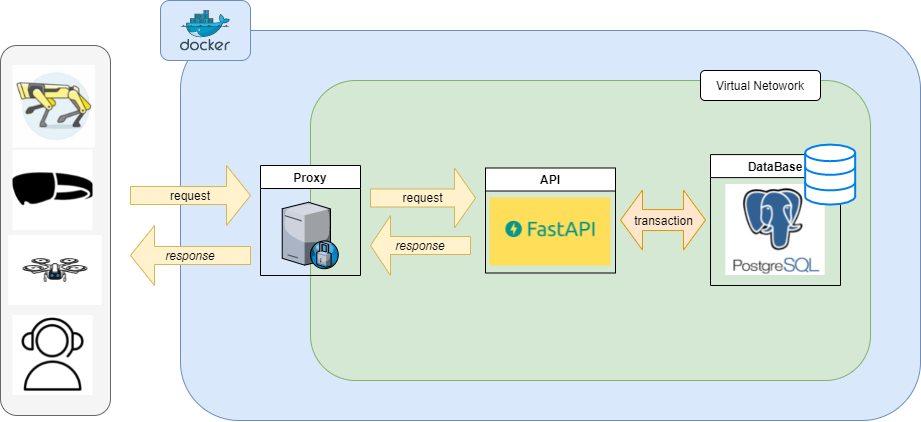

## Database overview

This is, obviously, the most important part of the server. In this case, it starts with some data already present and loaded when the server is enabled. 

Here are the steps to run the database in your local PC. 

Frist of all, start Docker Engine. Then open a console from the Database container folder. You can find a `compose.yml` inside, along with a `dockerfile`:

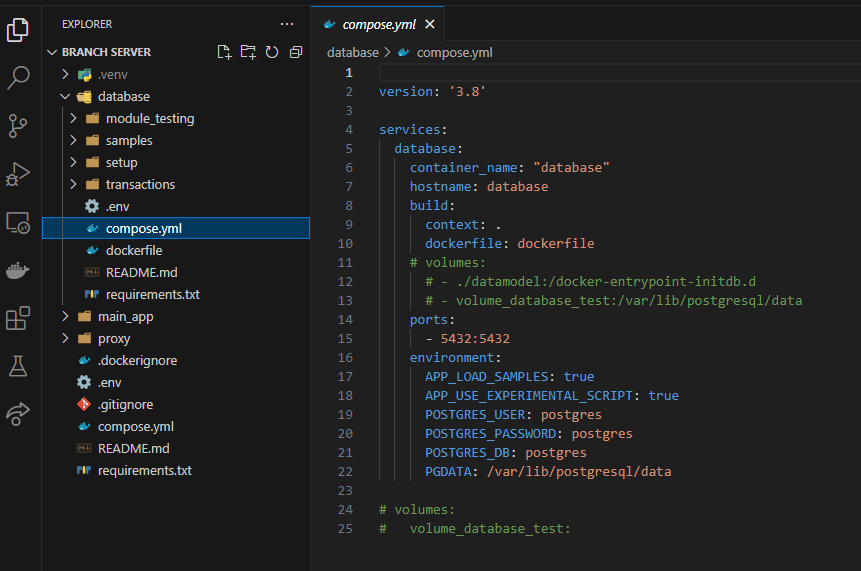

### If you don't have VS Code

1. open up a terminal inside the folder `database`
2. run this command:

```sh
# to run the service,
docker compose up --build -d

# to check if the container is running
docker compose ls
```
It should produce a output similar to the following one:

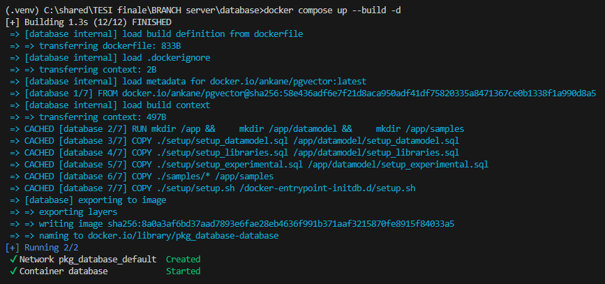

### If you have VS Code

1. there's a official extension: I  strongly suggest it, since it can speed up the development process and give you a better cozy *insight* of the containers. It's super-fast to install, and very useful

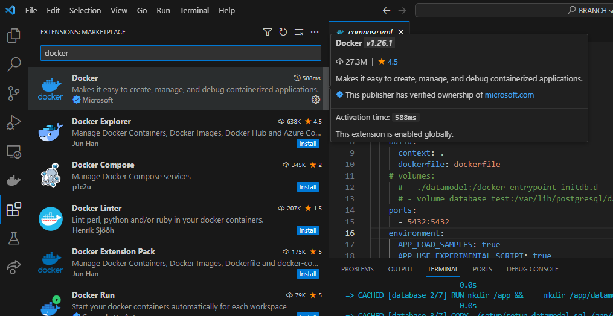

2. open up the `compose.yml` file
3. `ctrl + P` for Command Palette
4. **Docker: Compose Restart** choosing file `database/compose.yml`
5. the output screen should resemble the one I showed in the previous section

### What we done so far

With the previously issued commands, we started the Postgresql Database. I suggest to use [DBeaver](https://dbeaver.io/) to connect to the database. 

The database is reachable with these non-production credentials:

- **username**
  - postgres
- **database**
  - postgres
- **password**
  - postgres
- *port*
  - default is 5432
- *host*
  - default is localhost

Here's how to connect with DBeaver:

1. New Database Connection
2. Popular --> PostgreSQL --> double click
3. host is localhost --> insert credentials
4. test connection --> you should see something like the following screenshot

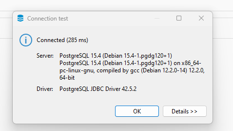

5. Click *finish* --> Explorer Sidebar --> pen up Postgres --> it opens the service showing a green check under the Postgres logo

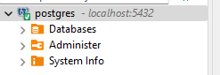

If you take a closer look to `database/compose.yml` file, you'll notice in particular two improtant parameters starting with `APP_`. And, in the `dockerfile`, yu can see all the parameters of the microservice. Here's a brief summary of parameters and meaning:

- `APP_SETUP_PATH` : string, *folder path*
  - the file `database/setup/setup_datamodel.sql` is a SQL script containing the complete definition of the relational data model implemented for this project
  - this file is copied into the location specified by this parameter
  - you shouldn't use this parameter even if you don't want to use a different data model
- `APP_SETUP_FILE` : string *file path*
  - please refer to the `APP_SETUP_PATH` parameter
  - it contains also the name of the setup file
  - you shouldn't use this parameter even if you don't want to use a different data model
- `APP_LIB_SETUP_FILE` : string *file path*
  - another useful file is `database/setup/setup_libraries.sql` which contains definitions of custom SQL functions for this data model
  - you shouldn't use this parameter even if you don't want to use a different version of the library
- `APP_SAMPLES_PATH` : string, *folder path*
  - the folder `database/samples/` contains some examples used for populatig the database before testing; te startup script runs all these files one by one
  - it is enough to secify the path where sample scripts are contained
- `APP_LOAD_SAMPLES` : bool (true, false)
  - eithe load or not the sample scripts
  - if false samples are not loaded and the database will be empty at startup
- `APP_USE_EXPERIMENTAL_SCRIPT` : bool (true, false)
  - the SQL script file `database/setup/setup_experimental.sql` is meant to support the development of new features 
  - you can put here INSERT, SELECT and CREATE FUNCTION for testig purposes

Here's how the service starts:

1. container creation with the copies of the files from the above mentioned folders
   - **sper important** : the above mentioned procedure starts the database in development configuration, which is not persistent
   - if you close the container, you'll lost all the datainside the DB
2. the container runs the bash script `database/setup/setup.sh`
3. setup libraries
4. data model creation
   - any previously defined version of the data model is dropped before starting
5. (if requested) sample loading, file by file
6. (if requested) experimental setup loading

### Data Model Quick Insight

*interested in HoloLens2 only?* Well: *jump to the next chapter*. 

To create a space where to write some SQL code in DBeaver, 

1. SQL Editor
2. New SQL script

You can see all the tables in Explorer:

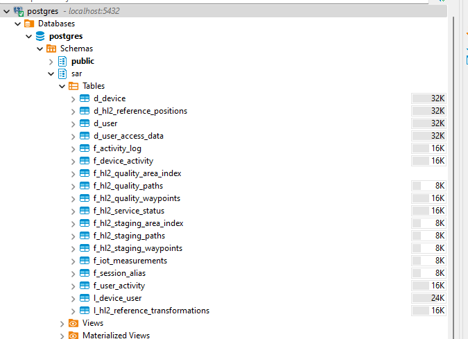

To simplify, the database could be divided into "areas" : 

- **users** : `D_USER`, `D_USER_ACCESS_DATA`, `F_USER_ACTIVITY`
- **activity tracking** : `F_ACTIVITY_LOG`, `F_SESSION_ALIAS`
- **devices** : `D_DEVICE`, `F_DEVICE_ACTIIVTY`, `L_DEVICE_USER`, `F_DEVICE_ACTIVITY`
- **HoloLens2** : `D_HL2_REFERENCE_POSITIONS`
  - divided into Quality tables (proposal only) 
  - and staging tables : `F_HL2_STAGING_WAYPOINTS`, `F_HL2_STAGING_PATHS`
- **IoT** (proposal only) : `F_IOT_MEASUREMENTS`

In short, the organization we're modelling here is made up of `USERS`, 

- divided into Admin and not-admin
- divided into extrnal or not (te database *should not allow* to give Admin role to a external user)
  - the way the user accesses the device changes between admin and non-admin user
  - in particular, the not-admin user needs two user codes to access the resources of the database: their user ID, and the ID of one active *approver user*. The idea is that one admin user must explicitly authorize a non-admin user to open a session to the database
- with clear authorizations with respect to data requests

Double click on the main table `D_USER` : 

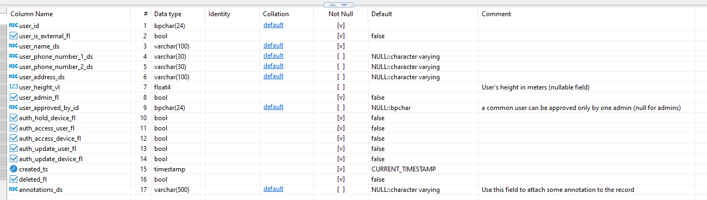

If you loaded the samples, a `SELECT` statement will reveal the users already present into the database:

```sql
SELECT * FROM sar.D_USER;
```

(to use DBeaver script: highlight the code you want to run --> `ctrl + Enter` to run it)

there are some example users:

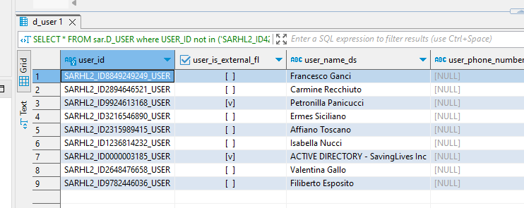

You can check if the users are admin or external:

```sql
SELECT 
USER_ID,
USER_IS_EXTERNAL_FL,
USER_ADMIN_FL,
user_approved_by_id 
FROM sar.D_USER;
```

The screen shows the output from that query:

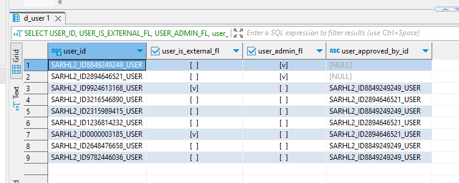

Please notice that the field `USER_APPROVVED_BY_ID` must be populated with a valid `USER_ID` if `USER_ADMIN_FL` is false. 

You can check out their authorizations:

```sql
SELECT 
USER_ID,
auth_hold_device_fl ,
auth_access_user_fl ,
auth_access_device_fl ,
auth_update_user_fl ,
auth_update_device_fl 
FROM sar.D_USER;
```

Noteworthy to mention that the database knows what the user can ask or not, and this is a important part of the API, particulartly important since the database will be a mission-critical component, so it will require adequate defence. 

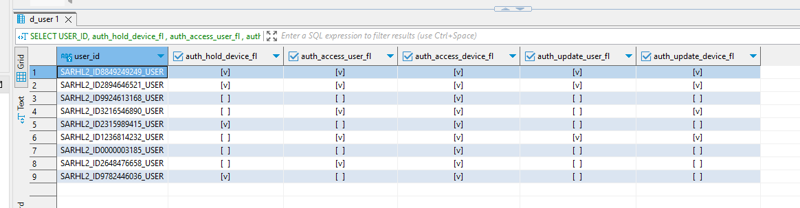

meaning of these fields:

- `auth_hold_device_fl`
  - either the user is authorized to open a session on a device, such as HoloLens2
  - there's another check in the `D_DEVICE` which tells either the device can be required in this way or not
  - *when a user asks for a device, the API must check if the device supports that request and if the user is authorized to ask for it*
- `auth_access_user_fl`, `auth_access_device_fl`
  - data read authorizations
  - respectively for user and device
- `auth_update_user_fl`, `auth_update_device_fl`
  - write authorizations

The user logs in opening a *user session*, then asks for a resource opening a *device session* which is related to the abovementioned *user session*, at least for the sers asking for HoloLens2 that is the only integration available so far. 

Each user have to open a session providing:

- username
- approver (which is the user_id in case the user is admin)
- and a password

The database stores the passwords *in HASH format* into the table

```sql
SELECT * FROM sar.D_USER_ACCESS_DATA
```

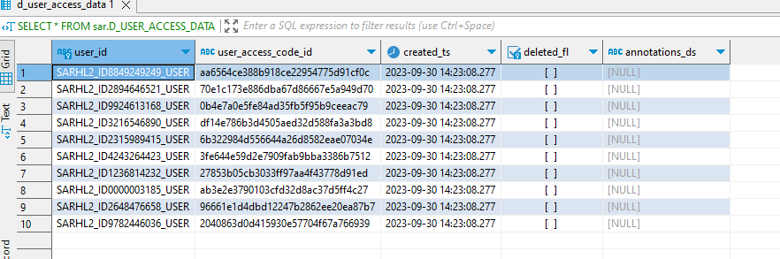

If a user manages to log in, a *sessin ID* is generated, and this code is registered inside the table `F_USER_ACTIVITY`:

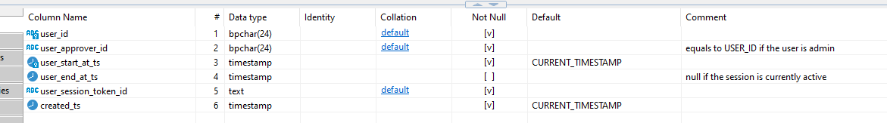

Also a record inside the log table `F_ACTIIVTY_LOG` is created. 

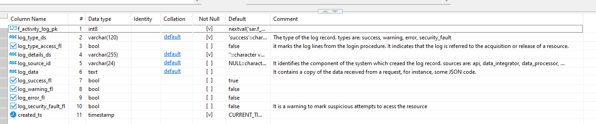

Once the user obtained a session ID, a resourcecan be requested. The devices the user ca require are contained into the dimensional table `D_DEVICE`:

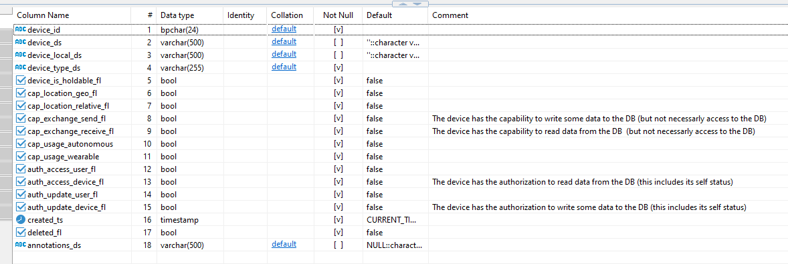

as you can see, there are many parts in this table:

- id, description and local informations (organization custom)
- auth : device authorizations
- cap : device capabilities
- either the device is holdable or not

to get all the devices, 

```sql 
SELECT * FROM sar.D_DEVICE
```

there are some samples aready into the table:

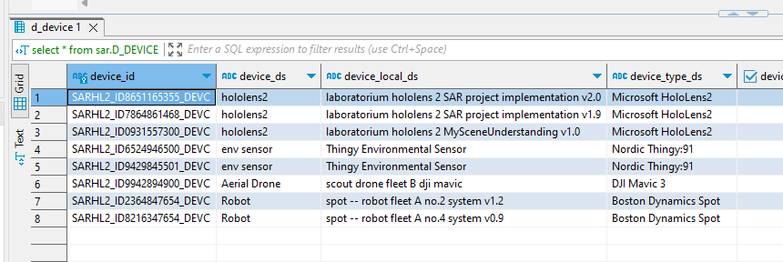

Currently the system supports only integration with HoloLens2, but in future this table should collect all the robots, IoT devices and AR devices of the organization, and more.

In paticular, to have all the holdable devices: 

```sql
SELECT
DEVICE_ID,
DEVICE_TYPE_DS
FROM sar.D_DEVICE
WHERE DEVICE_IS_HOLDABLE_FL;
```

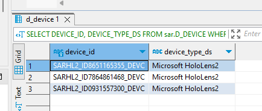

Notice that the user can hold a device only if it is authorized to do it. You can find this information inside the table `L_USER_DEVICE`:

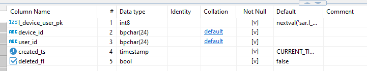

when a user is authorized to hold a device, a *device session* is opened. You can find the sesison inside the fact table `F_DEVICE_ACTIVITY`:

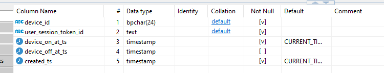

Here, the user session id is also the device session id. 

### And here comes the important part

When a user asks for a HoloLens2 device, it is authorized to read/write the tables with prefix `hl2`. 

*Quality* is the set of tables with the clean, final informations. *Staging* is a set of tables used for managing the real-time exploration process: informations in Staging should be cleared and promoted to quality. *This part has not been implemented currently*: oly *staaging* is used by the system, since implementing the quality environment requires a BE data processor. 

Staging is currently made up of two tables: `F_HL2_STAGING_WAYPOINTS` and `F_HL2_STAGING_PATHS`. 

`F_HL2_STAGING_WAYPOINTS` collects all the waypoints registered by the devices, supporting a simplified form of collaboration. Here's its schema:

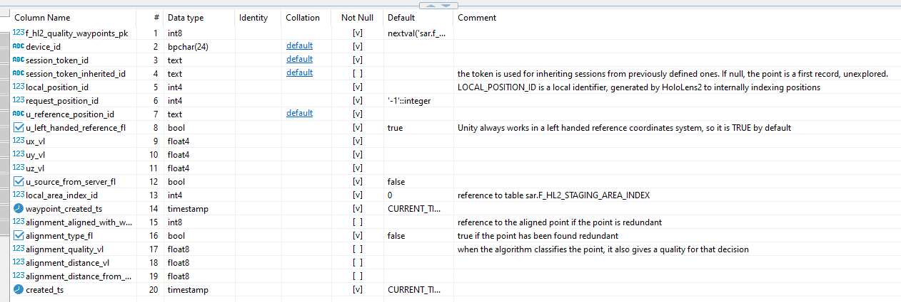

The principle is that each device sends a set of points (`ux_vl`, `uy_vl`, `uz_vl`) when a connectivity spot is available. 

- from a given device with its ID
- a key is automatically assigned to the measurement
- *a reference position must be provided*

What is a reference position? Just a way to allow many devices to "speak the same language":

- a operator calirates their device staying in a point and looking towards a specific point --> origin and orientatation are given
- another device can use the same operative method to calibrate its device

This operative procedure is known in the system as *reference position*. The method must be a known and recognized one, ad you can find all the methods inside the table `D_HL2_REFERENCE_POSITIONS` with he following schema:

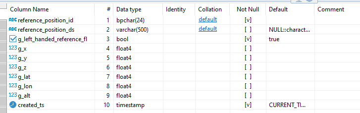

Currently different calibrations are not mapped. In future, someone could want to imple,ent a data processor ale to transform the coordinates from staging by ref pos A to B: for this purpose a lookup table `L_HL2_REFERENCE_TRANSFORMATIONS` has been provided, containintg the transformations between two frames in terms of distance vector and quaternion. 

Here's its schema:

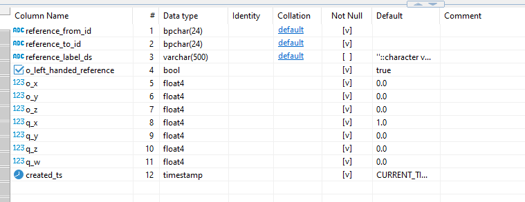

the field `session_token_inherited_id` inside the table `F_HL2_STAGING_WAYPOINTS` deserves a explaination. The system is currently implemented to reduce the entropy due to multiple measurements. 

Think to this scenario. There are are 46 HoloLesn2 devices, each of them throwing data inside the stagin table `F_HL2_STAGING_WAYPOINTS`. It is feasible, but we're interested also in providing consistent data to devices with respect to a graph structure. Each device cold potentially draw a different graph from the same reference position, then a solution like this is at least troublesome. 

The solution proposed by this thesis path is to organize measurements with this approach in mind:

- the first device sending measurements *rules*
- if another device comes in action, their measurements are linked with the ones of the previously created session, creating a *skeleton session* to enrich with new measurements
- measurements *aligned with the main session are discarded*; here, lease read *aligned* as *approximately in the same position of another known point alreadiìy in staging table*

Since this depends on the reference position, it is still possible to have multiple graphs inside the table, but a internal coherence is guaranteed inside a graph starting from a given reference position. 

A *inherited session* is a session ID (kinda, it is masked, but this is another story) identifying this shared data source. It is reused inside the staging table: inserted for the first time by the device discovering the very first positions, then reused by all the devices, aiming at creating a multi-hand drawing of the surrounding area. In jargon, a session is *inherited* from another session. 

We said that the space is modelled as a graph. Well, where are the paths? Inside the folder `F_HL2_STAGING_PATHS`. The mechanism of inheritance is pretty much the same. 

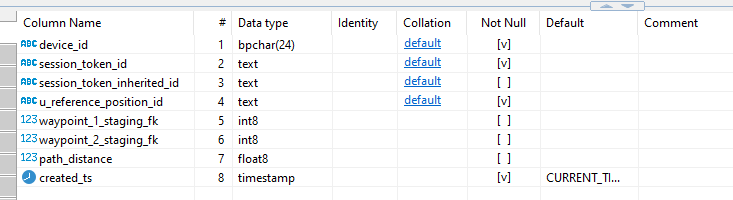

## API Overview

The code is contained into the folder `main_app/main_app`

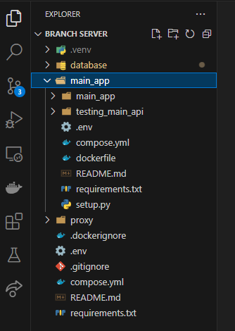

As usual, the folder contains its `dockerfile` and its `compose.yml` file. Please notice taht the entry point of the API also enables the database (ok, it's trivial). Even in this case, the database storage is not persistent: no volume is defined. There's no virtual network here, hence no need to use a proxy. 

### Start the API

There are thousands of options, but it's not important: the `compose.yml` is already configured for testing the service. 

the service to start is `main_app/compose.yml`

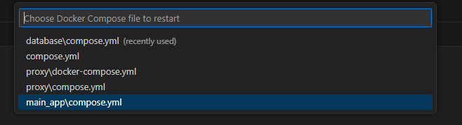

```sh
docker compose up --build -d
```

To test the app, you can use this address on LocalHost:

```txt
# the following one returns 400 (it's OK if the next one returns 418)
http://localhost:5000/

# the following one returns 418 (it's OK)
http://localhost:5000/api
```

You should receive a response like this for the second request:

```json
{
    "timestamp_received": "2023-09-30T16:18:13.712501",
    "timestamp_sent": "2023-09-30T16:18:13.713306",
    "status": 418,
    "status_detail": ""
}
```

### Logging and container insight

let's go back to Docker engine. ou should see two containers running under a general service:

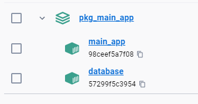

`main_app` is the API provider, and `database` is the Postgresql database we explored above. 

The log is a bit messy right now. You can inspect it from the **Logs tab**:

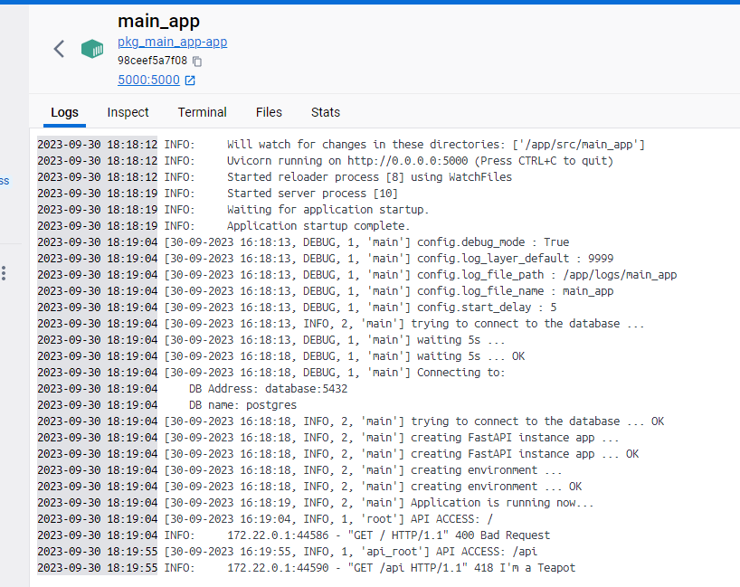

There's another folder you can use to check the log. In fact, the application generates a log file with all the operations performed by the API. Here:

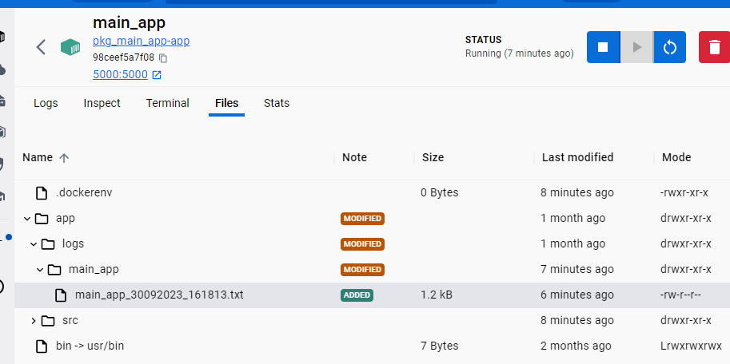

Double click on it, and you can see the content of the log. 

### API Hand On!

I suggest you to use: 

- [Postman](https://www.postman.com/) for API requests/responses 
- and [DBeaver](https://dbeaver.io/) to inspect the database

With these two tools, you should have all you need to fully test the API. The following tutorial is just a oersimplified test for understanding the overall idea behing the API: mechanics of the interaction in this project are more complex than this, but the concept is there. 

To use the API, you generally need to perform these steps:

- user login
  - if you're using a non-admin user, you should provide also the user ID of the approver, which must be admin
  - the approver must be online
- device login
  - device has capabilities you are authorized to use
  - and you must be authorized to use that device
- ... HL2 API usage ...
- user logout
  - also all the devices hold by the user are released
  - otherwise you can do: device logout, and then user logout

### User Login

let's start with the login. If you're using samples, you can use this user which is a admin (you understand that it is admin from the fact that the `user_id` and the `approver_id` are the same):

**POST** : `http://127.0.0.1:5000/api/user/login`

```json
{
    "user_id" : "SARHL2_ID8849249249_USER",
    "approver_id" : "SARHL2_ID8849249249_USER", 
    "access_key" : "anoth3rBr3akabl3P0sswArd"
}
```

the response wll be similar to this one:

```json
{
    "timestamp_received": "2023-09-30T16:32:39.040505",
    "timestamp_sent": "2023-09-30T16:40:07.303689",
    "status": 200,
    "status_detail": "user successfully logged in",
    "session_token": "46d93c6892cd1e53bf491b4b3be99ce8"
}
```

In particular, please notice that the server returned a code labeled `session_token` This is the session user id, and it's a token used for all the operations from here. 

ou can see from Docker Engine that the API received and processed the request:

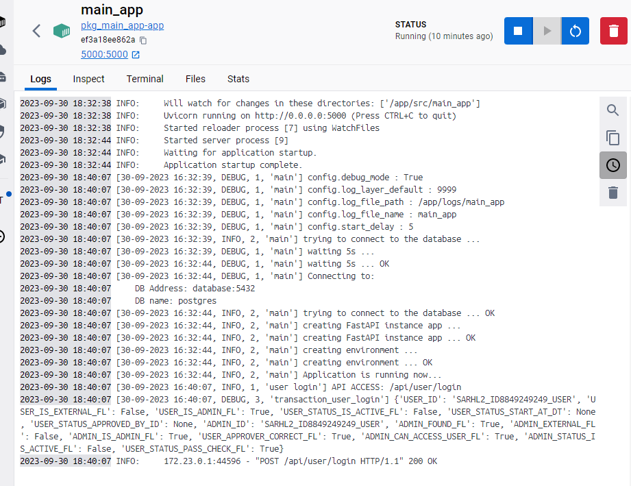

Another way to check how many users are logged in currently is to check the table `F_USER_ACTIVITY`:

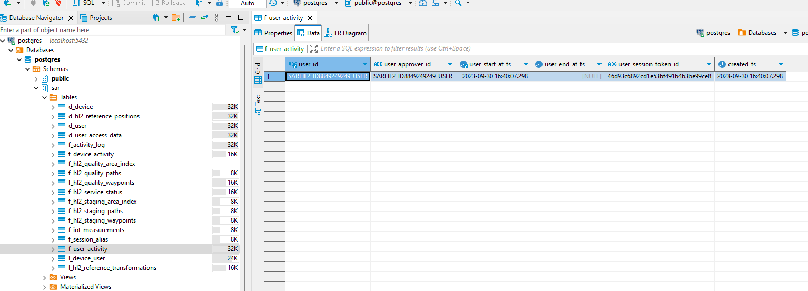

And you can also retrieve more detailed informations from the table `F_ACTIVITY_LOG`:

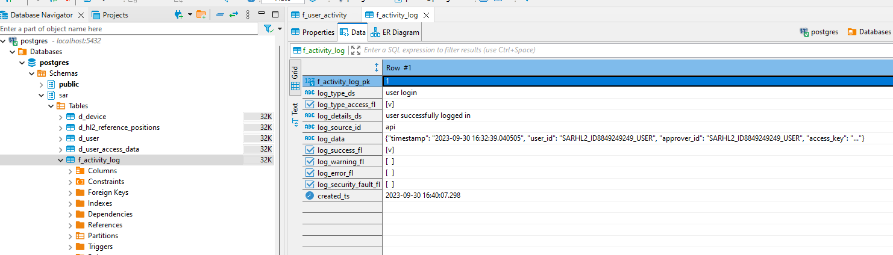

The activity log tracks also the request from the client, which allows to precisely determine the sequence of actons in case of failures. 

### User Logout

To log out, it is important to know the session token. The request format is the following:

- **POST** : `http://127.0.0.1:5000/api/user/logout`

```json
{
    "user_id" : "SARHL2_ID8849249249_USER",
    "session_token" : "46d93c6892cd1e53bf491b4b3be99ce8"
}
```

Example of response:

```json
{
    "timestamp_received": "2023-09-30T16:32:39.040505",
    "timestamp_sent": "2023-09-30T16:49:37.237926",
    "status": 200,
    "status_detail": "success",
    "logged_out_devices": []
}
```

Notice that the field `logged_out_devices` would report the IDs of the devices released along with the logout request if some device had been taken by the user. 

s usual, we can have a feedback f the operation by the LOG table:

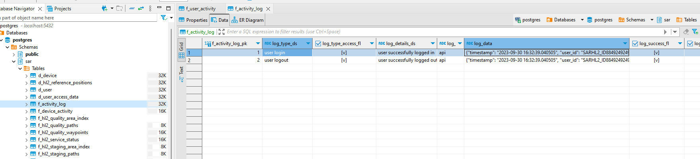

It deserves a note: the table of the sessions reports the date of the logout. 

*before*:


*after*:

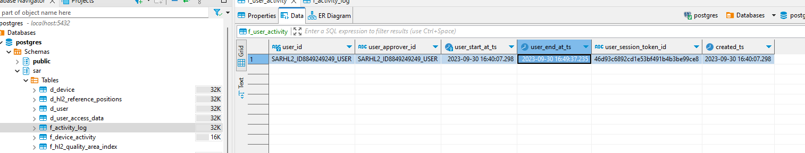

### Device Login

Login REQUEST:

```json 
{
    "user_id" : "SARHL2_ID8849249249_USER",
    "approver_id" : "SARHL2_ID8849249249_USER", 
    "access_key" : "anoth3rBr3akabl3P0sswArd"
}
```

Login RESPONSE:

```json 
{
    "timestamp_received": "2023-09-30T16:32:39.040505",
    "timestamp_sent": "2023-09-30T16:58:20.681152",
    "status": 200,
    "status_detail": "user successfully logged in",
    "session_token": "a310dea8270774939112d3e6dfa9d2bd"
}
```

to ask for a device, the request format is the following:

- **POST** :  `http://127.0.0.1:5000/api/device/login`

```json
{
    "user_id" : "SARHL2_ID8849249249_USER",
    "device_id" : "SARHL2_ID8651165355_DEVC", 
    "session_token": "a310dea8270774939112d3e6dfa9d2bd"
}
```

the response will be like this, very simple:

```json
{
    "timestamp_received": "2023-09-30T16:32:39.040505",
    "timestamp_sent": "2023-09-30T16:59:57.769122",
    "status": 200,
    "status_detail": "success"
}
```

just a success notice. You can notice that the device is active from Activity log...

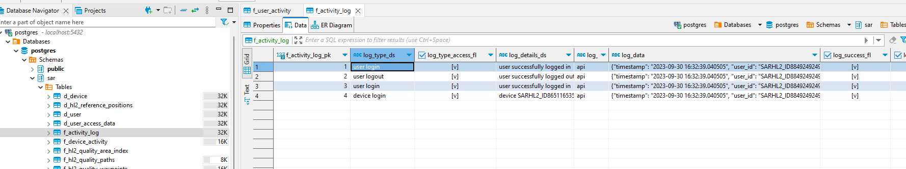

... and from `F_DEVICE_ACTIVITY`. The structure of the table is identical to the one of the  other table `F_USER_ACTIVITY`. 

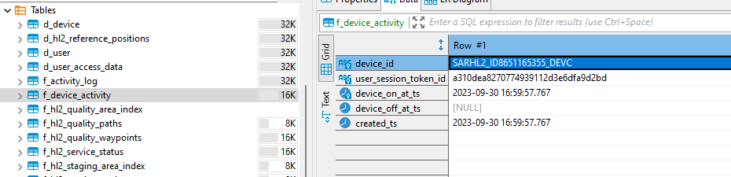

### First download

Download request: the device is asking fresh data from the database. Please take into account that the database recalls what data have been returned by the system and other data related to exchange. 

We're now in this situation:

- first device to do measurements : the server creates a new inheritable session
- the device have no other positions except the origin

Here's the format of the Download request:

- **POST** : `http://127.0.0.1:5000/api/hl2/download`

```json
{
    "user_id" : "SARHL2_ID8849249249_USER",
    "device_id" : "SARHL2_ID8651165355_DEVC", 
    "session_token": "a310dea8270774939112d3e6dfa9d2bd",
    "based_on" : "",
    "ref_id" : "SARHL2_ID1234567890_REFP",
    "center" : [0,0,0],
    "radius" : 250.0
}
```

With this request, we are asking data around the origin with a radius of 250.0 meters. 

```json
{
    "timestamp_received": "2023-09-30T16:32:39.040505",
    "timestamp_sent": "2023-09-30T17:11:56.949208",
    "status": 202,
    "status_detail": "success",
    "ref_id": "SARHL2_ID1234567890_REFP",
    "based_on": "68b27dffebe2b04455f3340f5e6df01b",
    "max_idx": 0,
    "waypoints": [],
    "paths": []
}
```

The response is empty, meaning that you already know all the points you could know. Even this request is tracked into the LOG. 

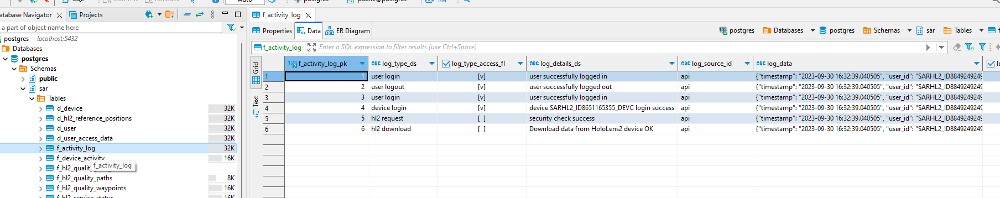

It is interesting to notice that the server returned another code, `based_on`, which is different from the token... what's happening? 

And it's here that the table `F_SESSION_ALIAS` comes into action. After the request, you'll notice a new line inside the table:

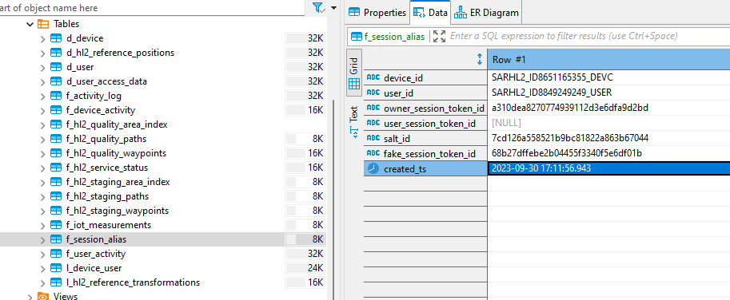

The idea is this. For security reasons, it's better to hide that the current session is *completely new*; instead, it's a better choice to assing a token anyway to the session, even if it is riginal. Hence, the upload/download process will require always two codes from here:

- the user session token
- and this special token `based_on` which is A FAKE TOKEN

And how can I find to retrieve the true token? I have to pass from this table. The mechanism is this: the real token `user_session_token_id` is hashed in some way using a `salt_id` which is another special code interal to the server and used only to generate the fake token, which is `fake_session_token_id`. 

And in our case, what a surprise: the `user_session_token_id` is empty! This means that the token is hiding a original session, but the server is the only guy knowing this fact. 

Let's take a look to staging waypoints: there's only one point, and it makes sense. 

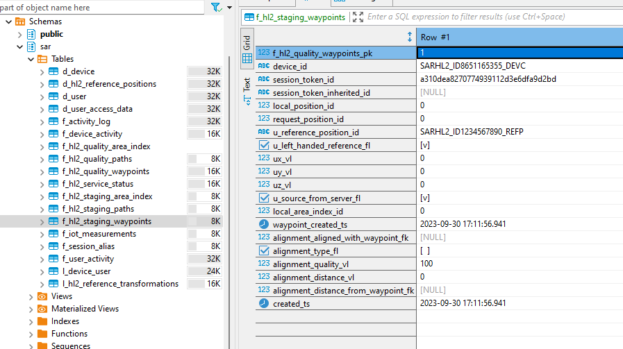

the point is the origin of the reference position. the inherited session token ID is null, as we did expect (notice: the fake token is used only to mask the access, and not in this phase). 

### First Upload

In a real scenario, the first upload can be performed by any other device already connected now. For simplicity, let's assume the same device we used so far uploads new positions. 

The following request assumes a path like this:

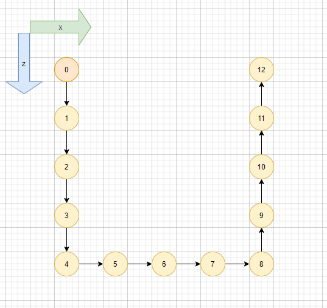

The request will have this format:

- **POST** : `http://127.0.0.1:5000/api/hl2/upload`

```json
{
	"user_id" : "SARHL2_ID8849249249_USER",
	"device_id" : "SARHL2_ID8651165355_DEVC",
	"session_token" : "a310dea8270774939112d3e6dfa9d2bd",
	"based_on" : "68b27dffebe2b04455f3340f5e6df01b",
	"ref_id" : "SARHL2_ID1234567890_REFP",
	"waypoints" : [
		{"pos_id":1,"area_id":0,"v":[0,0,2],"wp_timestamp":"2023/08/29 13:20:57"},
		{"pos_id":2,"area_id":0,"v":[0,0,4],"wp_timestamp":"2023/08/29 13:21:20"},
		{"pos_id":3,"area_id":0,"v":[0,0,6],"wp_timestamp":"2023/08/29 13:21:27"},
		{"pos_id":4,"area_id":0,"v":[0,0,8],"wp_timestamp":"2023/08/29 13:22:57"},
		{"pos_id":5,"area_id":0,"v":[2,0,8],"wp_timestamp":"2023/08/29 13:22:20"},
		{"pos_id":6,"area_id":0,"v":[4,0,8],"wp_timestamp":"2023/08/29 13:23:27"},
		{"pos_id":7,"area_id":0,"v":[6,0,8],"wp_timestamp":"2023/08/29 13:24:57"},
		{"pos_id":8,"area_id":0,"v":[8,0,8],"wp_timestamp":"2023/08/29 13:25:20"},
		{"pos_id":9,"area_id":0,"v":[8,0,6],"wp_timestamp":"2023/08/29 13:26:27"},
		{"pos_id":10,"area_id":0,"v":[8,0,4],"wp_timestamp":"2023/08/29 13:27:57"},
		{"pos_id":11,"area_id":0,"v":[8,0,2],"wp_timestamp":"2023/08/29 13:28:20"},
		{"pos_id":12,"area_id":0,"v":[8,0,0],"wp_timestamp":"2023/08/29 13:29:27"}
	],
	"paths" : [
		{"wp1":1,"wp2":0,"dist":2,"pt_timestamp":"2023/08/29 13:21:20"},
		{"wp1":2,"wp2":1,"dist":2,"pt_timestamp":"2023/08/29 13:21:20"},
		{"wp1":3,"wp2":2,"dist":2,"pt_timestamp":"2023/08/29 13:21:27"},
		{"wp1":4,"wp2":3,"dist":2,"pt_timestamp":"2023/08/29 13:21:20"},
		{"wp1":5,"wp2":4,"dist":2,"pt_timestamp":"2023/08/29 13:21:20"},
		{"wp1":6,"wp2":5,"dist":2,"pt_timestamp":"2023/08/29 13:21:27"},
		{"wp1":7,"wp2":6,"dist":2,"pt_timestamp":"2023/08/29 13:21:20"},
		{"wp1":8,"wp2":7,"dist":2,"pt_timestamp":"2023/08/29 13:21:20"},
		{"wp1":9,"wp2":8,"dist":2,"pt_timestamp":"2023/08/29 13:21:27"},
		{"wp1":10,"wp2":9,"dist":2,"pt_timestamp":"2023/08/29 13:21:20"},
		{"wp1":11,"wp2":10,"dist":2,"pt_timestamp":"2023/08/29 13:21:20"},
		{"wp1":12,"wp2":11,"dist":2,"pt_timestamp":"2023/08/29 13:21:27"}
	]
}
```

response will be like this:

```json
{
    "timestamp_received": "2023-09-30T16:32:39.040505",
    "timestamp_sent": "2023-09-30T17:34:03.322759",
    "status": 200,
    "status_detail": "success",
    "max_id": 12,
    "wp_alignment": []
}
```

the response noticed that 12 new points have been added. Well... but what is `wp_alignment`? Just a minute: it will be clear soon. 

Activity log reports the operations performed:

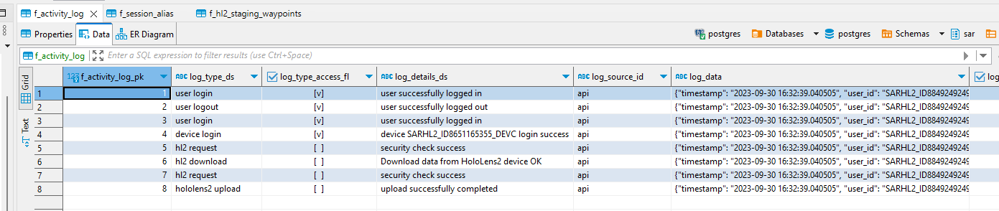

And the new waypoints are stored inside the table:

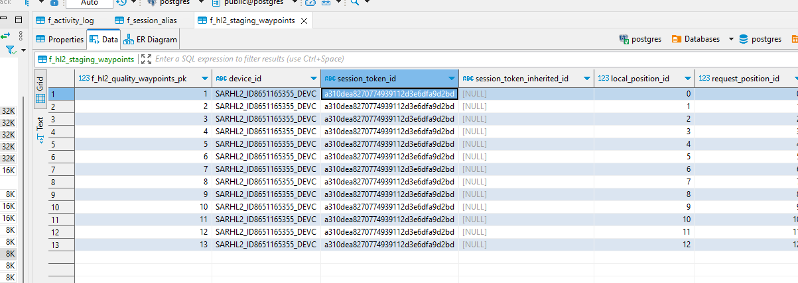

with the paths:

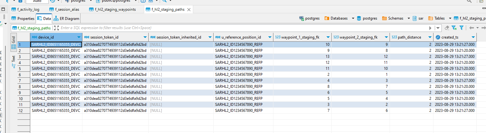

Notice that all the `session_token_inherited_id` are nulls as expected. 

### Second Download and Upload

Let's try to log in with a different user and device, without logging out from the previous user. 

User Login:

```json
{
    "user_id" : "SARHL2_ID2894646521_USER",
    "approver_id" : "SARHL2_ID2894646521_USER", 
    "access_key" : "s3vHngLh_F3s"
}
```

```json
{
    "timestamp_received": "2023-09-30T16:32:39.040505",
    "timestamp_sent": "2023-09-30T17:39:30.414663",
    "status": 200,
    "status_detail": "user successfully logged in",
    "session_token": "74ee2b82d523ae8c3ae658e8e8c49206"
}
```

Device Login:

```json
{
    "user_id" : "SARHL2_ID2894646521_USER",
    "device_id" : "SARHL2_ID7864861468_DEVC", 
    "session_token": "74ee2b82d523ae8c3ae658e8e8c49206"
}
```

with success response. 

The first action the device MUST perform is the download. In this way, the device is registered in staging table. Let's request a smaller radius, for instance 4m around the origin. 

request:

```json
{
    "user_id" : "SARHL2_ID2894646521_USER",
    "device_id" : "SARHL2_ID7864861468_DEVC", 
    "session_token": "74ee2b82d523ae8c3ae658e8e8c49206",
    "based_on" : "",
    "ref_id" : "SARHL2_ID1234567890_REFP",
    "center" : [0,0,0],
    "radius" : 4.1
}
```

`based_on` is empty at first, since the device doesn't know its code before asking for a download for the first time.

response: we received more points!

```json
{
    "timestamp_received": "2023-09-30T16:32:39.040505",
    "timestamp_sent": "2023-09-30T17:42:15.204623",
    "status": 202,
    "status_detail": "success",
    "ref_id": "SARHL2_ID1234567890_REFP",
    "based_on": "ea484d42ae359564554c227f9c596942",
    "max_idx": 12,
    "waypoints": [
        {
            "pos_id": 2,
            "area_id": 0,
            "v": [
                0.0,
                0.0,
                4.0
            ],
            "wp_timestamp": "2023-08-29T13:21:20"
        },
        {
            "pos_id": 1,
            "area_id": 0,
            "v": [
                0.0,
                0.0,
                2.0
            ],
            "wp_timestamp": "2023-08-29T13:20:57"
        }
    ],
    "paths": [
        {
            "wp1": 1,
            "wp2": 0,
            "dist": 2.0,
            "pt_timestamp": "2023-08-29T13:20:57"
        },
        {
            "wp1": 2,
            "wp2": 1,
            "dist": 2.0,
            "pt_timestamp": "2023-08-29T13:21:20"
        }
    ]
}
```

Let's take a look at the waypoints table. There are three new records:

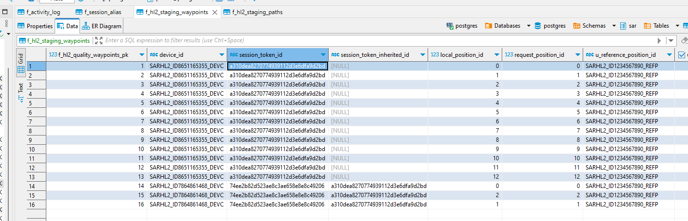

The inherited session is not null, meaning that the measurements from that device and user are linked to the ones of the base session. 

The situation retuend by the user is the following:

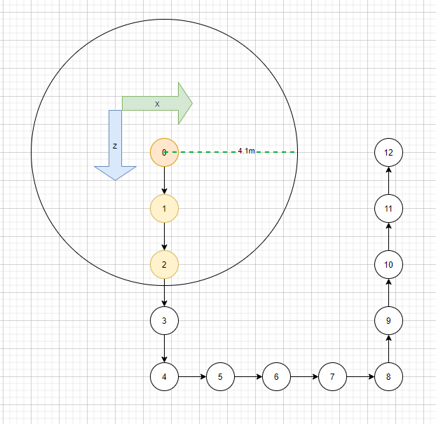


### The Alignment Algorithm

let's try a upload with two new measurements, plus another one, *which is very close to ID=3*.

Upload request:

```json
{
	"user_id" : "SARHL2_ID2894646521_USER",
	"device_id" : "SARHL2_ID7864861468_DEVC",
	"session_token" : "74ee2b82d523ae8c3ae658e8e8c49206",
	"based_on" : "ea484d42ae359564554c227f9c596942",
	"ref_id" : "SARHL2_ID1234567890_REFP",
	"waypoints" : [
		{"pos_id":3,"area_id":0,"v":[-2,0,0],"wp_timestamp":"2023/08/29 13:20:57"},
		{"pos_id":4,"area_id":0,"v":[2,0,0],"wp_timestamp":"2023/08/29 13:21:20"},
    {"pos_id":5,"area_id":0,"v":[0,0,5.920648618],"wp_timestamp":"2023/08/29 13:21:20"}
	],
	"paths" : [
		{"wp1":3,"wp2":4,"dist":2,"pt_timestamp":"2023/08/29 13:21:20"},
		{"wp1":0,"wp2":3,"dist":2,"pt_timestamp":"2023/08/29 13:21:20"},
		{"wp1":2,"wp2":5,"dist":2,"pt_timestamp":"2023/08/29 13:21:27"}
	]
}
```

response:

```json
{
    "timestamp_received": "2023-09-30T16:32:39.040505",
    "timestamp_sent": "2023-09-30T18:03:30.189713",
    "status": 200,
    "status_detail": "success",
    "max_id": 14,
    "wp_alignment": [
        {
            "request_position_id": 3,
            "aligned_position_id": 13
        },
        {
            "request_position_id": 5,
            "aligned_position_id": 3
        },
        {
            "request_position_id": 4,
            "aligned_position_id": 14
        }
    ]
}
```

the alignment is a negotiation of IDs between the server and the client, in a way such that it becomes simple to track known positions among the devices. Let's take for instance the first alignment:

- the client proposes `ID=3` for that waypoint
- but, since the max ID is 12, the server renames this point as `ID=13` instead of the name of the request

It is interesting the case of the point with request `ID=5` : that waypoint have been *discarded* from the server, and the client is informed that the point is already known with `ID=3`: this is its final name. 

Let's see what's happened inside the database. The new points are there.

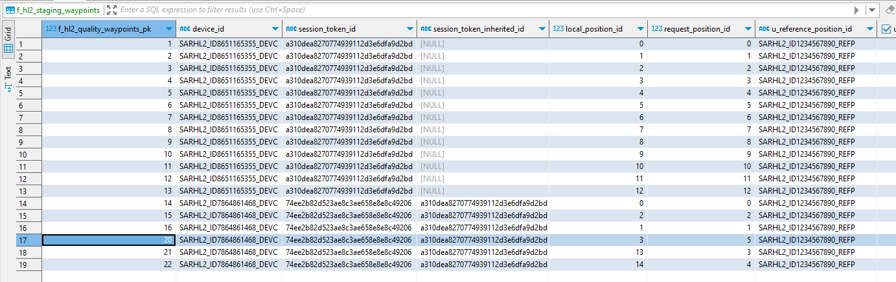

the last two points are the new ones. The third from the end of the list is the point the server aligned with another known point. 

Let's get a closer look to this last case:

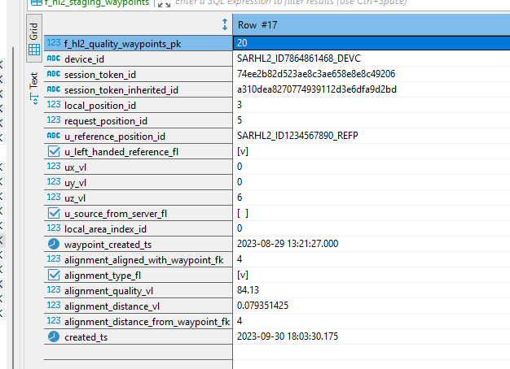

in particular, 

- `request_position_id` is the request ID we sent to the server
- `local_position_id` is the new ID assigned by the server

The local position ID is the alignes ID. If you look carrefully the column so far, you can notice that the database is maintaining a uniform numerical sequence of IDs:

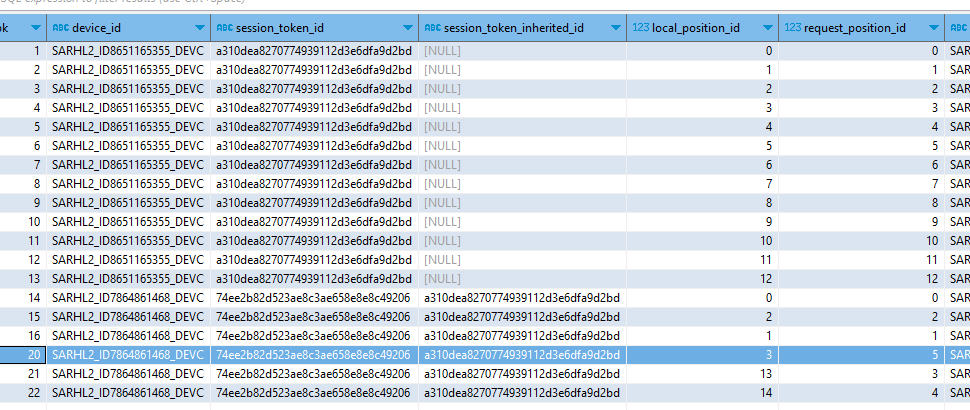

there are also other important fields you can use to have details abut the "move" of the server. There's a set of column starting with prefix `alignment`: these columns report details about the considerations of the server about the time the point has been uploaded. 

- `alignment_aligned_with_waypoint_fk` : the primary key referring to the point aligned with the one in the row
- `alignment_type_fl` : true if the point is redundant, and in this case is true
- `alignment_quality_vl` : this is a metric explaining how much "good" is the move executed by the server, and in this case it amounts to quality 84% (a good choice)
- `alignment_distance_vl` : the distance from the nearest point. This is the error between the nearest point and the position the system is trying to upload. 
- `alignment_distance_from_waypoint_fk` : the primary key of the nearest point. You can notice that even other new points have a value for this field, meaning that, when the requeste have been evaluated, the nearest (known) point considered for the alignment was that.

By these informations it is possible to understand how the system works, especially in case of problematic cases. 

Just to give another example, here is a new point from the request above:

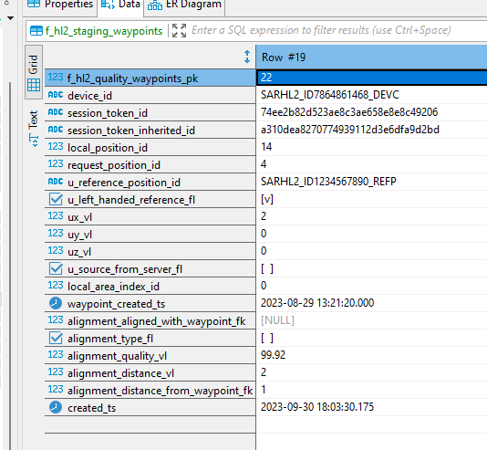

### Automted tests

doing tests step by step is good... but what about big tests? It becomes unfeasible soon. 

For this reason, there's a package inside the `main_app` folder, made for performing *automated tests* against the API. 

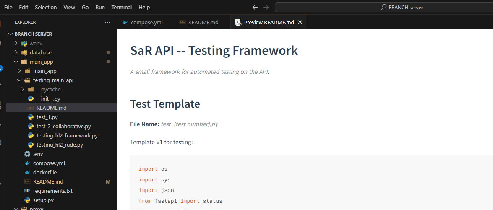

there's also a README providing all the details about how to use the framework for automated testings. Using this, you can perform any kind of test, from the simplest ones (many of them are already available inside the project) to the most complex ones (for instance, creating threads simulating the collaboration and stressing the system with thousands of requests). 

---

## Start the complete project

The only thing missing is the Proxy server. You can try it independently, but it would be a bit pointless. 

We saw almost everything relevant. It's time to start the entire process; to recall the structure, 


There's a `compose.yml` in the main folder, already configured for the entire project. 

Notice that, due to the virtual network structure, now it is impossible to access Postgres directly, which is a important point for security: data are unaccessible from outside, which is good. 

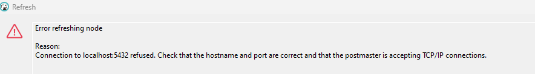

The API is reachable from a different endpoint:

- `http://localhost/sar/api`

notice the `/sar` path before the `/api`. Calling this, the service should return 418, meaning that the service is running correctly. 

This `compose.yml` also defines a persistent volume, hence the container can be enabed and disabled anytime without loosing informations. 

### CINECA setup

*NOTICE: the procedure is the same with the UNIGE machine, and with all the other server machines of the same kind.*

[Cienca AdaCloud](https://wiki.u-gov.it/confluence/pages/viewpage.action?pageId=436932577) is a externa server provider, used in this proposal for hosting the server side. 

before starting, you need

- a Cineca ADA Cloud virtual machine (suggested: Ubuntu20 LTS based)
- with a static IP and port (I used port 5000)
- a SSH access to the machine
- Docker Engine already installed on your machine

Here's the procedure (it's easy!):

1. open up a terminal --> SSH to the server 
2. `cd ~` your home folder --> create a folder named `/app`
3. clone the repository containing the server

I suggest this sequence of commands (you can rewrite it in a way such that all the instructions are insde the script)

```sh
# === secure token management === #
touch define_token.sh
chmod +x define_token.sh
nano define_token.sh
# ... define your token there as variable 'token' ...
source ./define_token.sh
rm define_token.sh

# === repo data === #
export git_user="ProgrammatoroSeduto"
export git_repo="SaR4HoloLens2"
export git_url="https://${token}@github.com/${git_user}/${git_repo}.git"
export token=

# === repo download === #
git clone ${git_url} --single-branch -b server .
export git_url=
```

4. run the service

```sh
docker compose up --build -d
```

5. to check if the server is online, try to reach it with a URL similar to this one: `https://<host>:80/sar/api` where `<host>` is the IP of your Cineca machine. It should respond with 418 as usual. 

### HOW TO inspect the database from server

since there's no a interface neither a direct access for security reasons, the only way to query the database is to use `psql` from inside the postgres container. 

1. `docker container` --> copy the `CONTAINER ID` 
2. `docker exec -it <YOUR CONTAINER ID> /bin/bash`
3. `psql -h localhost -U postgres`
4. to have a list of all the tables defined into the database, `SELECT table_name FROM information_schema.tables WHERE table_schema='sar';`
  
remember that all the statements must end with semicolon; doing so, the command will perform operations. for instance, `SELECT COUNT(*) FROM sar.D_USER;` allows to check the table `D_USER` inside the database. 

5. when you have done, `\q` --> `exit`

You can also extract data from the database on a file with the psql command `\o`, combined with a Git Repository or a file transfer system. 

### Uninstall Procedure

Pretty simple:

1. `cd ~/app` folder
2. `docker compose down` --> the command `docker container ls --all` should show a empty table
3. `docker container prune -f` --> `docker image prune -f` --> `docker network prune -f` --> `docker volume prune -f`
4. `docker volume rm sar_server_database_volume -f` --> `docker image rm sar_server-main_app sar_server-database sar_server-proxy -f`
5. `cd && rm -rf /app`

---

## HoloLens2 Unity Components

The main package you need for interacting with the dedicated server is `SAR4HL2NetworkingServices`, endowed with these components:

- `SarHL2Client` : it collects all the functions you need to interact with the server. 
  - fully integrated with the startuo script
  - and with the `ProjectAppSettings` component
- `SarHL2ClientVoiceCommands` : a convenient script for implementing client commands by vocal interfate. 
  - `VOICE_Connect()` : server login
  - `VOICE_Disconnect()` : server logout (Unity currently has some problems in calling destroyers and closing the connection, hence it has been provided this command to manually close the connection)
- `PositionDatabaseClientUtility` allows the client to interact with the database. 

### Client configuration

Before starting, you need a scene with these features already configured:

- ordered startup (see startup script tutorial)
- Project App Settings
- calibration
- positions database
- visualization features
- a voice interface

In addition, you need to provide these credentials for accessing the server:

- (it should be already inside the device) Device ID
- User ID
- Approver User ID
- User Access Key
- Reference Position ID

Please refer to the following procedure:

1. create a `Client` GameObject with components `SarHL2Client` and `SarHL2ClientVoiceCommands`. The first component in particular does not need to be configured, since the Project App Settings will do the job

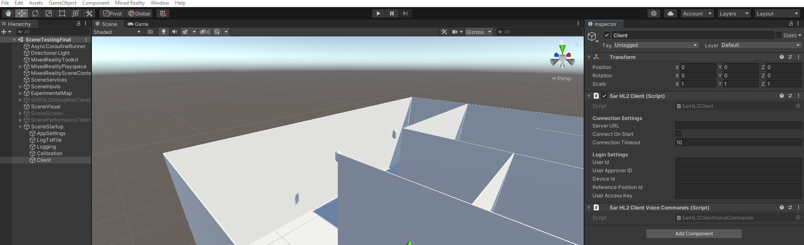

2. `ProjectAppSettings`, section Networking : Put the reference to the `SarHL2Client`
3. create a `PositionDatabaseClientUtility` component along with the `PositionsDatabase` compoennt, and pur the proper references

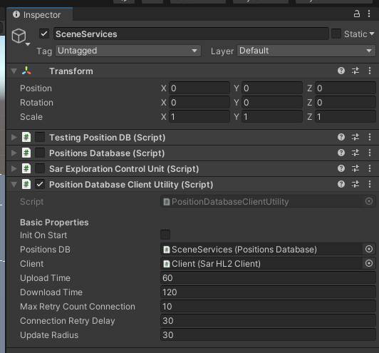

4. `ProjectAppSettings`, section Networking : assign the reference to the positions database client utility

To test localy, remember to use the DebugMode

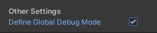

The option TestConnecton allows to refer to a local connection, perfect for tests on localhost:

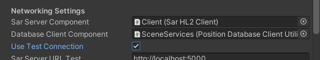

5. Scene Startup: client should start before the calibration utility

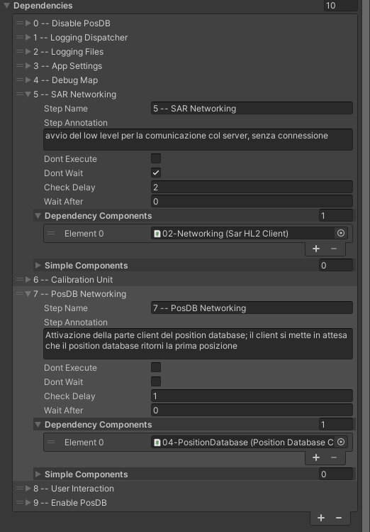

To test locally the service, you need to start the Docker Engine with the service (you can also use jsut the main_app for testing: it allows you to have insights with DBeaver) and then to enable the application. 

If everything works fine, you should see somehing like this on Unity:

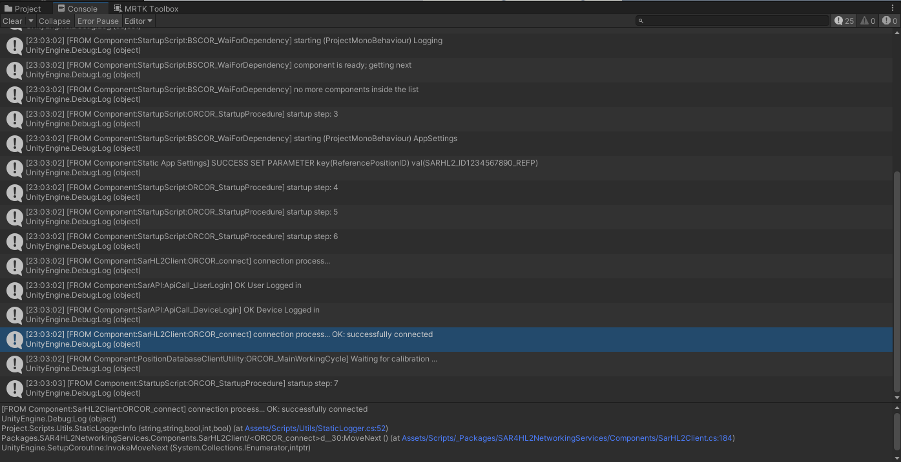

and you should see the feedback of the operations on the docker console:

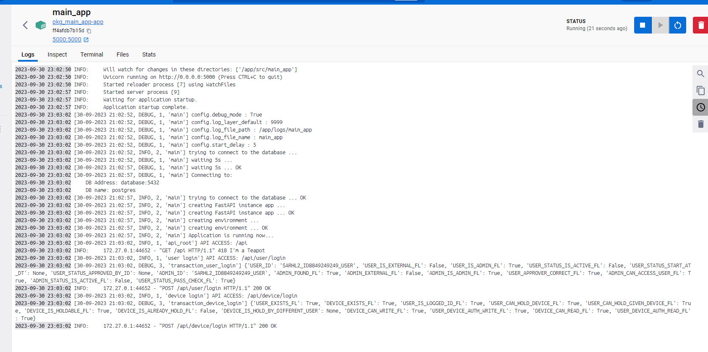

Just another step before starting. Regarding voice commands, you should add the *Server Logout* voice command attached to the function `VOICE_Disconnect()` part of the component `SarHL2ClientVoiceCommands`. 

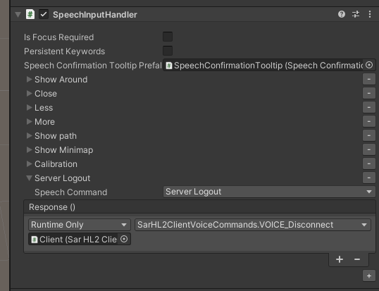

When you're using the device, you should always remember to explicitly close the session using this command, since HoloLens2 is not able to manage the `Destroy()` Unity Callback properly. 

### System Hands on! 

Let's use this setup:

- **Server** : localhost server, using `main_app/compose.yml` so we can have a insight with DBeaver and Docker
- **Client** : see `SceneTestingFinal`
  - log layer : 4 (including imports and exports)
  - with tuning: see the image below (don't change the base distance and distance tolerance! They are standard and shared between client and server)

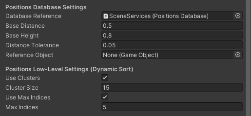

There's a demo along with this document, showing a simple exeriment in three steps: 

1. First exploration: complete exploration of the environment
   - [video](./exp_p1.mp4)
2. Second exploration: stay in one point and wait for data from the server
   - [video](./exp_p2.mp4)
3. Third step: combined exploration and live data integration
   - [video](./exp_p3.mp4)

