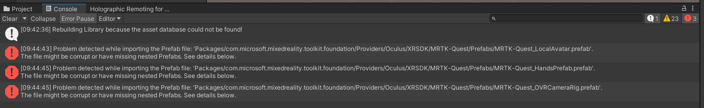

# SaR4HL2 Tutorial 0 - Client Project Setup

Here are the steps to install the HoloLens2 project. 

## Versions

- Unity: 2020.3.42f
- Unity Hub: *the first available one*
- Visual studio: *Microsoft Visual Studio Community 2019 v16.11.17* 
  - it doesn't matter the precise build: the important thing is that Unity has to be compliant with it
- Mixed Reality ToolKit v2: 2.8.3.0
  - since the MRTK2 installation is done directly in the project workspace, you don't need it as a standalone application 

## Hololens2 Project setup

Setting up the project is easy. After installed Unity and all the other necessary components, 

1. **Clone the repository** inside one folder. The name of the folder will be the name of te project in Unity
    - branch `release_client`
2. **Open the folder** with UnityHub
    - the first load will take some minute to set up everything

The project could give some error in the first run; the image below shows the one in my test:

It is not important, however: just open up one scene (for instance, the template scene under *Scenes/* folder) and run it. Before testing the project, please disable the holographic remoting (the tab at the bottom of the window). After completed the installation, close and re-open the project: all the errors should disappear. 

As last step, my advice is to create a folder for logging: `C:/shared/output`. Of course you can rework the project so that the log folder is different: every storage component have a parameter with the local path. 