# SaR4HL2 Tutorial 1 - Map Setup

*The project starts with a small simulated indoor environment, useful for testing the functionalities during the PC development phase.*

## Setup the default map

The scene template already contains a example of "maze". 

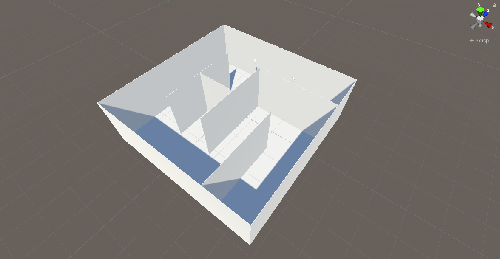

In the explorer on the left side of the editor, you can check its structure:

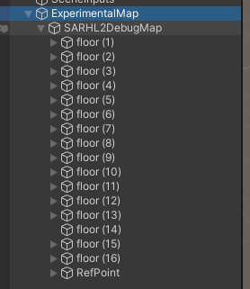

It is very important to point out that each comonent is places in (0, 0, 0), which is the view height for the device. If you start the application without adjusting the height, the user's view will be on the same level of the floor!

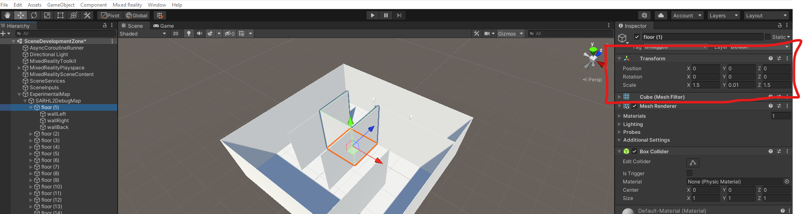

this is what it would happen in this scenario:

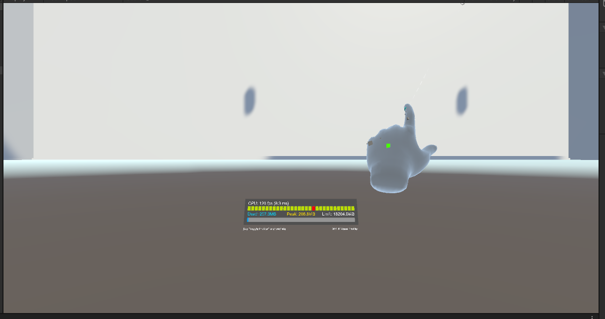

To adjust the user's height there's a script that moves the map downwards. 

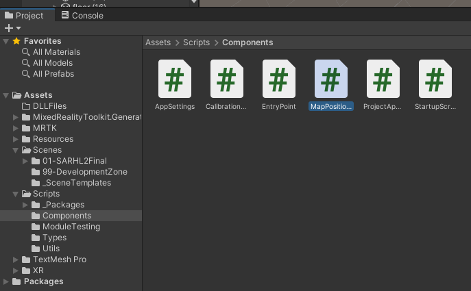

To add the script to the scene, you have two choices:

1. select the *ExperimentalMap* GameObject inside the explorer, then drag and drop the script on the GUI in the left pannel

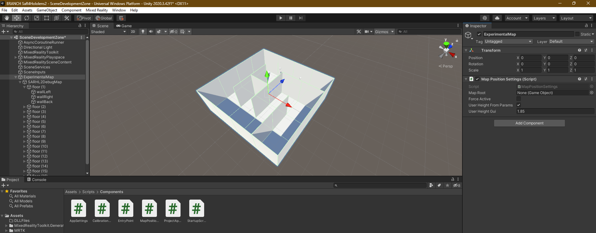

2. otherwise, you can simply use the *Add Component* button, to search the component with the search textbox by name, and finally to select it. 

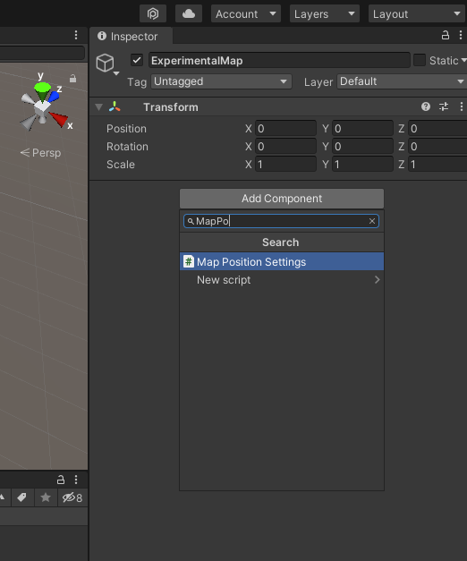

To adjust the height, you can use a manual methods. There's also a method based on user settings, explained later on.

- Map Root : the `SARHL2DebugMap` GameObject
- Force Active : is True
- Check Debug Mode : is False
- User Height from params : is False
- User Height Gui : your height (in my case, the default)

Here's a screen of the final configuratio:

<!-- 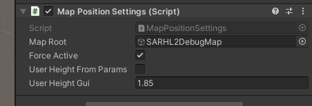 -->
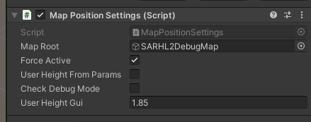

And here's how the map appears in play mode:

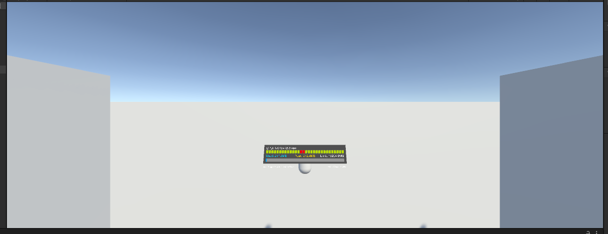

You can switch in the Scene tab during the play mode:

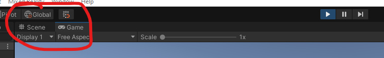

In the following screen, you can see where the entry point is placed:

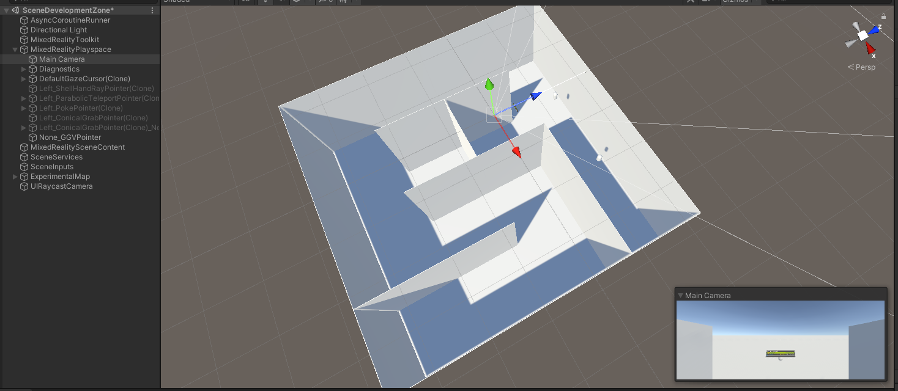

## Build your own Maze

This map is a default. If you want to build your won, there's a template inside the project:

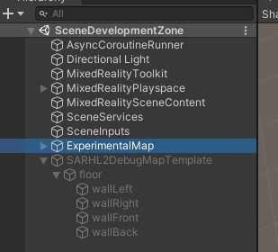

The template is modular: it includes one floor and four walls. 

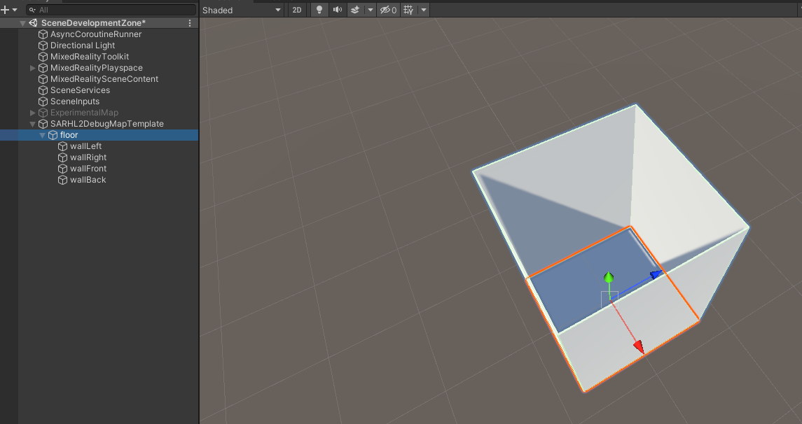

Please take into account the scale of the objects, in particular the one of the floor, which is a square plane:

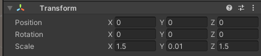

Just remember to don't modify the template! 

## Manage AutoHide

AutoHide is a featur eof the script `MapPositionSettings` useful to manage teh switch between debug mode and testing/production mode, especially working with the device. 

Let's try this combination of settings:

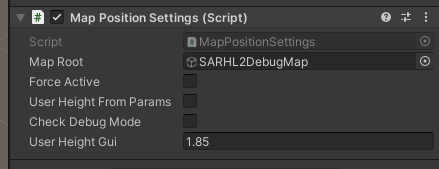

And let's start the play mode: the map start hidden!

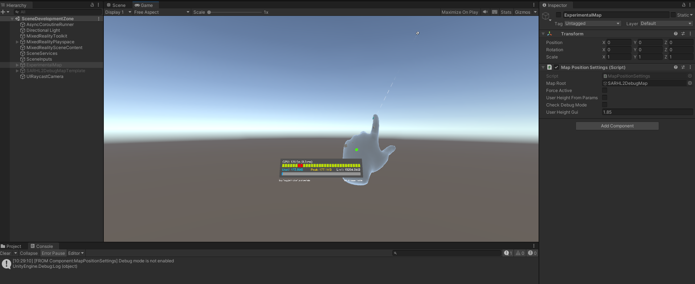

In the screen above, please notice the console tab, at the bottom of the screen: 

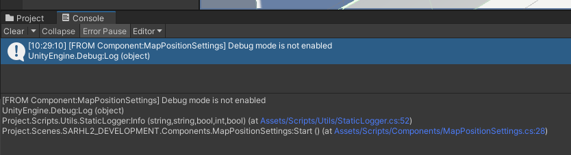

... meaning that the map has been hidden by that component. 