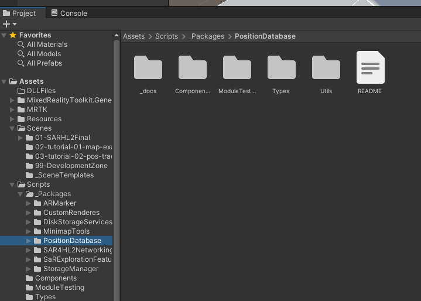
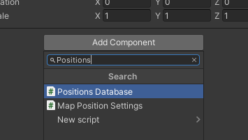
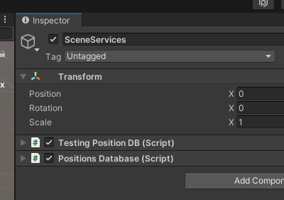
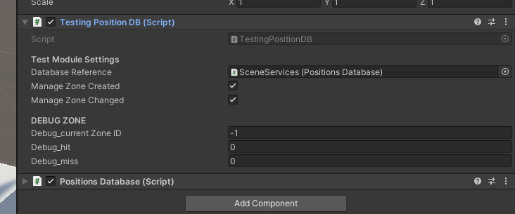
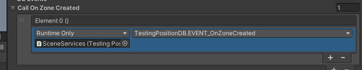
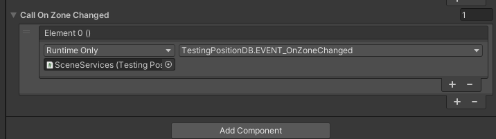
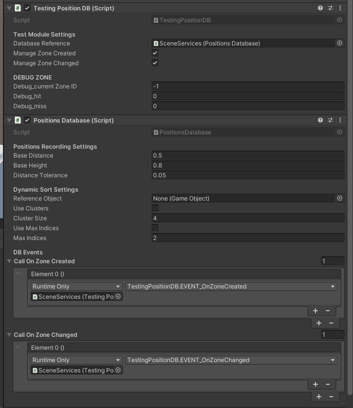
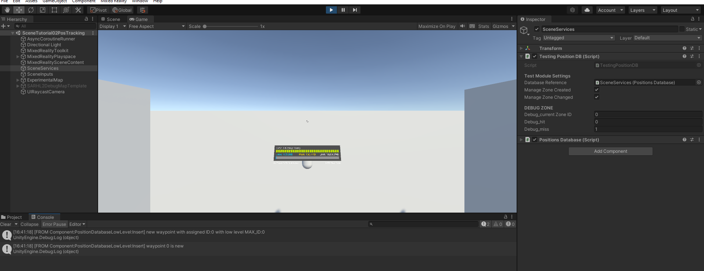
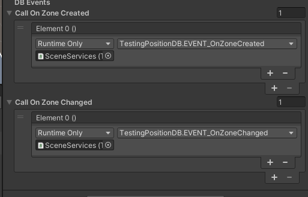
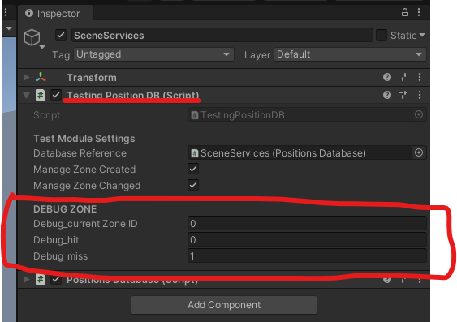

# SaR4HL2 Tutorial 2 - Position Estimaton and Tracking

*The first real problem considered in this solution is the automated position tracking*.

## The Position Databasee Package

The solution is entirely implemented as components. You can fin all of them inside the package `PositionDatabase`:

In particular the folder `Components` contains all you need to get started. The main component is the `PositionsDatabase`, which is a database capable of collecting positions and paths among them. 

### Apply the component in the Scene

`PositionsDatabase` is a compoennt with a bunch of options. In particular, it has to be *tuned* to perform well. 

To enable the component, 

1. click on SceneServices
2. Drag&Drop of the component inside SceneServices

Otherwise, just search for it under the `Add Component`.

## In short - how the component works

The space is represented as a unoriented graph:

- **waypoints** : the positions of the user collected during the exploration
- **Paths** : the first connection identified by the system to link one node to another one

The script has different functions:

- estimate the current position of the user
- collect positions in a convenient graph structure avoiding clusters and pointless redundancy
- collect user paths
- keep the position searching around the user as much efficient as possible
- issue events when a new position is collected or when the position changes

And many other things related to the position tracking. In general, the script encloses in one component every common function you should expect from this system. This is a sort of low level, to be exploited as low level for other components requiring the knowledge about the user position. 

## Check if the system is working fine

Please follow this procedure:

1. add a `TestingPositionDB` to the `SceneServices component`

2. database reference: it should refer to our position database

3. call on zone created: press + and add the reference to the `TestingPositionDB` component
4. do the same thing with Zone Changed
5. assign to the Zone Created : 

6. Assign to the Zone Changed : 

the final setting should be like this:

Now, enable the play mode: the environment should be like this. 

### Understanding the test component

Later on we're going to understand how to visualize these data. By now, let's try to understand how the component is working. 

Previously, in the above procedure, we configured these two fields:

In particular,

- Zone Created: the function is called every time a new position is created
- Zone Changed: the function is called every time the user moves to a new position wrt the previous one; the event is issued when a new waypoint is create or becomes another already known position. 

During the play mode, click on the SceneServices Game Object in the explorer. The panel shows these fields:

(notice that these fields are only used for output; you can change them, but it has no effect on how the script works). 

Output options:

- **Current zone ID** : each waypoint, when created, has a unique index
- **hit** : it counts how many times the system mnaged to identify a previously known position
- **miss** : it counts how many times a new position is created. If the zone is new, it is correct and expected that the system wll report a miss; but in the case when the system generates misses even in known positions, it is likely to be a problem with the tuning of the database component. 

Please check [`tutorial2_01`](./tutorial2_01.mp4) for a practical demonstration. Here's a short summary:

1. the user moves next, finding out some unknown points. Miss count icnreases
2. the user turns back to a known zone: hit counter increases
3. the user explores a new zone: miss count increases
4. the user turns back to the known zone: the hit count increases

Tis scenario indicates a good calibration of the system. In case of poor calibration parameters, the number of miss tends to increase even in known zone, which indicates that the system is producing *clusters of waypoints*. 