# SaR4HL2 Tutorial 3 - Markers Visualization

*To understand more complex themes, it's better to introduce the visualization from the beginning.*

## Visualization Packages of the Project

Visualization is divided into severl packages in the project:

- **ARMarker** : it contains scripting for the main visual asset of the project
- **CustomRenderers** : it contains anther useful asset to visualize links between waypoints
- **MinimapTools** : it offers important functionalities to manage the assets, not only related to minimaps

But the most important is for sure this one:

- **SarExplorationFeature** : it collects and controls the entire visualization stack. 

### Setting up Visualization

Here's the following setup procedure:

1. create a new empty GameObject, and call it `SceneVisual` with coordinates (0,0,0). It will be the root of the assets created at runtime. 
2. Under the package `SarExplorationFeature` there's a component called `SarExplorationControlUnit`, which is the main component for the visualization. You can put it under the `SceneServices` GameObject

Until now, the situation should be like this:

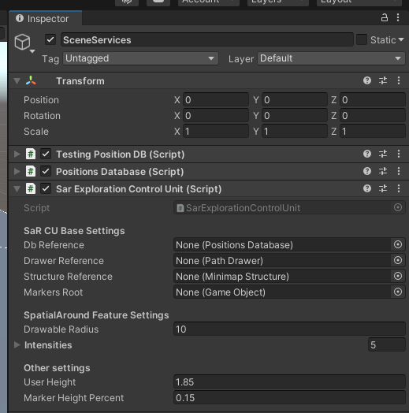

3. Db Reference : reference to your PositionDatabase
4. Markers Root : reference to the `SceneVisual` GameObject
5. you can skip the other options: Drawer Reference and Structure Reference are automatically created and set up

The configuration should be like the following one:

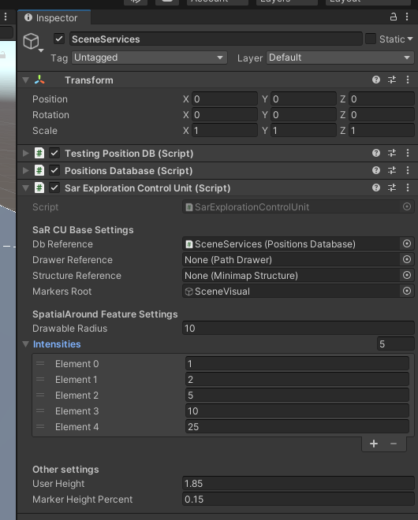

### Enable Visualization Commands

At the time of writing, the component is designed to work triggered by voice commands. The callbacks handling the visuals are clearly visible, since each of them starts with `VOICE_` . 

1. Click on `MixedRealityToolkit` GameObject
2. Main profile set should be `_Project`

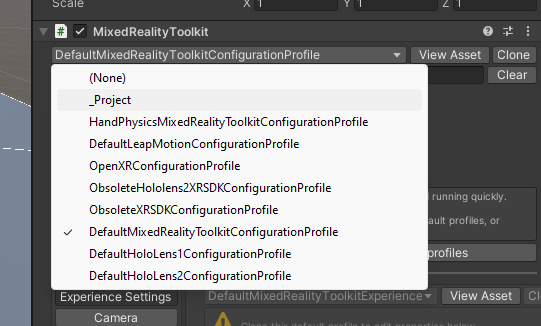

3. Click on Inputs, then Speech. You should see something like the following setup:

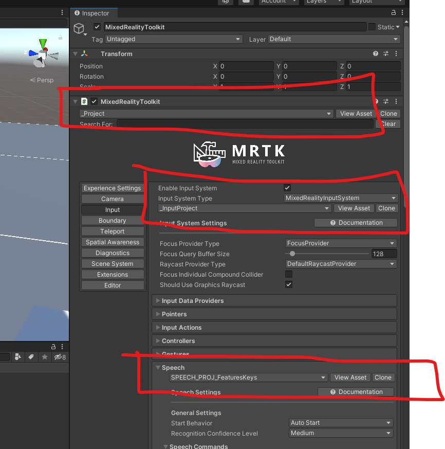

4. Click on `SceneInputs`, and add the MRTK standard component `SpeechInputHandle`

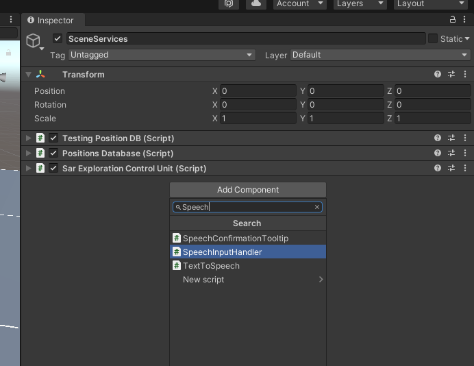

5. In the `Project` tab, search `SpeechConfirmationTooltip` in all the project. 

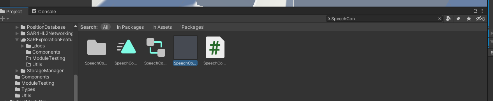

6. Then, drag and drop the component inside the option `Speech Confirimation Tooltip Prefab`

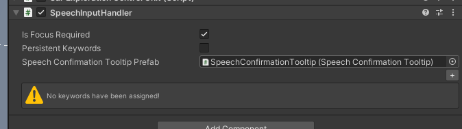

7. Notice that the standard Microsoft interface for this component is just a little ... misleading. Click on `+` --> Speech Command --> there's a dropdown --> Click on it --> select the voice command `Show Path` --> under Response --> click on `+` --> Put the reference to `SarExplorationControlUnit` --> Select `VOICE_SpatialOnUpdate()` --> checkbox under the dropdown menu --> chekc it. The command `Show Path` is associated to the Key `P` in the keyboard

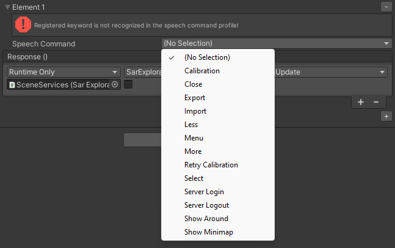

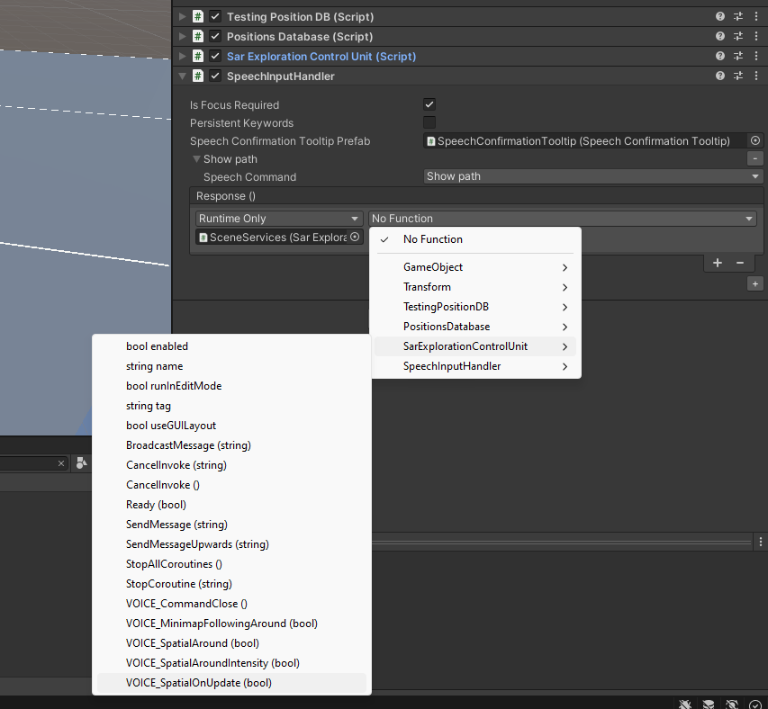

8. You also need a command to close the visualization. There's a command called `Close` to be linked to the command `VOICE_CommandClose()`. The key is `Q`.
9. Uncheck te option `Is Focus Required`

The script should be like this at the end of the procedure:

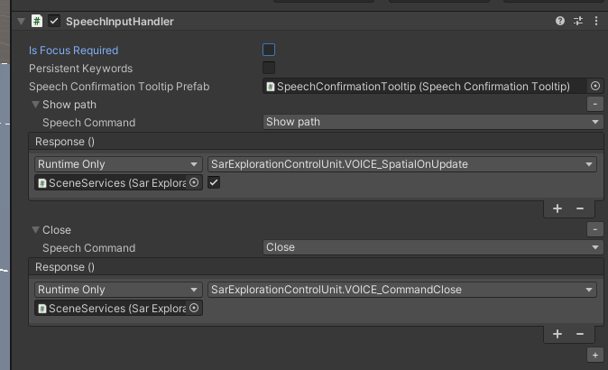

To test if everything is working fine, press Play and go around. It should appear something like this as you walk around:

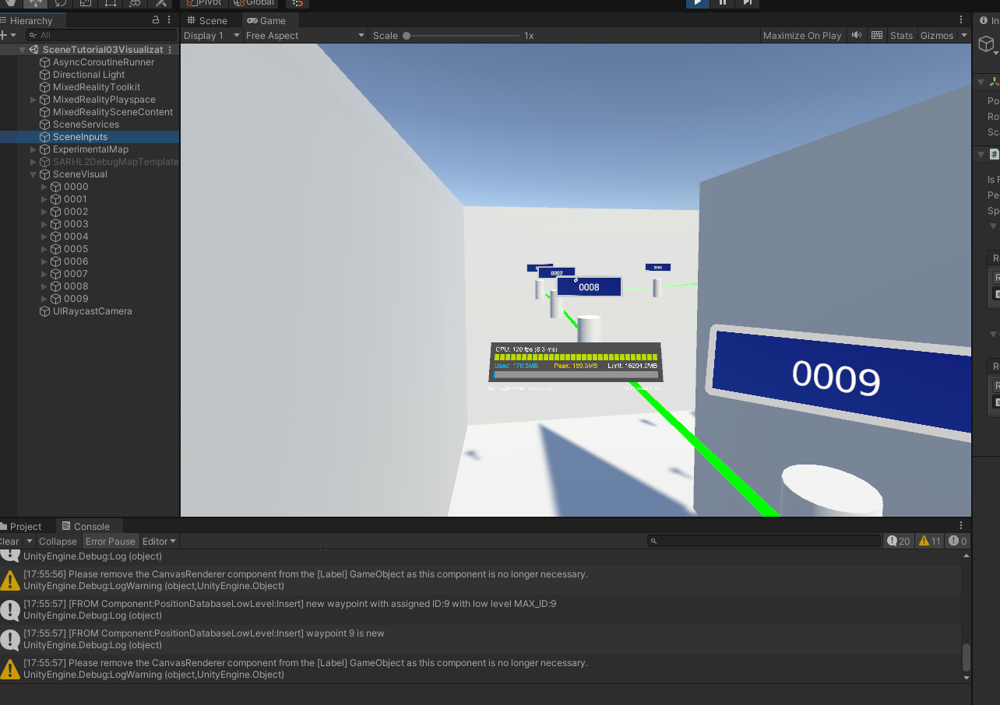

The path is revealed during the exploration. Going into Scene during the play mode, you can have a different perspective on the generated path:

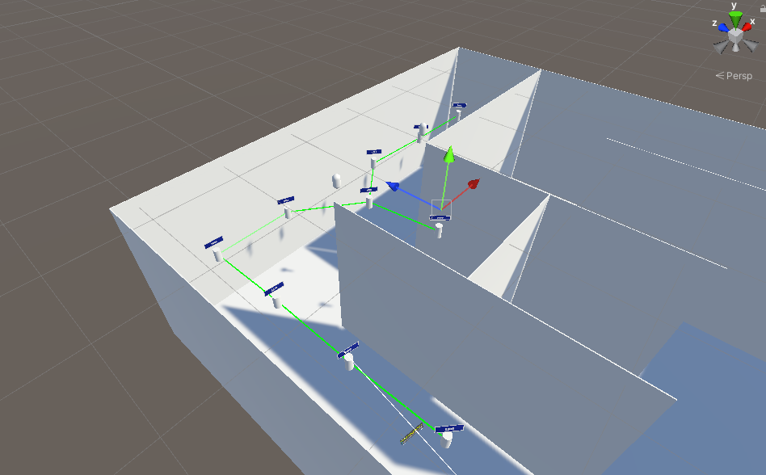

Press `Q` to delete the path. Then, press `P` to enable again the visualization, then walk around: you should notice the same points re-appearing. 

## Different types of visuals

The project currently supports three types of visual: 

- **Path Visual** : points appear as the user walks aound. They could be either new or already discovered. The visual strictly follows the user's activity. 
- **Around Visual** : the system shows the user a mini-graph representation of near waypoints with their available connections. The visual is updates as the user walks. 
- **Dynamic Minimap Tool** : it can be thought as a variant of Around Visual. The paths around are visualized in a minimap capable to adapt itself for a better usability

Let's try each of them. Befor etesting, I strongly suggest a structure under the `SceneInputs` like the following one:

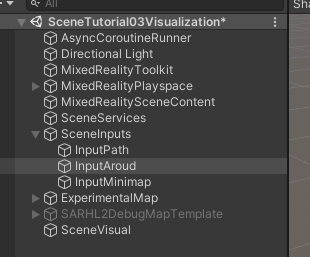

You can disable a game object if you don't want that speech handlle to be active. This allows you to try out different command configurations. For instance, if you want to test out only Path visual, yu can do something like this:

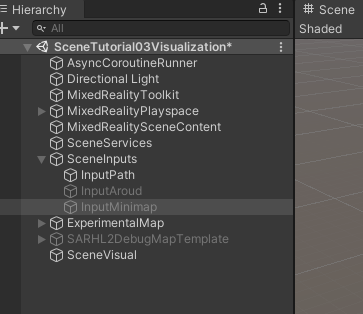

### Path Visual

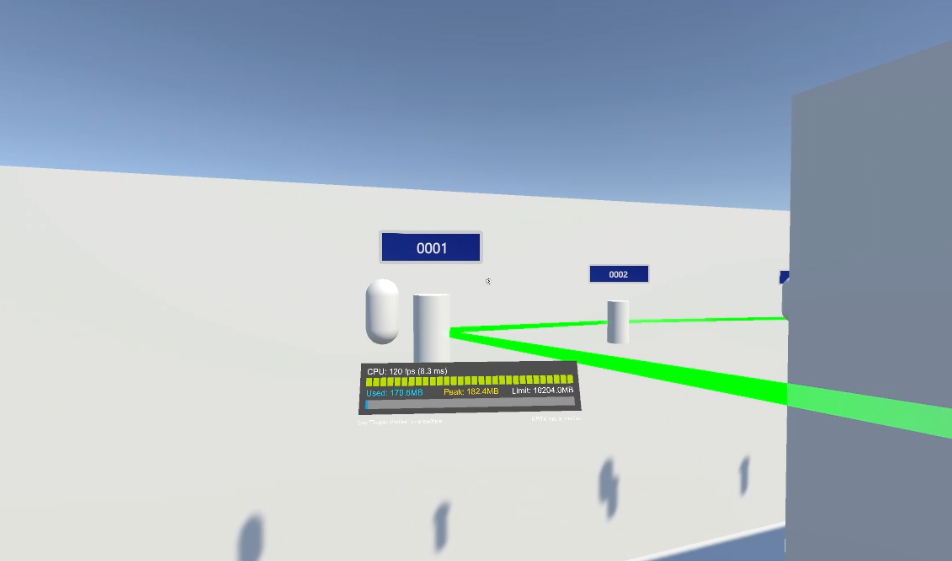

Here are the voice commands:

- Show Path
  - `VOICE_SpatialOnUpdate()`
  - Keyword `P`
- Close
  - `VOICE_CommandClose()`
  - Keyword `C`

Speech configuration Handle settings:

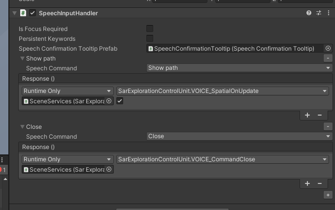

You can find the demo into the video [tutorial_03_pathvisual.mp4](tutorial_03_pathvisual.mp4)

### Around Visual

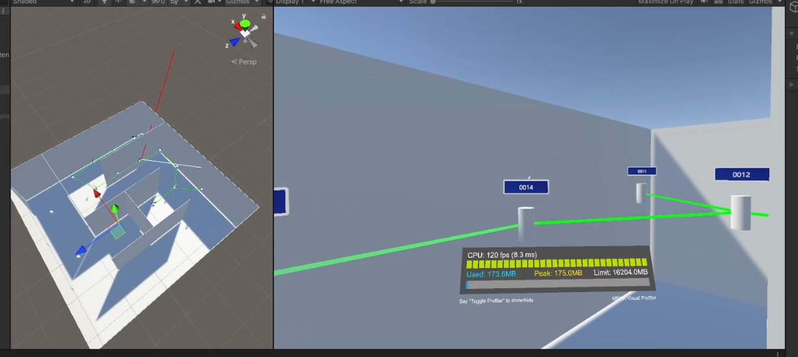

Here are the voice commands:

- Show Path
  - `VOICE_SpatialAround()`
  - Keyword `O`
- Close
  - `VOICE_CommandClose()`
  - Keyword `C`

Speech configuration Handle settings:

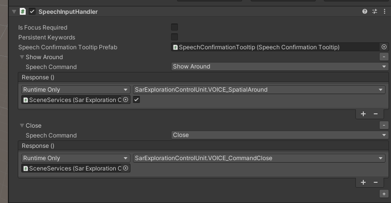

The video [tutorial_03_aroundvisual.mp4](tutorial_03_aroundvisual.mp4) shows how this visual feature works. 

You can tune the visualized radius around the user by the voice commands `Less` and `More` : 

- Less
  - `VOICE_SpatialAroundIntensity(false)`
  - Keyword `Down Arrow`
- More
  - `VOICE_CommandClose(true)`
  - Keyword `Up Arrow`

Here below the configuration:

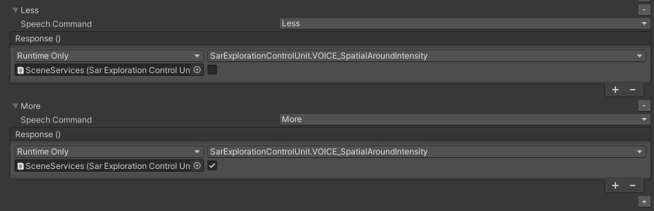

To setup the intensities, you can use the `SarExplorationControlUnit`.

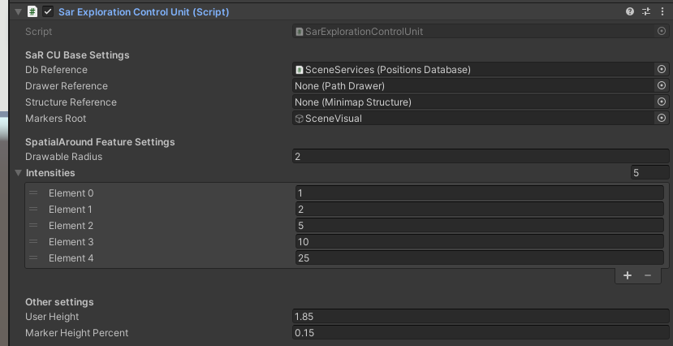

### Dynamic Minimap Visual

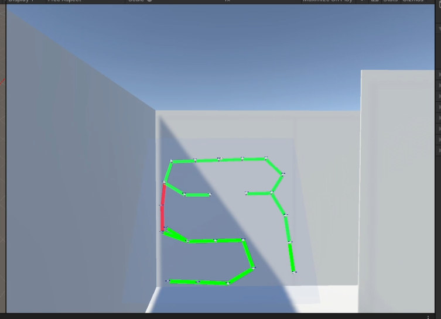

Here are the voice commands:

- Show Minimap
  - `VOICE_MinimapFollowingAround()`
  - Keyword `M`
- Close
  - `VOICE_CommandClose()`
  - Keyword `C`

Speech configuration Handle settings:

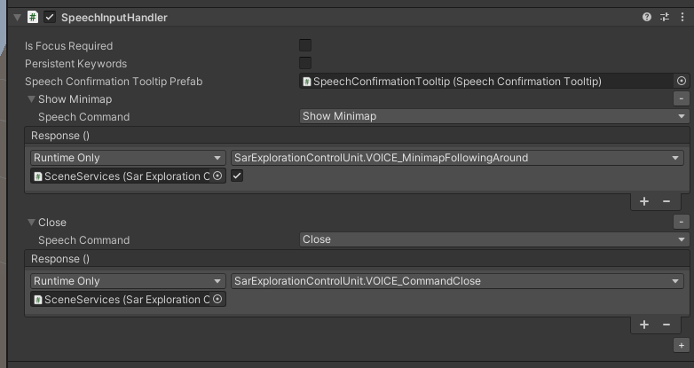

Also this visual supports less and more commands. To have a demo of the functionality, please check the video [tutorial_03_minimapvisual.mp4](tutorial_03_minimapvisual.mp4) .