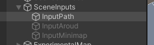
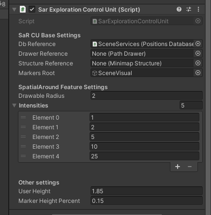
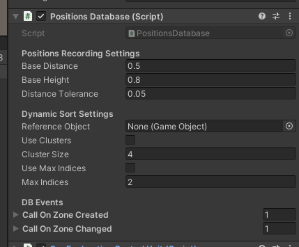
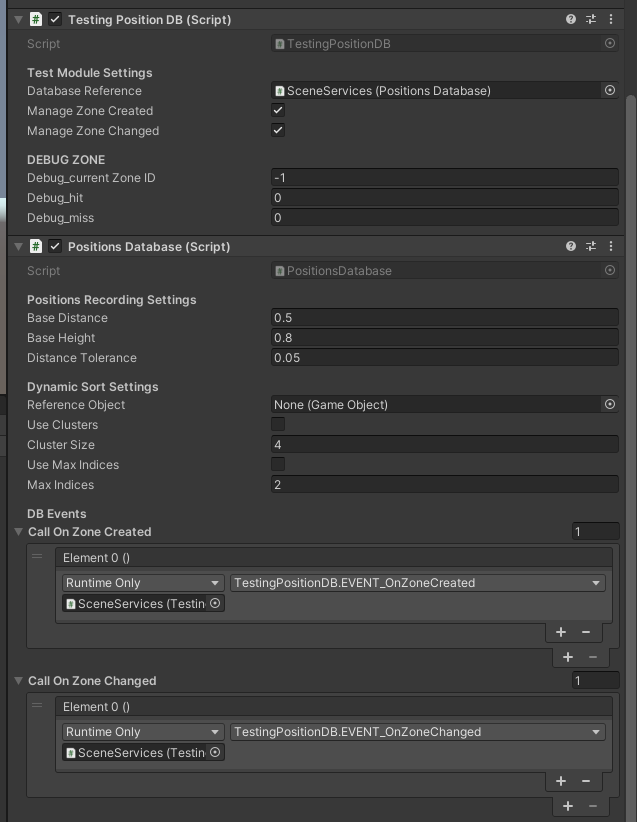
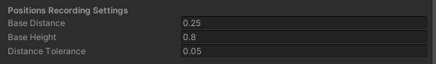
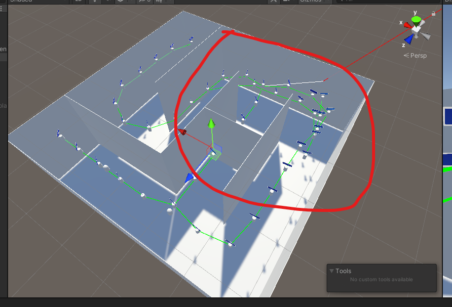
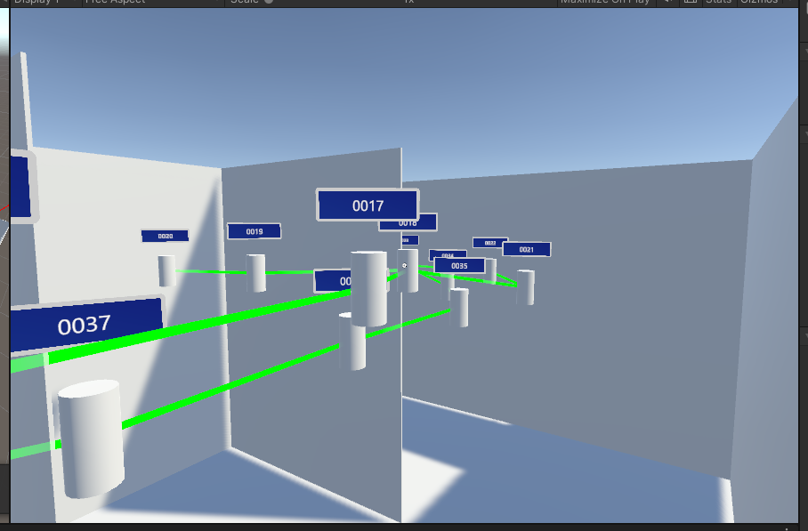
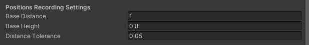

# SaR4HL2 Tutorial 4 - Db Tuning

*The Positions Database is a mission-critical component for a bunch of applications you would want to implement on a device like this. The project offers many options for hndling performances at PosDB level.* 

## Experimental Setup

The main setup is the same shown in the previous tutorial step. In particular,

- I'm going to use the Path visualization

- the configuration of the SAR Exploration Control Unit is pretty much the same as in the previous tutorial:

- this tutorial shows a simple way to tune up the system. Let's start with these PosDB options:

- and finally, a Testing Position DB component is required for the test.

---

## Base Distance Tuning

Please take into account that

- the posDB checks the distance at each frame
  - at most one swap is performed at each frame
- when the distance satisfies the internal distance formula, then a new point is generated

We're going to test out these parameters:

- **Base Distance** : the radius around one waypoint
  - to insert a new waypoint, it must be at least 2*BaseDistance far from the nearest known position
  - the user is inside that waypoint when its position falls into the area with that radius around the waypoint
- **Base Height** : to prevent some anomalies due to the height of the head, the Positions Database uses a *cylinder space*, not a sferic one. This parameter is the height of that cyliner
- **Distance Tollerance** : to goarantee flexibility to the system, a new position can be inserted cnsidering a distance of (2\*BaseDistance-+Tollerance) instead of only (2*BaseDistance)

let's start with only these settings. To perform the tuning, you have at disposal (on the PC environment) the "TestingPositionsDB" component (showing hits and misses) and the visualization of the path.

To test out the configuration, you could perform these steps:

1. start the simulation
2. explore a new zone
3. and pass again in that zone
4. then explore a new zone
5. and the pass again throught that zone

And so forth. It is a good test. In particular, try to change zone frequently to see if some anomaly is generted.

### Default Configuration

this is the best one for my PC:

it has several advantages:

- (for my PC) it is the distance with smallest value
- this has the advantage to draw a path which is *precise enough* 
  - in general no paths passing through walls are generated by the system
- the number of points is not so big
  - this allows better performances, since the list does not contain too much points to order
  - this is a key observation for extensive explorations

### Let's try a smallest radius

for instance, the half of the default one. What should we expect fro mthis configuration?

- the paths are more presice, better drawing the user's path
- number of generated points increase

for my PC, the effects are visible after approsimately 33 generated points. Try to move fast from one zone to another one, and, after a bit, you should see a mess like this:

This happens since the pos DB is no more able to follow the user, hence it generates new positions simply because the positions database can't sort the list quickly enough to understand where the user is. 

To solve this, we are a bunch of options:

- **IMPLEMENTATION** : implement a rule which doesn't allow to insert a new position if the user is too much far from one point
  - in this case, the system is generating one position each 0.5m
  - we could add a rule which prevents the database to generate a new waypoint if the user is (for instance) 1.1m far from the currently identified position
  - this could solve many of the points shows before, *but some case remains*

- **IMPLEMENTATION** : improve the following capability exploiting the graph strcture of the data
  - while searching for the current position, the database could also explore the other positions around the previously identified one

- **CLUSTERING** : see the following sections. The main problem in this case is that the system is managing one swap by frame. This heavily limits the performances of the algorithm. 

### And what about a bigger radius

let's try with a radius of 1m, doubled compared to the default one. 

- number of points decrease (good for performances)
- but the path drawinf precision decreases
  - in particular, the user seems to "pass through walls"

here's the new configuration:

