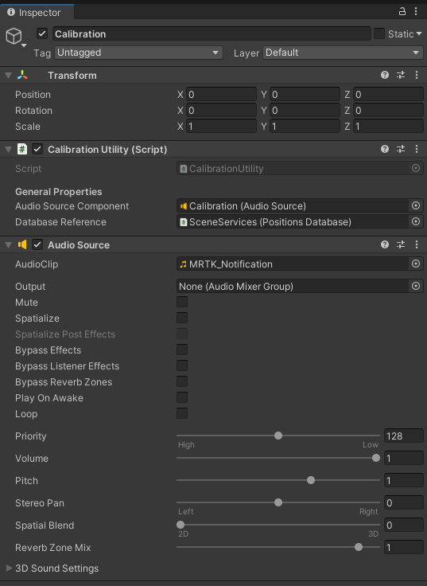
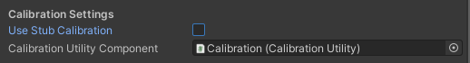
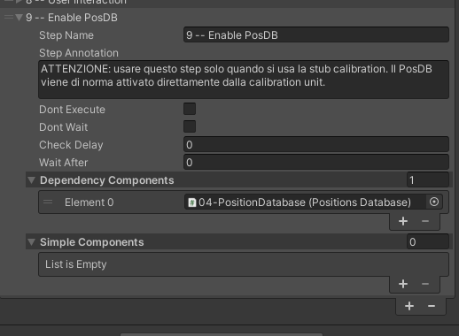
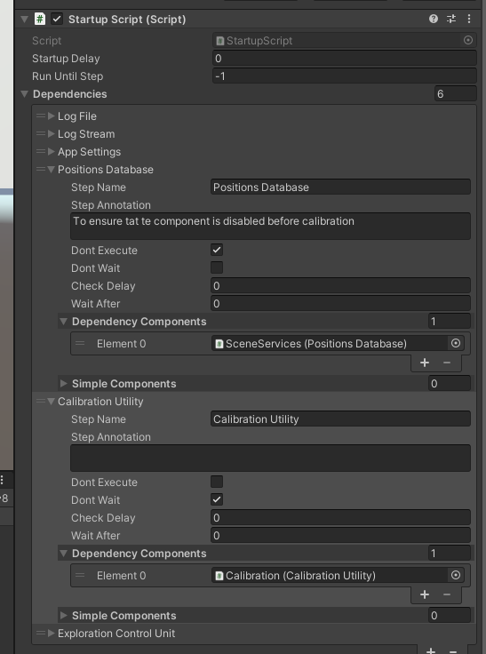
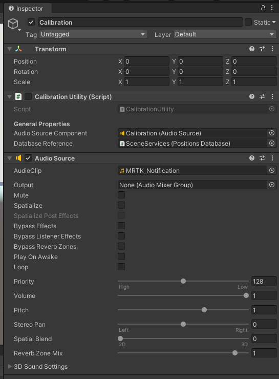
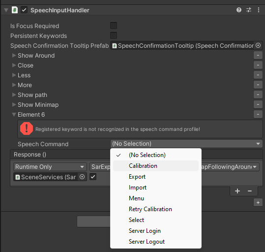
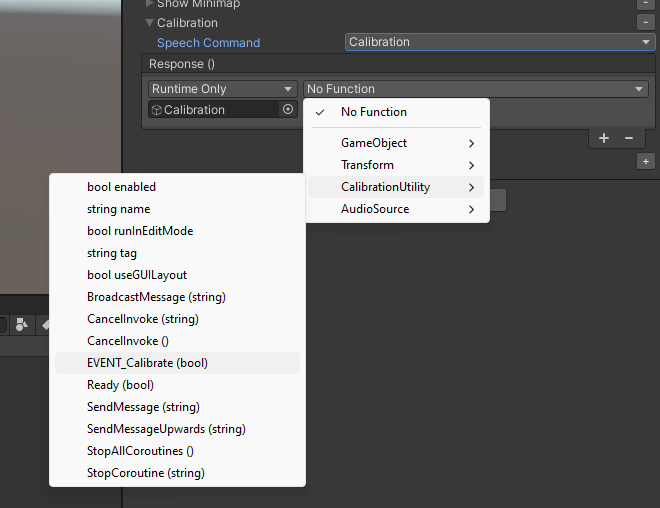

# HOWTO - Calibration System Setup

The script allowing to perform the calibration is the `CalibrationUtility` COmponent, which implements a tiny user interacton to perform the calibration. 

## The component

Please refer to the configuration below:

you should have a PositionDatabase already configured somewhere into the scene. ou can find the audio resource in the assets folrder `Assets/Resources/Audio/MRTK_Notification.wav`

## Integration with App Settings

very simple: there's a section under the settings of the `AppSettings` component. 

## Integration with Startup Script

If you're using a startup script, please remember that, when the calibration utility is enabled, the positions database is enabled only by the calibration utility. 

## How to setup the calibration utility

- before starting, you need a position database
  - remember to dsable it, since the calibration utility will enable it at the end of the calibration procedure
- assign the component `CalibrationUtility` to a game object in the scene
- also create a AudioSource
  - and assign it to the `CalibrationUtility` component 

It should be like this:

now, you need a *voice command* to start the calibration process. 

- create a speech input handle with command *calibration* (it has been already set under the `_project` profile). The key is `C` .

