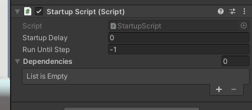
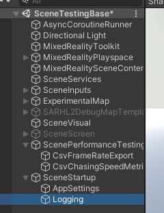
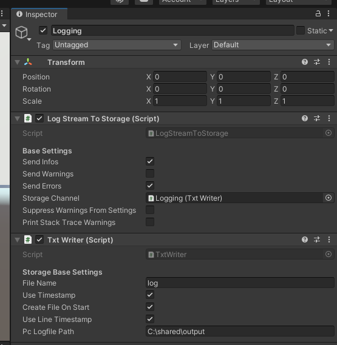
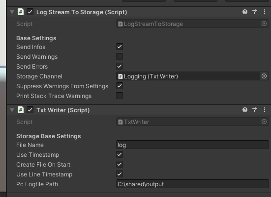
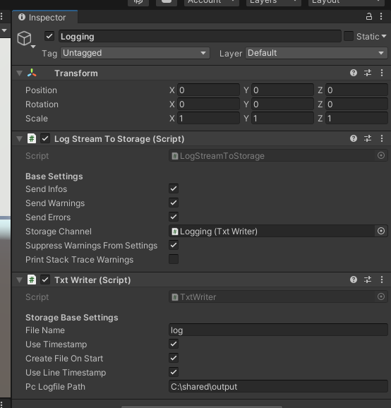
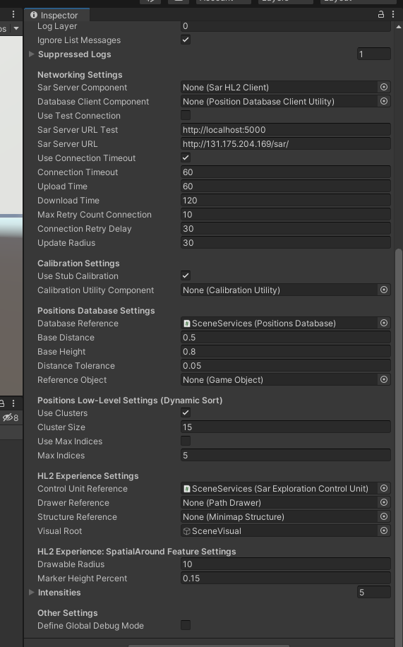
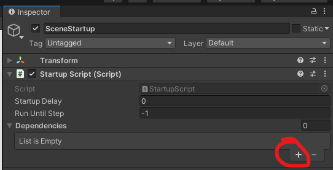
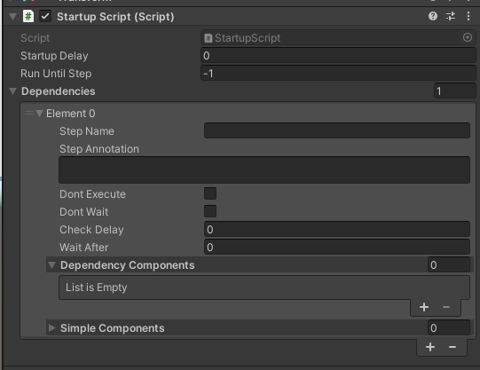
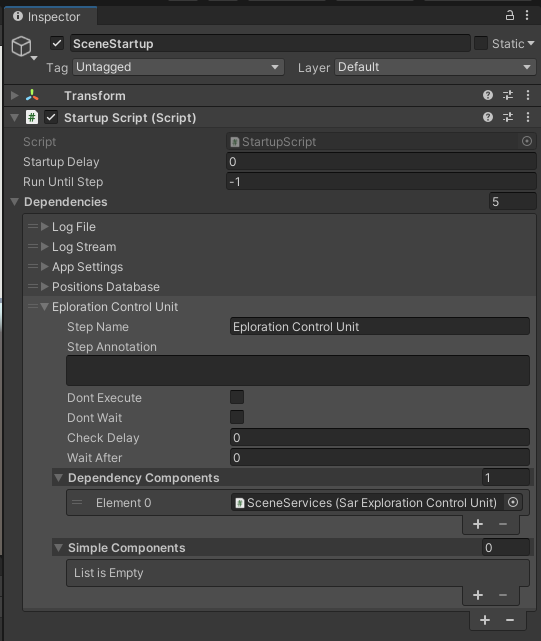

# HOWTO - Startup Script

*A startup script allows to startup the scripting part of the project with a precise order, enabling to prevent some problems related to the unordered startup by Unity.*

## How to setup a startup script

- (optional) Create a `SceneStartup` GameObject

    I strongly suggest to put aside this script and to keepp ordered the part of the scene in charge to startup the components. 
- Add a component to the `SceneStartup` GameObject: `StartupScript`

Here are the settings immediately after added it to the scene:

### Common System Setup

As a example, assume we're interested to put these scripts: logging on file, app settings, then position database, and finally the SAR exploration control unit. 

We could use a structure like this:

for the logging:
- `LogStreamToStorage` under the `Logging` GO
- `TxtWriter` under the `Logging` GO

<!--  -->
<!--  -->

for the AppSettings:
- `ProjectAppSettings` under te `AppSettings` GO

### Startup Script Options

The current `StartupScript` component offers many modes to start your project. 

- first of all, click on `+` under the `Dependencies` list

For each element, te available optons are the following:

- **step name** : a name identifying the step (instead of *element 0* hich is not exactly meaningful...)
- **step annotation** : you can explain the step; it's just a documentation parameter
- **dont Execute** : this is a cozy option for testing; checking this option, the step will be ignored. 
- **dont wait** : the script just enables the component without waiting for a feedback. It is useful for simple component in particular. This option has another important usage: **it ensures that the component is not enabled**. 
- **Check Delay** : if zero, and if the component has to wait for this dependency, the component polls for the status of the dependency at each frame. If not zero and the system has to wait, then the component polls less frequently, repeating the request with a given delay
- **wait after** : time to wait after the dependency has been stssrted. It is useful especially with the simple components. 

Dependencies are of two types:

- **Dependency Component** : this is inherited by a `ProjectMonoBehaviour` which is a child of `MonoBehaviour` with some extra functionalities like for instance the capability to signal when the component is ready, basically not supported by `MonoBehaviour`
- **Simple Component** : to guarantee flexibility also with components which cannot inherit the `ProjectMonoBehaviour` for some reason, the script enables also to manage common components. Instead of polling for feedback, the system can just enable the component and wait some time

Here's ow this script works:

- when a component is registered as dependency, the script sets it as not enabled directly from editor
- the project starts: the startup script, for each dependency,
  - first tries to enable it
  - then waits for its status or for some time
- then tries to enable the nect one, and the cycle goes until each dependency hasn't been enabled

